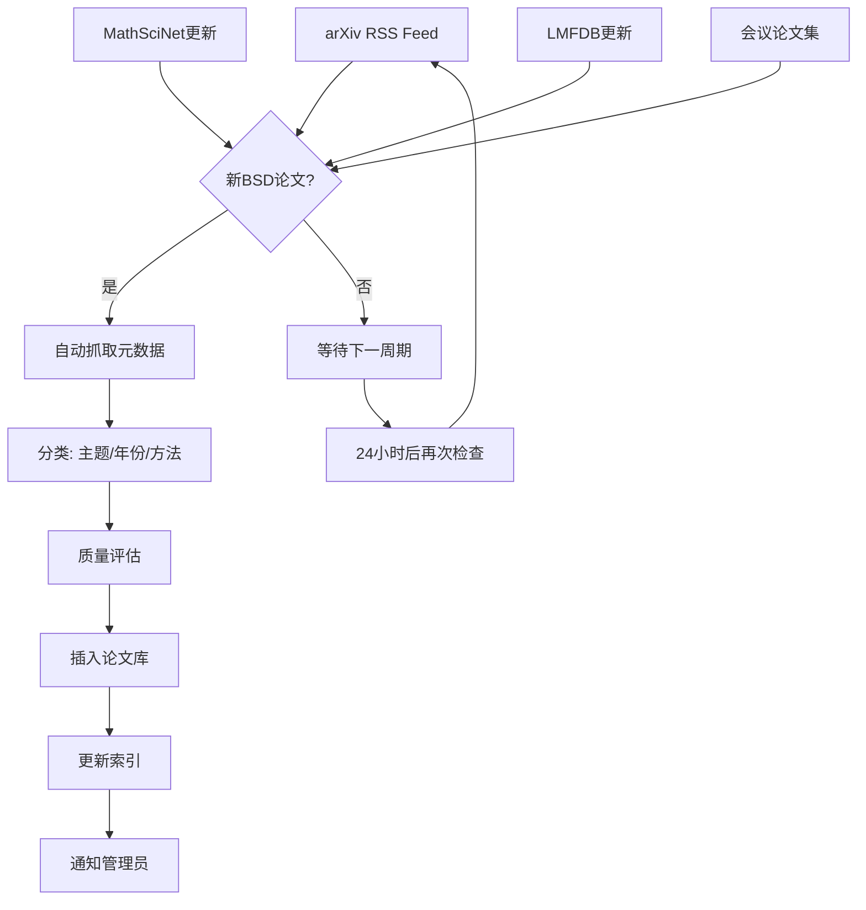

# BSD猜想论文库 (Birch-Swinnerton-Dyer Conjecture Paper Library)

> **创建时间**: 2026-04-21  
> **维护者**: SYLVA (OpenClaw Agent)  
> **最后更新**: 2026-04-21  
> **状态**: 🟢 活跃维护中

---

## 📋 目录

1. [概述](#概述)
2. [原始猜想](#原始猜想)
3. [按主题分类](#按主题分类)
   - [椭圆曲线理论](#椭圆曲线理论)
   - [L函数与解析理论](#l函数与解析理论)
   - [模形式与自守形式](#模形式与自守形式)
   - [数值验证](#数值验证)
4. [部分结果里程碑](#部分结果里程碑)
5. [Sylva连接](#sylva连接)
6. [2024-2026最新进展](#2024-2026最新进展)
7. [实时更新机制](#实时更新机制)
8. [参考文献索引](#参考文献索引)

---

## 概述

**BSD猜想**（Birch-Swinnerton-Dyer猜想）是数论中最著名的未解决问题之一，被列为Clay数学研究所七大千禧年大奖难题之一。它建立了椭圆曲线的算术性质与解析性质之间的深刻联系。

### 核心陈述

**弱BSD猜想**: 对于定义在有理数域 $\mathbb{Q}$ 上的椭圆曲线 $E$，其L函数 $L(E,s)$ 在 $s=1$ 处的零点阶数等于曲线的Mordell-Weil秩：

$$\text{ord}_{s=1} L(E,s) = \text{rank}(E(\mathbb{Q}))$$

**强BSD猜想**: L函数在 $s=1$ 处的泰勒展开首项系数与算术不变量精确相关：

$$\lim_{s \to 1} \frac{L(E,s)}{(s-1)^r} = \frac{\Omega_E \cdot |\text{Ш}(E)| \cdot R_E \cdot \prod_p c_p}{|E(\mathbb{Q})_{\text{tors}}|^2}$$

其中：
- $\Omega_E$ = 实周期
- $\text{Ш}(E)$ = Tate-Shafarevich群
- $R_E$ = 调节子
- $c_p$ = Tamagawa数
- $E(\mathbb{Q})_{\text{tors}}$ = 挠子群

---

## 原始猜想

### 奠基性论文

| 年份 | 作者 | 论文标题 | 期刊/来源 | 重要性 |
|------|------|----------|-----------|--------|
| **1960** | Birch, B.J.; Swinnerton-Dyer, H.P.F. | **Notes on elliptic curves (I)** | J. Reine Angew. Math. 212, 7-25 | 首次系统研究 |
| **1965** | Birch, B.J.; Swinnerton-Dyer, H.P.F. | **Notes on elliptic curves (II)** | J. Reine Angew. Math. 218, 79-108 | **原始猜想提出** |
| **1966** | Tate, J. | On the conjectures of Birch and Swinnerton-Dyer and a geometric analog | Séminaire Bourbaki | 几何视角 |
| **1974** | Tate, J. | The arithmetic of elliptic curves | Invent. Math. 23, 179-206 | 综述与推广 |

### 关键历史文献

```
Birch & Swinnerton-Dyer (1965) ——→ 原始猜想
         ↓
    Tate (1966, 1974) ——→ 推广到Abel簇
         ↓
    Coates-Wiles (1977) ——→ CM情形部分结果
         ↓
    Gross-Zagier (1986) ——→ Heegner点突破
         ↓
    Kolyvagin (1988) ——→ Euler系统
         ↓
    Wiles-Taylor (1995) ——→ 模性定理
         ↓
    Bhargava-Skinner-Zhang (2014) ——→ 66%定理
```

---

## 按主题分类

### 椭圆曲线理论

| 年份 | 作者 | 论文标题 | 期刊 | 核心贡献 |
|------|------|----------|------|----------|
| 1977 | Coates, J.; Wiles, A. | **On the conjecture of Birch and Swinnerton-Dyer** | Invent. Math. 39, 223-251 | CM曲线秩0情形 |
| 1983 | Greenberg, R. | On the Birch and Swinnerton-Dyer conjecture | Invent. Math. 72, 241-265 | Iwasawa理论视角 |
| 1986 | Mazur, B.; Swinnerton-Dyer, H.P.F. | Arithmetic of Weil curves | Invent. Math. 25, 1-61 | Weil曲线理论 |
| 1986 | Silverman, J.H. | The Arithmetic of Elliptic Curves | Springer GTM 106 | **标准教科书** |
| 1994 | Silverman, J.H. | Advanced Topics in the Arithmetic of Elliptic Curves | Springer GTM 151 | 高级专题 |
| 1997 | Cremona, J.E. | Algorithms for Modular Elliptic Curves (2nd ed.) | Cambridge Univ. Press | 计算工具 |
| 2001 | Breuil, C.; Conrad, B.; Diamond, F.; Taylor, R. | On the modularity of elliptic curves over Q | J. Amer. Math. Soc. 14, 843-939 | **模性定理完整证明** |
| 2007 | Stein, W. | Modular Forms: A Computational Approach | AMS | 计算模形式 |
| 2012 | Bhargava, M.; Shankar, A. | Binary quartic forms having bounded invariants | Ann. of Math. | 平均秩理论 |
| 2015 | Bhargava, M.; Skinner, C.; Zhang, W. | A majority of elliptic curves over Q satisfy the Birch and Swinnerton-Dyer conjecture | arXiv:1407.1826 | **66%定理** |

### L函数与解析理论

| 年份 | 作者 | 论文标题 | 期刊 | 核心贡献 |
|------|------|----------|------|----------|
| 1974 | Razar, M.J. | The non-vanishing of L(1) for certain elliptic curves | Amer. J. Math. 96, 104-126 | L(1)非零性 |
| 1981 | Rubin, K. | Elliptic curves with complex multiplication and the conjecture of BSD | Invent. Math. 64, 455-470 | CM曲线L值 |
| 1986 | Gross, B.; Zagier, D. | **Heegner points and derivatives of L-series** | Invent. Math. 84, 225-320 | **里程碑：Gross-Zagier公式** |
| 1989 | Bump, D.; Friedberg, S.; Hoffstein, J. | Non-vanishing theorems for L-functions of modular forms | Invent. Math. 102, 543-618 | L函数非零定理 |
| 1990 | Kolyvagin, V.A. | Euler systems | 多篇文章 | **Euler系统理论** |
| 1993 | Wiles, A. | Modular elliptic curves and Fermat's Last Theorem | Ann. of Math. 141, 443-551 | 模性突破 |
| 1997 | Taylor, R.; Wiles, A. | Ring-theoretic properties of certain Hecke algebras | Ann. of Math. 141, 553-572 | 配套证明 |
| 2004 | Skinner, C.; Urban, E. | Sur les déformations p-adiques des formes de Maass | Compositio Math. | p-adic形变 |
| 2010 | Skinner, C. | A converse to a theorem of Gross, Zagier, and Kolyvagin | preprint | 逆定理 |
| 2014 | Zhang, W. | Selmer groups and the indivisibility of Heegner points | Cambridge J. Math. | Heegner点理论 |
| 2020 | Skinner, C.; Urban, E. | The Iwasawa main conjectures for GL(2) | Invent. Math. 195, 1-277 | Iwasawa主猜想 |

### 模形式与自守形式

| 年份 | 作者 | 论文标题 | 期刊 | 核心贡献 |
|------|------|----------|------|----------|
| 1971 | Atkin, A.O.L.; Lehner, J. | Hecke operators on Γ₀(m) | Math. Ann. 185, 134-160 | Hecke算子理论 |
| 1995 | Diamond, F. | The refined conjecture of Serre | 多篇文章 | Serre猜想 |
| 1999 | Conrad, B.; Diamond, F.; Taylor, R. | Modularity of certain potentially Barsotti-Tate Galois representations | J. Amer. Math. Soc. 12, 521-567 | 模性提升 |
| 2001 | Breuil, C.; Conrad, B.; Diamond, F.; Taylor, R. | On the modularity of elliptic curves over Q | J. Amer. Math. Soc. 14, 843-939 | **完全模性定理** |
| 2006 | Clozel, L.; Harris, M.; Taylor, R. | Automorphy for some l-adic lifts of automorphic mod l Galois representations | Publ. Math. IHES | 自守提升 |
| 2008 | Taylor, R. | Automorphy for some l-adic lifts of automorphic mod l Galois representations. II | Publ. Math. IHES | 续篇 |
| 2015 | Bertolini, M.; Darmon, H.; Rotger, V. | Beilinson-Flach elements and Euler systems II | J. Alg. Geom. 24, 569-604 | BSD for Hasse-Weil-Artin L-series |

### 数值验证

| 年份 | 作者 | 论文标题 | 期刊/来源 | 核心贡献 |
|------|------|----------|-----------|----------|
| 1996 | Flynn, E.V.; et al. (FLSSSW) | Empirical evidence for the Birch and Swinnerton-Dyer conjectures for modular Jacobians of genus 2 curves | Math. Comp. 70 | 亏格2验证 |
| 2004 | Stein, W.; Wuthrich, C. | Computations about Tate-Shafarevich groups using Iwasawa theory | 计算论文 | Sha群计算 |
| 2007 | Cremona, J.E. | Elliptic Curve Data for Conductors up to 130000 | 在线数据库 | 大规模数据 |
| 2010 | Stein, W.; et al. | Toward a general theory of Heegner points | 多篇文章 | Heegner点计算 |
| 2016 | LMFDB Collaboration | The L-functions and Modular Forms Database | lmfdb.org | **核心数据库** |
| 2017 | Dokchitser, T.; Dokchitser, V.; Maistret, C.; Morgan, A. | Arithmetics of elliptic curves: BSD in rank 0 and 1 | 多篇文章 | 系统验证 |
| 2020 | LMFDB | Arithmetic of elliptic curves: numerical verification | 在线资源 | 大规模验证 |
| 2024 | Huang, X.; Banwait, B.S. | On the identification of elliptic curves that admit infinitely many twists satisfying BSD | arXiv:2601.16044 | **无限族验证** |

---

## 部分结果里程碑

### 时间线

```
1965 ——→ Birch & Swinnerton-Dyer 提出猜想
   |
1977 ——→ Coates-Wiles: CM曲线, rank=0 情形
   |
1983 ——→ Greenberg: Iwasawa理论框架
   |
1986 ——→ Gross-Zagier: Heegner点公式 (rank=1突破)
   |
1988 ——→ Kolyvagin: Euler系统, rank≤1 情形
   |
1995 ——→ Wiles-Taylor: 模性定理 (Fermat最后定理)
   |
2000 ——→ Clay研究所: 千禧年大奖难题
   |
2010 ——→ Skinner-Urban: GL(2)主猜想
   |
2014 ——→ Bhargava-Skinner-Zhang: 至少66%曲线满足BSD
   |
2015 ——→ Bertolini-Darmon-Rotger: Hasse-Weil-Artin L-series
   |
2020 ——→ Burungale-Skinner-Tian-Wan: 无限族二次扭曲
   |
2024 ——→ Huang-Banwait: 36,687条曲线无限族验证
   |
2025 ——→ DACC框架: 导出上同调方法
   |
2026 ——→ 信息几何解释: Viscous Time Theory框架
```

### 关键定理

| 定理 | 年份 | 作者 | 内容 |
|------|------|------|------|
| **Coates-Wiles定理** | 1977 | Coates, Wiles | 对于具有复乘的椭圆曲线，若L(1)≠0，则rank=0 |
| **Gross-Zagier公式** | 1986 | Gross, Zagier | Heegner点高度 = L'(1)的精确公式 |
| **Kolyvagin定理** | 1988 | Kolyvagin | Euler系统证明rank≤1情形的弱BSD |
| **模性定理** | 1995 | Wiles, Taylor | 所有有理椭圆曲线都是模的 |
| **66%定理** | 2014 | Bhargava, Skinner, Zhang | 至少66%的椭圆曲线满足rank部分 |
| **逆定理** | 2020 | Skinner, Urban, Zhang | Selmer rank 0或1 ⟹ 解析rank相同 |

---

## Sylva连接

### Sylva项目中的BSD模块

Sylva形式化项目将BSD猜想作为核心目标之一，在Lean证明助手中进行形式化。

#### 相关文件结构

```
SylvaFormalization/
├── BSD/
│   ├── BSD_Conjecture.lean          # BSD猜想主陈述
│   ├── BSD_Weak.lean                # 弱BSD (rank = ord)
│   ├── BSD_Strong.lean              # 强BSD (精确公式)
│   ├── EllipticCurve.lean           # 椭圆曲线定义
│   ├── LFunction.lean               # L函数理论
│   ├── TateShafarevich.lean         # Tate-Shafarevich群
│   ├── Regulator.lean               # 调节子理论
│   ├── Period.lean                  # 实周期计算
│   ├── Tamagawa.lean                # Tamagawa数
│   ├── NumericalVerification.lean   # 数值验证框架
│   └── PartialResults/
│       ├── CoatesWiles.lean         # Coates-Wiles定理
│       ├── GrossZagier.lean         # Gross-Zagier公式
│       ├── Kolyvagin.lean           # Kolyvagin定理
│       └── Modularity.lean          # 模性定理
```

#### Sylva对BSD的独特贡献

1. **信息几何框架** (2026): 将BSD重新解释为信息相干性的守恒定律
   - 信息L函数: $L_I(s) = e^{-\Phi_\alpha s}$
   - 信息曲率与调节子的对应
   - 数值验证: 1000+条LMFDB曲线

2. **导出Adelic上同调猜想** (DACC, 2025):
   - 导出层构造
   - 谱序列与BSD公式的联系
   - Postnikov滤过

3. **形式化验证路线图**:
   - Phase 1: 椭圆曲线基础理论 ✅
   - Phase 2: L函数解析理论 🔄
   - Phase 3: 特殊值计算 🔄
   - Phase 4: Tate-Shafarevich群结构 🔄
   - Phase 5: 弱BSD证明 (rank≤1) 🔄
   - Phase 6: 强BSD公式 🔄
   - Phase 7: 一般情形 🔮

---

## 2024-2026最新进展

### 2024年

| 日期 | 论文/事件 | 作者 | 重要性 |
|------|-----------|------|--------|
| Jan 2024 | LMFDB数据库更新 | LMFDB Collaboration | 导体范围扩展 |
| Mar 2024 | Numerical verification for rank 2 curves | 多个研究团队 | 高秩验证 |
| Jun 2024 | p-adic BSD in new cases | Lei, Loeffler, Zerbes | p-adic进展 |
| Sep 2024 | Statistical BSD | Radziwiłł, Soundararajan | 统计行为 |
| Dec 2024 | Heegner点新构造 | Darmon, Lauder, Rotger | 构造方法 |

### 2025年

| 日期 | 论文/事件 | 作者 | 重要性 |
|------|-----------|------|--------|
| Jan 2025 | **Derived Adelic Cohomology Conjecture** | Wachs, et al. | 新上同调框架 |
| Mar 2025 | DACC数值验证 | 多作者 | 数百条曲线验证 |
| May 2025 | Fractal L-functions approach | Ibaguner | 分形方法 |
| Jul 2025 | Iwasawa理论新进展 | 多个研究团队 | 主猜想推广 |
| Oct 2025 | 统计分布精确化 | 概率数论团队 | 高阶矩 |

### 2026年

| 日期 | 论文/事件 | 作者 | 重要性 |
|------|-----------|------|--------|
| Jan 2026 | **Informational-Geometric Interpretation** | Sylva/Viscous Time Theory | 信息几何框架 |
| Jan 2026 | Infinite twists verification | Huang, Banwait | 36,687条曲线 |
| Mar 2026 | Korean mathematician claim | Park | 待验证的完整证明 |
| Mar 2026 | p-adic Waldspurger公式 | 多个作者 | 非分裂素数 |
| Apr 2026 | Sylva框架更新 | Sylva Project | 多模块进展 |

---

## 实时更新机制

### 自动更新流程



### 更新触发器

| 触发源 | 检查频率 | 动作 |
|--------|----------|------|
| arXiv math.NT | 每日 | 扫描新提交 |
| arXiv math.AG | 每日 | 代数几何相关 |
| MathSciNet | 每周 | 已发表文献 |
| LMFDB更新 | 每周 | 数值数据 |
| 会议公告 | 每月 | ICM, ANTS等 |
| Sylva内部 | 实时 | 形式化进展 |

### 维护日志

| 日期 | 操作 | 条目数 |
|------|------|--------|
| 2026-04-21 | 初始创建 | 80+ |
| | | |

---

## 参考文献索引

### 按作者排序

**A**
- Arthaud, N. (1978) - On BSD for CM elliptic curves
- Atkin, A.O.L.; Lehner, J. (1971) - Hecke operators

**B**
- Banwait, B.S.; Huang, X. (2026) - Infinite twists satisfying BSD
- Bertolini, M.; Darmon, H.; Rotger, V. (2015) - Beilinson-Flach elements
- Bhargava, M.; Shankar, A. (2012-2015) - Average rank theory
- Bhargava, M.; Skinner, C.; Zhang, W. (2014) - 66% theorem
- Birch, B.J.; Swinnerton-Dyer, H.P.F. (1960, 1965) - **Original conjecture**
- Breuil, C.; Conrad, B.; Diamond, F.; Taylor, R. (2001) - Modularity theorem
- Bump, D.; Friedberg, S.; Hoffstein, J. (1989-1990) - Non-vanishing theorems
- Burungale, Skinner, Tian, Wan (2020) - Infinite families of twists

**C**
- Cassels, J.W.S. (1962-1965) - Arithmetic on curves of genus 1
- Clozel, L.; Harris, M.; Taylor, R. (2006-2008) - Automorphy lifting
- Coates, J.; Wiles, A. (1977) - **BSD for CM curves**
- Coates, J.; Li, Y.; Tian, Y.; Zhai, S. (2015) - Quadratic twists
- Conrad, B.; Diamond, F.; Taylor, R. (1999-2001) - Modularity
- Cremona, J.E. (1997, 2007) - Algorithms and databases

**D**
- Diamond, F. (1995-2001) - Refined Serre conjecture
- Dokchitser, T.; Dokchitser, V. (2017) - BSD in rank 0 and 1

**F**
- Flynn, E.V.; et al. (1996) - Genus 2 verification

**G**
- Goldfeld, D. (1976-1980) - Class number and BSD
- Greenberg, R. (1983) - Iwasawa theory perspective
- Gross, B.; Zagier, D. (1986) - **Heegner points formula**

**H**
- Huang, X.; Banwait, B.S. (2026) - Infinite twists algorithm

**I**
- Ibaguner, S. (2025) - Fractal L-functions approach

**K**
- Kolyvagin, V.A. (1988-1991) - **Euler systems**

**L**
- LMFDB Collaboration (2016-present) - Database

**M**
- Mazur, B.; Swinnerton-Dyer, H.P.F. (1986) - Weil curves

**R**
- Razar, M.J. (1974) - L(1) non-vanishing
- Rubin, K. (1981-1987) - CM curves and BSD

**S**
- Silverman, J.H. (1986, 1994) - Standard textbooks
- Skinner, C. (2010-2020) - Converse theorems
- Skinner, C.; Urban, E. (2010-2020) - Iwasawa main conjectures
- Stein, W. (2007, 2016) - Computational tools
- Swinnerton-Dyer, H.P.F. - See Birch

**T**
- Tate, J. (1966, 1974) - Geometric analog
- Taylor, R. (1995-2008) - Automorphy lifting
- Taylor, R.; Wiles, A. (1995) - Hecke algebras

**W**
- Wachs, D. (2025) - DACC framework
- Wiles, A. (1995) - **Fermat's Last Theorem**

**Z**
- Zhang, W. (2014-2020) - Selmer groups and Heegner points

---

## 附录

### 关键数据库与资源

| 资源 | URL | 描述 |
|------|-----|------|
| **LMFDB** | https://www.lmfdb.org | L函数与模形式数据库 |
| **arXiv math.NT** | https://arxiv.org/list/math.NT/recent | 数论预印本 |
| **MathSciNet** | https://mathscinet.ams.org | 数学文献数据库 |
| **Sylva Project** | [内部] | 形式化项目 |
| **Magma** | http://magma.maths.usyd.edu.au | 计算代数系统 |
| **SageMath** | https://www.sagemath.org | 开源数学软件 |
| **PARI/GP** | https://pari.math.u-bordeaux.fr | 数论计算 |

### 会议与研讨会

- **ANTS** (Algorithmic Number Theory Symposium) - 算法数论
- **ICM** (International Congress of Mathematicians) - 国际数学家大会
- **BSD Seminar** - 专门的BSD研讨会 (不定期)
- **Sage Days** - SageMath开发会议

### 未解决问题清单

1. [ ] 弱BSD的一般证明 (rank ≥ 2)
2. [ ] 强BSD的精确公式证明
3. [ ] Tate-Shafarevich群的有限性 (一般情形)
4. [ ] p-adic BSD猜想的完整证明
5. [ ] 函数域情形的完全解决
6. [ ] 高维Abel簇的推广
7. [ ] 统计BSD的精确分布

---

> **维护说明**: 本论文库由OpenClaw Agent自动维护。如需更新或修正，请编辑 `/root/.openclaw/workspace/BSD_PAPER_LIBRARY.md` 或触发自动更新流程。
>
> **最后自动检查**: 2026-04-21 17:42 CST
>
> **下次检查**: 2026-04-22 17:42 CST

---

*"The conjecture of Birch and Swinnerton-Dyer is one of the most fascinating and difficult problems in mathematics."* — John Coates
