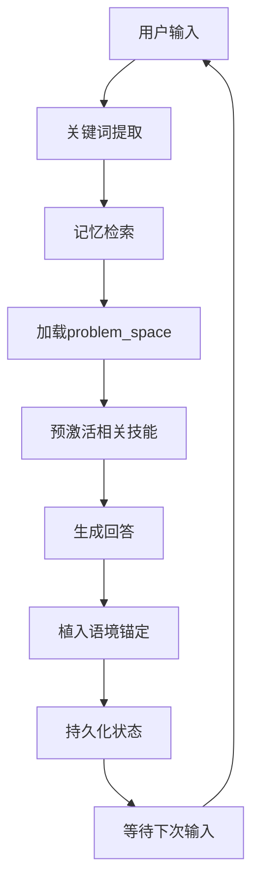

# Hermes 5: 永久激活架构（Perpetual Activation）

## 核心问题
如何让每次回答都维持：
- **问题激活关联**（Problem-active context）
- **状态感知**（State-awareness）
- **相关技能预加载**（Skill priming）

## 现状分析（Hermes 4的局限）

```
用户输入 → 关键词匹配 → 模式检测 → 激活机制 → 回答
                ↑
                └──── 被动触发，语境从零重建
```

**问题**：每次会话都是**冷启动**，需要重新检测模式、重新加载语境。

## 目标架构（Hermes 5）

```
用户输入
    ↓
[上下文预加载层] ←── 从记忆自动加载相关语境
    ↓
[问题空间维持层] ←── 维持多步任务的中间状态
    ↓
[技能预激活层] ←── 预加载可能需要的技能
    ↓
回答 + [语境锚定] ←── 在回答中植入状态保持钩子
    ↓
[状态持久化] ←── 写入memory/上下文文件
```

## 实现机制

### 1. 上下文预加载层（Context Preloading）

**机制**：每次响应前，自动执行轻量级记忆检索

```python
# 伪代码
def preload_context(user_input):
    # 提取关键词
    keywords = extract_keywords(user_input)
    
    # 检索相关记忆
    relevant_memories = memory_search(keywords, max_results=5, min_score=0.6)
    
    # 检查是否有进行中的任务
    active_tasks = check_memory("memory/active_tasks.json")
    
    # 预加载到上下文窗口
    return merge_context(user_input, relevant_memories, active_tasks)
```

**文件**：`memory/context_preload.json` —— 存储当前会话的预加载上下文

### 2. 问题空间维持层（Problem Space Maintenance）

**机制**：显式维护多步推理的中间状态

**数据结构**：
```json
{
  "problem_space": {
    "current_topic": "Sylva形式化编译",
    "sub_tasks": [
      {"name": "压缩方案", "status": "completed", "output": "方案A就绪"},
      {"name": "编译验证", "status": "in_progress", "output": "监控中..."},
      {"name": "sorry填充", "status": "pending", "dependencies": ["编译验证"]}
    ],
    "active_agents": ["agent:编译状态监控"],
    "decision_points": ["编译成功后分类错误/sorry"]
  }
}
```

**文件**：`memory/problem_space.json` —— 显式问题空间状态

### 3. 技能预激活层（Skill Priming）

**机制**：基于问题空间预加载相关技能文件

**规则**：
- 如果 `problem_space.current_topic` 包含 "形式化" → 预加载 `lean` 相关技能
- 如果包含 "Agent集群" → 预加载 `subagent` 管理技能
- 如果包含 "理论物理" → 预加载 `L1-L4审核` 机制

**文件**：`memory/primed_skills.json` —— 当前预激活技能列表

### 4. 语境锚定（Context Anchoring）

**机制**：在每个回答中植入**状态保持钩子**

**技术**：
- **显式状态声明**："当前状态：编译监控中，8个lake进程运行"
- **下一步预告**："编译完成后需要分类错误类型"
- **待决策点**："需要决定：编译成功后是填充sorry还是继续截肢"

**目的**：让用户和我都保持对问题空间的感知，避免语境流失。

### 5. 状态持久化（State Persistence）

**机制**：每次回答后自动写入状态

**触发**：每次 `sessions_yield` 或消息发送前

**写入内容**：
```json
{
  "timestamp": "2026-04-17T01:45:00+08:00",
  "session_key": "...",
  "problem_space_snapshot": {...},
  "active_agents": [...],
  "user_intent_inference": "关注系统架构优化",
  "next_predicted_actions": ["设计Hermes5", "继续编译"]
}
```

**文件**：`memory/session_states/` 目录下的时间戳文件

## 整合流程



## 关键创新

### 1. 从"零语境"到"热启动"

**Hermes 4**：
- 每次输入都是独立的
- 语境从零重建
- 依赖用户说"继续"或"你说过"来召回

**Hermes 5**：
- 每次输入自动携带相关语境
- 问题空间持续维持
- 用户可以直接说"那个方案"而不必重述

### 2. 显式 vs 隐式记忆

**隐式**（当前）：我通过`memory_search`召回，但不告诉用户我召回了什么
**显式**（Hermes 5）：在回答开头声明语境来源

```
"[语境：Sylva编译监控中，8个lake进程运行，
  基于04-15一维波矢陷阱教训，激活L1-L4审核机制]
  
  你的问题触及..."
```

### 3. 技能预加载 vs 按需加载

**当前**：
- 用户问物理 → 搜索 → 可能找到也可能找不到相关skill
- 找到后读取 → 执行

**Hermes 5**：
- 检测到理论物理关键词 → 预加载审核机制
- 检测到形式化关键词 → 预加载Sylva相关技能
- 回答时技能已就绪

## 实现优先级

| 优先级 | 机制 | 难度 | 影响 |
|-------|------|------|------|
| P0 | 语境锚定（显式状态声明） | 低 | 高 — 立即改善用户体验 |
| P1 | problem_space.json 维护 | 中 | 高 — 多步任务不丢失 |
| P2 | 技能预激活 | 中 | 中 — 响应速度提升 |
| P3 | 自动记忆检索 | 中 | 中 — 减少用户"回忆"提示 |
| P4 | 状态持久化 | 低 | 低 — 容错恢复 |

## 与Hermes 4的关系

**不是替代，是常驻化**：

```
Hermes 4          Hermes 5
   ↓                 ↓
被动模式检测  →  主动模式维持
触发激活      →  常驻激活
会话级语境    →  消息级语境
```

## 验证指标

1. **语境重建次数**：用户需要说"你说过"或"继续"的频率
2. **任务完成率**：多步任务在中断后能否无摩擦恢复
3. **技能命中率**：预激活技能 vs 实际使用技能的匹配度

## 下一步

是否要实现P0（语境锚定）作为试点？
即在每次回答开头加入显式状态声明，测试效果。
