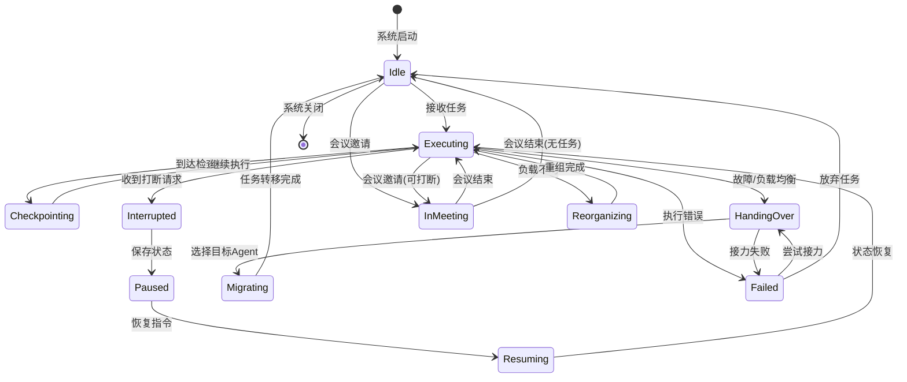

# Agent集群高级协作机制设计

本目录包含Agent集群高级协作机制的完整设计文档和伪代码实现。

## 文档清单

### 1. 核心设计文档
| 文件 | 描述 |
|------|------|
| `协作机制设计.md` | 四种协作机制的完整设计文档，包含协议定义、状态图、配置示例 |

### 2. 伪代码实现
| 文件 | 描述 |
|------|------|
| `可打断机制_伪代码.py` | Checkpoint + 暂停/恢复机制 |
| `接力机制_伪代码.py` | 故障时任务移交机制 |
| `动态重组机制_伪代码.py` | 负载均衡与扩缩容机制 |
| `Agent开会机制_伪代码.py` | 定期协调与共识机制 |
| `协作机制综合集成.py` | 所有机制的集成编排器 |

## 四种核心协作机制

### 1. 可打断机制 (Interruptible Mechanism)

**功能**：支持任务的优雅暂停、状态保存与恢复

**核心组件**：
- `Checkpoint` - 状态检查点
- `InterruptRequest/Response` - 打断请求/响应
- `InterruptibleAgent` - 支持打断的Agent基类
- `InterruptManager` - 集中式打断管理器

**使用场景**：
- 高优先级任务抢占
- 资源回收
- 用户主动干预
- 系统维护

---

### 2. 接力机制 (Handover Mechanism)

**功能**：故障时的任务无缝移交

**核心组件**：
- `HandoverContext` - 接力上下文
- `HandoverManager` - 接力管理器
- `HealthMonitor` - 健康监控
- `HandoverStrategy` - 接力策略（故障恢复、计划维护）

**使用场景**：
- Agent故障恢复
- 负载均衡迁移
- 计划维护
- 扩容时的任务重分配

---

### 3. 动态重组机制 (Dynamic Reorganization)

**功能**：基于负载指标的自动扩缩容和任务再平衡

**核心组件**：
- `DynamicReorganizer` - 动态重组管理器
- `MetricsCollector` - 指标收集器
- `RebalancingDecisionEngine` - 再平衡决策引擎
- `ReorganizationExecutor` - 重组执行器

**使用场景**：
- 负载过高时自动扩容
- 负载过低时自动缩容
- 负载不均时任务迁移
- 资源优化

---

### 4. Agent开会机制 (Agent Meeting)

**功能**：定期协调与冲突解决

**核心组件**：
- `MeetingCoordinator` - 会议协调器
- `ConflictDetector` - 冲突检测器
- `Consensus` - 共识机制
- `Meeting` - 会议管理

**使用场景**：
- 定期状态同步
- 决策分歧协调
- 资源竞争仲裁
- 紧急会议

---

## 协议分层架构

```
┌─────────────────────────────────────┐
│ Layer 4: 会议与协调 (Meeting)          │
├─────────────────────────────────────┤
│ Layer 3: 动态重组 (Reorganization)    │
├─────────────────────────────────────┤
│ Layer 2: 接力与恢复 (Handover)         │
├─────────────────────────────────────┤
│ Layer 1: 可打断性 (Interruptibility)   │
├─────────────────────────────────────┤
│ Layer 0: 消息总线 (Message Bus)        │
└─────────────────────────────────────┘
```

## 快速开始

### 启动完整协作系统

```python
import asyncio
from collaboration_orchestrator import CollaborationOrchestrator
from cluster_manager import ClusterManager

# 创建集群
cluster = ClusterManager()

# 添加Agent
for i in range(3):
    cluster.agents[f"agent_{i}"] = Agent(f"agent_{i}")

# 创建并启动编排器
orchestrator = CollaborationOrchestrator(cluster)
await orchestrator.start()

# 系统运行中...
await asyncio.sleep(60)

# 停止
await orchestrator.stop()
```

### 请求任务打断

```python
response = await orchestrator.interrupt_manager.request_interrupt(
    task_id="task_001",
    agent_id="agent_0",
    reason="PRIORITY_PREEMPTION",
    priority=95,
    graceful=True
)

if response.accepted:
    # 任务已被打断，保存checkpoint
    print(f"Task paused at checkpoint: {response.checkpoint_id}")
```

### 从checkpoint恢复

```python
result = await orchestrator.interrupt_manager.resume_task(
    checkpoint_id="checkpoint_123",
    agent_id="agent_0"
)
```

### 召开紧急会议

```python
meeting = await orchestrator.meeting_coordinator.emergency_meeting(
    topic="Critical decision needed",
    involved_agents=["agent_0", "agent_1", "agent_2"],
    context={"issue": "resource_contention"}
)
```

## 配置示例

```yaml
# collaboration_config.yaml
collaboration:
  # 可打断机制配置
  interruptibility:
    checkpoint_interval_seconds: 30
    max_checkpoints_per_task: 10
    auto_cleanup_old_checkpoints: true
    
  # 接力机制配置
  handover:
    health_check_interval_seconds: 5
    heartbeat_timeout_seconds: 15
    handover_timeout_seconds: 60
    max_retry_attempts: 3
    
  # 动态重组配置
  reorganization:
    metrics_collection_interval_seconds: 10
    rebalancing_interval_seconds: 30
    scale_out_threshold: 0.8
    scale_in_threshold: 0.2
    cooldown_seconds: 60
    
  # 会议机制配置
  meeting:
    sync_interval_seconds: 300
    min_participants: 2
    max_meeting_duration_seconds: 600
    consensus_threshold: 0.67
```

## 系统状态图



## 统计指标

编排器提供以下统计信息：

```python
stats = orchestrator.get_comprehensive_stats()

# 输出示例:
{
    "orchestration": {
        "situations_handled": 15,
        "interrupts_triggered": 3,
        "handovers_executed": 2,
        "reorganizations": 5,
        "meetings_scheduled": 8
    },
    "interrupts": [...],
    "handovers": {
        "total_handovers": 10,
        "successful": 9,
        "failed": 1,
        "success_rate": 0.9,
        "avg_recovery_time_seconds": 2.5
    },
    "reorganizations": {
        "total_reorganizations": 5,
        "successful_reorganizations": 5,
        "current_agent_count": 6
    },
    "meetings": {
        "total_meetings": 12,
        "completed": 11,
        "active": 1,
        "success_rate": 0.92,
        "avg_duration_seconds": 180
    }
}
```

## 注意事项

1. **线程安全**：所有组件都使用asyncio进行并发控制
2. **状态一致性**：通过消息总线确保各子系统状态同步
3. **故障处理**：级联故障有专门的紧急处理流程
4. **性能**：指标收集和决策计算都有缓存和批处理优化
