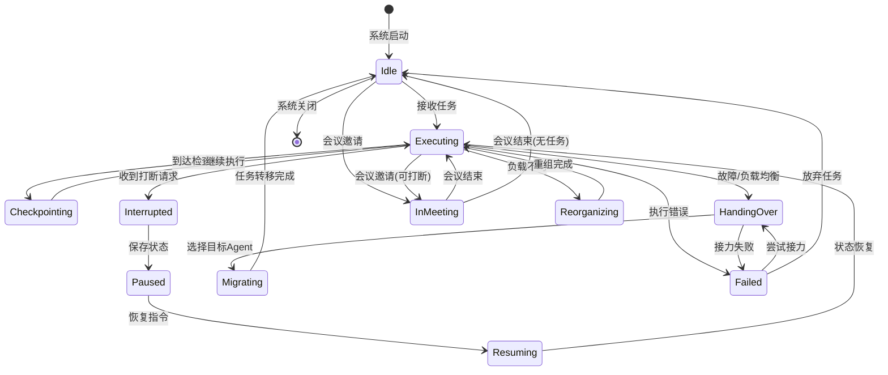

# Agent集群高级协作机制设计文档

## 1. 概述

本文档定义Agent集群的高级协作机制，包含四个核心子系统：
- **可打断机制 (Interruptible Mechanism)**：支持任务暂停、状态保存与恢复
- **接力机制 (Handover Mechanism)**：故障检测与任务无缝移交
- **动态重组机制 (Dynamic Reorganization)**：负载均衡与集群自适应
- **Agent开会机制 (Agent Meeting)**：定期协调与决策同步

---

## 2. 可打断机制 (Checkpoint + 暂停/恢复)

### 2.1 核心概念

```
┌─────────────────────────────────────────────────────────────┐
│                    可打断任务生命周期                         │
├─────────────────────────────────────────────────────────────┤
│  RUNNING ──► PAUSED ──► CHECKPOINT_SAVED ──► RESUMED       │
│     │          │            │                 │              │
│     ▼          ▼            ▼                 ▼              │
│  ┌─────┐   ┌─────┐     ┌─────────┐      ┌─────────┐         │
│  │执行 │   │保存 │     │ 持久化  │      │ 状态恢复 │         │
│  │计算 │   │状态 │     │ 到存储  │      │ 继续执行 │         │
│  └─────┘   └─────┘     └─────────┘      └─────────┘         │
│     │          │            │                 │              │
│     ▼          ▼            ▼                 ▼              │
│  INTERRUPT   SAVE_STATE   PERSIST        LOAD_STATE         │
└─────────────────────────────────────────────────────────────┘
```

### 2.2 协议定义

```protobuf
message Checkpoint {
  string checkpoint_id = 1;
  string task_id = 2;
  string agent_id = 3;
  int64 timestamp = 4;
  TaskState state = 5;
  bytes state_data = 6;        // 序列化的Agent状态
  map<string, string> metadata = 7;
  int64 sequence_number = 8;   // 单调递增版本号
}

message InterruptRequest {
  string task_id = 1;
  InterruptReason reason = 2;
  int32 priority = 3;          // 打断优先级 (0-100)
  bool graceful = 4;           // 是否优雅打断
  int32 timeout_ms = 5;        // 等待超时
}

enum InterruptReason {
  PRIORITY_PREEMPTION = 0;     // 高优先级任务抢占
  RESOURCE_RECLAIM = 1;        // 资源回收
  USER_REQUEST = 2;            // 用户主动请求
  SYSTEM_MAINTENANCE = 3;      // 系统维护
  DEPENDENCY_WAIT = 4;         // 等待依赖
}

message InterruptResponse {
  string task_id = 1;
  bool accepted = 2;
  string checkpoint_id = 3;
  int64 estimated_resume_time = 4;
  string rejection_reason = 5;
}
```

### 2.3 伪代码实现

```python
class InterruptibleAgent(BaseAgent):
    """支持可打断执行的Agent基类"""
    
    def __init__(self, agent_id: str, checkpoint_store: CheckpointStore):
        super().__init__(agent_id)
        self.checkpoint_store = checkpoint_store
        self.current_task: Optional[Task] = None
        self.interruptible_points: List[str] = []  # 安全打断点
        self.state_lock = asyncio.Lock()
        self.interrupt_event = asyncio.Event()
        self._sequence_number = 0
        
    async def execute_with_interruptibility(
        self, 
        task: Task,
        interruptible_callback: Optional[Callable] = None
    ) -> TaskResult:
        """支持打断的任务执行入口"""
        self.current_task = task
        task.state = TaskState.RUNNING
        
        try:
            # 创建初始checkpoint
            await self._create_checkpoint("init")
            
            # 分阶段执行，每个阶段检查打断信号
            for phase in self._get_execution_phases(task):
                # 检查是否收到打断请求
                if await self._should_interrupt():
                    return await self._handle_interrupt(phase)
                
                # 标记当前安全打断点
                await self._mark_interruptible_point(phase.id)
                
                # 执行阶段
                phase_result = await self._execute_phase(phase)
                
                # 阶段完成，创建checkpoint
                await self._create_checkpoint(f"phase_{phase.id}")
                
            return TaskResult(success=True, data=phase_result)
            
        except InterruptedException:
            return await self._handle_emergency_stop()
        finally:
            self.current_task = None
    
    async def _create_checkpoint(self, label: str) -> Checkpoint:
        """创建状态检查点"""
        async with self.state_lock:
            self._sequence_number += 1
            
            checkpoint = Checkpoint(
                checkpoint_id=f"{self.agent_id}_{self.current_task.id}_{int(time.time())}",
                task_id=self.current_task.id,
                agent_id=self.agent_id,
                timestamp=time.time(),
                state=self.current_task.state,
                state_data=self._serialize_state(),
                metadata={
                    "label": label,
                    "memory_usage": self._get_memory_usage(),
                    "progress": self._get_progress()
                },
                sequence_number=self._sequence_number
            )
            
            # 异步持久化
            await self.checkpoint_store.save(checkpoint)
            
            # 更新任务checkpoint历史
            self.current_task.checkpoint_history.append(checkpoint.checkpoint_id)
            
            return checkpoint
    
    async def handle_interrupt_request(
        self, 
        request: InterruptRequest
    ) -> InterruptResponse:
        """处理打断请求"""
        
        # 评估打断可行性
        can_interrupt = await self._evaluate_interruptibility(request)
        
        if not can_interrupt:
            return InterruptResponse(
                task_id=request.task_id,
                accepted=False,
                rejection_reason="当前不在安全打断点"
            )
        
        # 设置打断信号
        self.interrupt_event.set()
        
        # 等待当前阶段完成（优雅模式）或直接打断
        if request.graceful:
            try:
                await asyncio.wait_for(
                    self._wait_for_safe_point(),
                    timeout=request.timeout_ms / 1000
                )
            except asyncio.TimeoutError:
                # 超时后强制打断
                pass
        
        # 创建紧急checkpoint
        checkpoint = await self._create_checkpoint("interrupt")
        
        # 暂停任务
        self.current_task.state = TaskState.PAUSED
        
        return InterruptResponse(
            task_id=request.task_id,
            accepted=True,
            checkpoint_id=checkpoint.checkpoint_id,
            estimated_resume_time=self._estimate_resume_time()
        )
    
    async def resume_from_checkpoint(self, checkpoint_id: str) -> TaskResult:
        """从checkpoint恢复执行"""
        # 加载checkpoint
        checkpoint = await self.checkpoint_store.load(checkpoint_id)
        
        # 恢复状态
        await self._deserialize_state(checkpoint.state_data)
        
        # 恢复任务上下文
        self.current_task = await self._restore_task_context(checkpoint.task_id)
        self.current_task.state = TaskState.RESUMING
        self._sequence_number = checkpoint.sequence_number
        
        # 找到恢复点继续执行
        resume_phase = self._find_resume_phase(checkpoint.metadata["label"])
        
        # 重置打断信号
        self.interrupt_event.clear()
        
        # 继续执行
        return await self.execute_with_interruptibility(
            self.current_task,
            start_from=resume_phase
        )
    
    def _serialize_state(self) -> bytes:
        """序列化当前状态"""
        state = {
            "agent_context": self.context,
            "task_variables": self.current_task.variables if self.current_task else {},
            "intermediate_results": self._get_intermediate_results(),
            "conversation_history": self._get_conversation_history(),
            "model_state": self._get_model_state(),
        }
        return pickle.dumps(state)
    
    async def _evaluate_interruptibility(self, request: InterruptRequest) -> bool:
        """评估是否可以被打断"""
        if not self.current_task:
            return False
        
        # 检查当前是否在安全打断点
        if self._is_at_interruptible_point():
            return True
        
        # 高优先级可以强制打断
        if request.priority >= 90:
            return True
        
        # 检查是否处于可中断操作
        if self._is_in_interruptible_operation():
            return True
        
        return False
```

### 2.4 打断策略矩阵

| 打断原因 | 优先级 | 优雅等待 | 强制打断条件 |
|---------|-------|---------|-------------|
| 用户主动请求 | 100 | 是 | 超时30秒 |
| 高优先级抢占 | 95 | 是 | 超时10秒 |
| 资源回收 | 80 | 是 | 超时60秒 |
| 系统维护 | 70 | 是 | 窗口期结束 |
| 依赖等待 | 50 | 否 | 立即执行 |

---

## 3. 接力机制 (故障时任务移交)

### 3.1 核心概念

```
┌─────────────────────────────────────────────────────────────┐
│                     接力机制架构                             │
├─────────────────────────────────────────────────────────────┤
│                                                              │
│  Agent A (主)          健康检查          Agent B (备)      │
│  ┌─────────┐           ┌───────┐         ┌─────────┐       │
│  │EXECUTING│◄─────────►│HEALTH │◄───────►│STANDBY  │       │
│  │  TASK   │   心跳    │CHECK  │  同步    │  READY  │       │
│  └────┬────┘           └───┬───┘         └────┬────┘       │
│       │                     │                  │            │
│       ▼                     ▼                  ▼            │
│  ┌─────────┐           ┌─────────┐        ┌─────────┐       │
│  │ FAILURE │──────────►│ HANDOVER│───────►│ TAKEOVER│       │
│  │DETECTED │  故障通知  │ PROTOCOL│ 激活   │  TASK   │       │
│  └─────────┘           └─────────┘        └─────────┘       │
│                                                              │
│  接力模式:                                                   │
│  1. 热备模式 (Hot-Standby): 实时状态同步                     │
│  2. 温备模式 (Warm-Standby): 定期checkpoint同步               │
│  3. 冷备模式 (Cold-Standby): 故障后从checkpoint恢复         │
└─────────────────────────────────────────────────────────────┘
```

### 3.2 协议定义

```protobuf
message HandoverProtocol {
  string handover_id = 1;
  string task_id = 2;
  string from_agent = 3;
  string to_agent = 4;
  HandoverType type = 5;
  int64 timestamp = 6;
  TaskStateSnapshot snapshot = 7;
  repeated string sync_messages = 8;
}

message TaskStateSnapshot {
  string task_id = 1;
  string checkpoint_id = 2;
  TaskState state = 3;
  float progress = 4;           // 0.0 - 1.0
  map<string, string> context = 5;
  bytes partial_result = 6;
  repeated string pending_dependencies = 7;
}

enum HandoverType {
  FAILURE_RECOVERY = 0;        // 故障恢复
  LOAD_BALANCING = 1;          // 负载均衡
  MAINTENANCE = 2;             // 计划维护
  SCALE_UP = 3;                // 扩容
}

message HealthStatus {
  string agent_id = 1;
  int64 timestamp = 2;
  AgentHealth health = 3;
  float cpu_usage = 4;
  float memory_usage = 5;
  int32 active_tasks = 6;
  int64 last_heartbeat = 7;
  map<string, string> diagnostics = 8;
}

enum AgentHealth {
  HEALTHY = 0;
  DEGRADED = 1;               // 性能下降
  OVERLOADED = 2;             // 过载
  UNRESPONSIVE = 3;           // 无响应
  FAILED = 4;
}
```

### 3.3 伪代码实现

```python
class HandoverManager:
    """任务接力管理器"""
    
    def __init__(self, cluster_manager: ClusterManager):
        self.cluster = cluster_manager
        self.health_monitor = HealthMonitor()
        self.handover_strategies: Dict[HandoverType, HandoverStrategy] = {
            HandoverType.FAILURE_RECOVERY: FailureRecoveryStrategy(),
            HandoverType.LOAD_BALANCING: LoadBalancingStrategy(),
            HandoverType.MAINTENANCE: PlannedHandoverStrategy(),
            HandoverType.SCALE_UP: ScaleUpStrategy(),
        }
        self.active_handovers: Dict[str, HandoverContext] = {}
        
    async def start(self):
        """启动接力管理器"""
        # 启动健康检查
        asyncio.create_task(self._health_check_loop())
        # 启动故障检测
        asyncio.create_task(self._failure_detection_loop())
    
    async def _health_check_loop(self):
        """定期健康检查"""
        while True:
            for agent in self.cluster.get_all_agents():
                health = await self._check_agent_health(agent)
                await self._update_health_status(agent, health)
            
            await asyncio.sleep(5)  # 5秒间隔
    
    async def _failure_detection_loop(self):
        """故障检测循环"""
        while True:
            failed_agents = self._detect_failures()
            
            for agent in failed_agents:
                await self._handle_agent_failure(agent)
            
            await asyncio.sleep(1)  # 1秒间隔快速检测
    
    async def _handle_agent_failure(self, failed_agent: Agent):
        """处理Agent故障"""
        logger.critical(f"Agent {failed_agent.id} failure detected")
        
        # 获取故障Agent上的所有任务
        affected_tasks = failed_agent.get_active_tasks()
        
        for task in affected_tasks:
            # 为每个任务触发接力流程
            asyncio.create_task(
                self.initiate_handover(
                    task_id=task.id,
                    from_agent=failed_agent.id,
                    handover_type=HandoverType.FAILURE_RECOVERY
                )
            )
    
    async def initiate_handover(
        self,
        task_id: str,
        from_agent: str,
        handover_type: HandoverType,
        preferred_target: Optional[str] = None
    ) -> HandoverResult:
        """启动任务接力"""
        
        handover_id = f"ho_{uuid.uuid4().hex[:8]}"
        
        # 1. 获取源Agent当前状态快照
        snapshot = await self._capture_task_snapshot(task_id, from_agent)
        
        # 2. 选择目标Agent
        if preferred_target:
            target_agent = preferred_target
        else:
            target_agent = await self._select_target_agent(
                handover_type, 
                from_agent,
                task_id
            )
        
        # 3. 创建接力上下文
        context = HandoverContext(
            handover_id=handover_id,
            task_id=task_id,
            from_agent=from_agent,
            to_agent=target_agent,
            type=handover_type,
            snapshot=snapshot,
            start_time=time.time()
        )
        self.active_handovers[handover_id] = context
        
        try:
            # 4. 执行接力策略
            strategy = self.handover_strategies[handover_type]
            result = await strategy.execute(context)
            
            context.status = HandoverStatus.COMPLETED
            context.completion_time = time.time()
            
            return HandoverResult(
                success=True,
                handover_id=handover_id,
                new_agent=target_agent,
                recovery_time=context.completion_time - context.start_time
            )
            
        except Exception as e:
            context.status = HandoverStatus.FAILED
            context.error = str(e)
            
            # 尝试备选接力方案
            return await self._fallback_handover(context)
    
    async def _capture_task_snapshot(
        self, 
        task_id: str, 
        agent_id: str
    ) -> TaskStateSnapshot:
        """捕获任务状态快照"""
        agent = self.cluster.get_agent(agent_id)
        
        try:
            # 尝试从Agent获取实时状态
            snapshot = await agent.get_task_snapshot(task_id)
            return snapshot
        except Exception:
            # Agent无响应，从最近的checkpoint恢复
            return await self._recover_from_checkpoint(task_id)
    
    async def _select_target_agent(
        self,
        handover_type: HandoverType,
        exclude_agent: str,
        task_id: str
    ) -> str:
        """选择目标Agent"""
        
        # 获取可用Agent列表
        available = [
            a for a in self.cluster.get_healthy_agents()
            if a.id != exclude_agent
        ]
        
        if not available:
            raise NoAvailableAgentError("没有可用的Agent进行接力")
        
        # 根据任务需求筛选
        task = self.cluster.get_task(task_id)
        suitable = [
            a for a in available
            if a.capabilities.matches(task.requirements)
        ]
        
        # 按负载排序，选择负载最低的
        scored = [
            (a, self._calculate_suitability_score(a, task))
            for a in suitable
        ]
        scored.sort(key=lambda x: x[1], reverse=True)
        
        return scored[0][0].id
    
    def _calculate_suitability_score(
        self, 
        agent: Agent, 
        task: Task
    ) -> float:
        """计算Agent suitability score"""
        scores = []
        
        # 负载权重 (40%)
        load_score = 1.0 - (agent.active_tasks / agent.max_tasks)
        scores.append((load_score, 0.4))
        
        # 资源权重 (30%)
        resource_score = 1.0 - max(agent.cpu_usage, agent.memory_usage)
        scores.append((resource_score, 0.3))
        
        # 能力匹配权重 (20%)
        capability_score = agent.capabilities.match_score(task.requirements)
        scores.append((capability_score, 0.2))
        
        # 历史成功率权重 (10%)
        history_score = agent.get_task_success_rate(task.type)
        scores.append((history_score, 0.1))
        
        return sum(s * w for s, w in scores)


class FailureRecoveryStrategy(HandoverStrategy):
    """故障恢复接力策略"""
    
    async def execute(self, context: HandoverContext) -> HandoverResult:
        """执行故障恢复接力"""
        
        # 1. 锁定任务，防止重复接力
        await self._lock_task(context.task_id)
        
        try:
            # 2. 准备状态转移
            transfer_data = await self._prepare_state_transfer(context)
            
            # 3. 通知目标Agent准备接收
            target_agent = self.cluster.get_agent(context.to_agent)
            ready = await target_agent.prepare_for_handover(
                context.task_id,
                transfer_data
            )
            
            if not ready:
                raise HandoverPreparationError("目标Agent准备失败")
            
            # 4. 执行状态转移
            await self._transfer_state(context, transfer_data)
            
            # 5. 激活任务在新Agent上
            result = await target_agent.activate_task(
                context.task_id,
                context.snapshot
            )
            
            # 6. 更新集群状态
            await self.cluster.update_task_assignment(
                context.task_id,
                from_agent=context.from_agent,
                to_agent=context.to_agent
            )
            
            return result
            
        finally:
            await self._unlock_task(context.task_id)
    
    async def _prepare_state_transfer(
        self, 
        context: HandoverContext
    ) -> StateTransferData:
        """准备状态转移数据"""
        
        snapshot = context.snapshot
        
        # 收集需要转移的所有状态
        transfer_data = StateTransferData(
            checkpoint_id=snapshot.checkpoint_id,
            task_context=snapshot.context,
            partial_results=snapshot.partial_result,
            conversation_log=await self._get_conversation_log(context.task_id),
            intermediate_files=await self._collect_intermediate_files(context.task_id),
            memory_state=snapshot.get("memory_state", {})
        )
        
        # 序列化并压缩
        transfer_data.payload = self._serialize_and_compress(transfer_data)
        
        return transfer_data
```

---

## 4. 动态重组机制 (负载均衡)

### 4.1 核心概念

```
┌─────────────────────────────────────────────────────────────┐
│                   动态重组机制                               │
├─────────────────────────────────────────────────────────────┤
│                                                              │
│   监控层        决策层         执行层         验证层          │
│  ┌──────┐    ┌──────┐      ┌──────┐      ┌──────┐          │
│  │Metric│───►│Policy│─────►│Action│─────►│Verify│          │
│  │Collect    │Decision      │Execute      │Result│          │
│  └──┬───┘    └──────┘      └──────┘      └──────┘          │
│     │                                                        │
│     ▼                                                        │
│  ┌─────────────────────────────────────────┐                 │
│  │ 负载指标 (Load Metrics)                  │                 │
│  │  • CPU/Memory/GPU 使用率                  │                 │
│  │  • 任务队列深度                           │                 │
│  │  • 响应延迟分布                           │                 │
│  │  • 错误率趋势                             │                 │
│  └─────────────────────────────────────────┘                 │
│                                                              │
│  重组动作类型:                                               │
│  ┌─────────┐ ┌─────────┐ ┌─────────┐ ┌─────────┐            │
│  │SCALE_OUT│ │SCALE_IN │ │REBALANCE│ │MIGRATE  │            │
│  │ 扩容    │ │ 缩容    │ │ 再平衡  │ │ 迁移    │            │
│  └─────────┘ └─────────┘ └─────────┘ └─────────┘            │
└─────────────────────────────────────────────────────────────┘
```

### 4.2 协议定义

```protobuf
message ReorganizationPlan {
  string plan_id = 1;
  ReorganizationType type = 2;
  int64 timestamp = 3;
  repeated MigrationAction migrations = 4;
  ScaleAction scale_action = 5;
  map<string, string> config = 6;
}

message MigrationAction {
  string task_id = 1;
  string from_agent = 2;
  string to_agent = 3;
  MigrationPriority priority = 4;
  int64 estimated_duration_ms = 5;
  bytes state_snapshot = 6;
}

message ScaleAction {
  ScaleDirection direction = 1;
  int32 target_count = 2;
  AgentProfile agent_profile = 3;
  repeated string preferred_zones = 4;
}

message LoadMetrics {
  string agent_id = 1;
  int64 timestamp = 2;
  float cpu_percent = 3;
  float memory_percent = 4;
  float gpu_utilization = 5;
  int32 task_queue_depth = 6;
  float avg_response_time_ms = 7;
  float error_rate = 8;
  map<string, float> custom_metrics = 9;
}

message RebalancingDecision {
  string decision_id = 1;
  DecisionTrigger trigger = 2;
  float imbalance_score = 3;    // 0.0-1.0, 越高越不平衡
  repeated string overloaded_agents = 4;
  repeated string underloaded_agents = 5;
  repeated MigrationAction recommended_moves = 6;
}
```

### 4.3 伪代码实现

```python
class DynamicReorganizer:
    """动态重组管理器"""
    
    def __init__(self, cluster_manager: ClusterManager):
        self.cluster = cluster_manager
        self.metrics_collector = MetricsCollector()
        self.decision_engine = RebalancingDecisionEngine()
        self.executor = ReorganizationExecutor()
        
        # 阈值配置
        self.thresholds = {
            "cpu_high": 80.0,
            "cpu_low": 20.0,
            "memory_high": 85.0,
            "memory_low": 25.0,
            "queue_depth_high": 10,
            "imbalance_threshold": 0.3,
        }
        
        # 冷却时间
        self.last_reorganization = 0
        self.cooldown_seconds = 60
        
    async def start(self):
        """启动动态重组监控"""
        asyncio.create_task(self._monitoring_loop())
        asyncio.create_task(self._rebalancing_loop())
    
    async def _monitoring_loop(self):
        """指标收集循环"""
        while True:
            metrics = await self.metrics_collector.collect_all()
            
            # 存储历史指标
            await self._store_metrics(metrics)
            
            # 检测异常
            anomalies = self._detect_anomalies(metrics)
            for anomaly in anomalies:
                await self._handle_anomaly(anomaly)
            
            await asyncio.sleep(10)  # 10秒收集间隔
    
    async def _rebalancing_loop(self):
        """再平衡决策循环"""
        while True:
            # 检查冷却时间
            if time.time() - self.last_reorganization < self.cooldown_seconds:
                await asyncio.sleep(5)
                continue
            
            # 获取当前负载分布
            load_distribution = await self._analyze_load_distribution()
            
            # 计算不平衡分数
            imbalance_score = self._calculate_imbalance(load_distribution)
            
            if imbalance_score > self.thresholds["imbalance_threshold"]:
                # 触发再平衡
                decision = await self.decision_engine.generate_decision(
                    load_distribution,
                    imbalance_score
                )
                
                if decision.recommended_moves:
                    await self._execute_rebalancing(decision)
            
            await asyncio.sleep(30)  # 30秒决策间隔
    
    def _calculate_imbalance(
        self, 
        distribution: LoadDistribution
    ) -> float:
        """计算集群不平衡分数"""
        
        loads = [a.load_score for a in distribution.agents]
        if not loads:
            return 0.0
        
        avg_load = sum(loads) / len(loads)
        
        # 计算方差系数 (CV)
        if avg_load == 0:
            return 0.0
        
        variance = sum((l - avg_load) ** 2 for l in loads) / len(loads)
        std_dev = variance ** 0.5
        cv = std_dev / avg_load
        
        # 考虑极值
        max_load = max(loads)
        min_load = min(loads)
        
        # 综合不平衡分数
        imbalance = (cv * 0.5) + ((max_load - min_load) / 100 * 0.5)
        
        return min(imbalance, 1.0)
    
    async def _execute_rebalancing(
        self, 
        decision: RebalancingDecision
    ):
        """执行再平衡决策"""
        
        logger.info(f"Executing rebalancing plan: {decision.decision_id}")
        
        # 创建重组计划
        plan = ReorganizationPlan(
            plan_id=f"reorg_{uuid.uuid4().hex[:8]}",
            type=ReorganizationType.REBALANCE,
            timestamp=time.time(),
            migrations=decision.recommended_moves
        )
        
        # 预验证
        valid, errors = await self._validate_plan(plan)
        if not valid:
            logger.error(f"Invalid rebalancing plan: {errors}")
            return
        
        # 执行迁移
        results = await self.executor.execute_migrations(
            plan.migrations,
            strategy=MigrationStrategy.GRADUAL
        )
        
        # 更新状态
        self.last_reorganization = time.time()
        
        # 记录结果
        await self._record_rebalancing_result(plan, results)
    
    async def scale_out(
        self, 
        target_count: int,
        reason: str = "auto"
    ) -> ScaleResult:
        """扩容操作"""
        
        current_count = len(self.cluster.get_all_agents())
        needed = target_count - current_count
        
        if needed <= 0:
            return ScaleResult(success=True, message="No scaling needed")
        
        logger.info(f"Scaling out: {current_count} -> {target_count}")
        
        # 创建新Agent实例
        new_agents = await self.cluster.create_agents(
            count=needed,
            profile=AgentProfile.STANDARD
        )
        
        # 等待新Agent就绪
        ready_agents = await self._wait_for_agents_ready(new_agents)
        
        # 重新分配部分任务以平衡负载
        await self._rebalance_to_new_agents(ready_agents)
        
        return ScaleResult(
            success=True,
            new_agents=[a.id for a in ready_agents],
            total_count=len(self.cluster.get_all_agents())
        )
    
    async def scale_in(self, target_count: int) -> ScaleResult:
        """缩容操作"""
        
        current_count = len(self.cluster.get_all_agents())
        to_remove = current_count - target_count
        
        if to_remove <= 0:
            return ScaleResult(success=True, message="No scaling needed")
        
        # 选择要移除的Agent（优先选择负载低的）
        candidates = sorted(
            self.cluster.get_all_agents(),
            key=lambda a: a.load_score
        )
        
        agents_to_remove = candidates[:to_remove]
        
        # 迁移这些Agent上的任务
        for agent in agents_to_remove:
            await self._migrate_all_tasks(agent)
        
        # 优雅关闭Agent
        for agent in agents_to_remove:
            await self.cluster.shutdown_agent(agent.id, graceful=True)
        
        return ScaleResult(
            success=True,
            removed_agents=[a.id for a in agents_to_remove],
            total_count=len(self.cluster.get_all_agents())
        )
    
    async def _migrate_all_tasks(self, agent: Agent):
        """迁移Agent上的所有任务"""
        
        tasks = agent.get_active_tasks()
        
        for task in tasks:
            # 找到合适的目标Agent
            target = await self._find_migration_target(task, exclude=agent.id)
            
            if target:
                # 使用接力机制迁移
                await self.cluster.handover_manager.initiate_handover(
                    task_id=task.id,
                    from_agent=agent.id,
                    handover_type=HandoverType.LOAD_BALANCING,
                    preferred_target=target
                )


class RebalancingDecisionEngine:
    """再平衡决策引擎"""
    
    def __init__(self):
        self.constraints = [
            MaxTaskConstraint(),
            CapabilityConstraint(),
            AffinityConstraint(),
        ]
    
    async def generate_decision(
        self,
        distribution: LoadDistribution,
        imbalance_score: float
    ) -> RebalancingDecision:
        """生成再平衡决策"""
        
        decision = RebalancingDecision(
            decision_id=f"dec_{uuid.uuid4().hex[:8]}",
            trigger=self._determine_trigger(distribution),
            imbalance_score=imbalance_score
        )
        
        # 分类Agent负载状态
        for agent in distribution.agents:
            if agent.load_score > 80:
                decision.overloaded_agents.append(agent.id)
            elif agent.load_score < 30:
                decision.underloaded_agents.append(agent.id)
        
        # 生成迁移建议
        migrations = await self._generate_migration_plan(
            decision.overloaded_agents,
            decision.underloaded_agents
        )
        
        # 应用约束验证
        valid_migrations = []
        for migration in migrations:
            if await self._validate_constraints(migration):
                valid_migrations.append(migration)
        
        decision.recommended_moves = valid_migrations
        
        return decision
    
    async def _generate_migration_plan(
        self,
        overloaded: List[str],
        underloaded: List[str]
    ) -> List[MigrationAction]:
        """生成迁移计划"""
        
        migrations = []
        
        # 简单的贪婪算法：从过载Agent向欠载Agent迁移任务
        for overloaded_agent in overloaded:
            agent = self.cluster.get_agent(overloaded_agent)
            tasks = agent.get_migratable_tasks()
            
            # 按优先级和可迁移性排序
            tasks.sort(key=lambda t: (t.priority, -t.migration_cost))
            
            for task in tasks:
                # 找到最佳目标
                best_target = await self._find_best_target(
                    task, 
                    underloaded,
                    exclude=overloaded_agent
                )
                
                if best_target:
                    migrations.append(MigrationAction(
                        task_id=task.id,
                        from_agent=overloaded_agent,
                        to_agent=best_target,
                        priority=task.priority,
                        estimated_duration_ms=task.estimated_migration_time
                    ))
                    
                    # 更新目标Agent的预期负载
                    self._update_expected_load(best_target, task)
                    
                    # 检查是否达到平衡
                    if self._is_load_acceptable(overloaded_agent):
                        break
        
        return migrations
```

---

## 5. Agent开会机制 (定期协调节点)

### 5.1 核心概念

```
┌─────────────────────────────────────────────────────────────┐
│                    Agent开会机制                            │
├─────────────────────────────────────────────────────────────┤
│                                                              │
│   会议触发条件                    会议类型                    │
│  ┌──────────────────┐          ┌──────────────────┐        │
│  │ • 定时触发         │          │ • 同步会议        │        │
│  │ • 事件触发         │          │ • 决策会议        │        │
│  │ • 冲突触发         │          │ • 协调会议        │        │
│  │ • 上级指派         │          │ • 紧急会议        │        │
│  └──────────────────┘          └──────────────────┘        │
│                                                              │
│   会议流程 (Consensus Protocol)                              │
│  ┌──────────┐   ┌──────────┐   ┌──────────┐   ┌──────────┐ │
│  │ 议题提出  │──►│ 观点收集  │──►│ 讨论协商  │──►│ 达成共识  │ │
│  │ PROPOSE  │   │  GATHER  │   │ DELIBER  │   │ CONSENSUS│ │
│  └──────────┘   └──────────┘   └──────────┘   └──────────┘ │
│       │              │              │              │           │
│       ▼              ▼              ▼              ▼           │
│  ┌──────────┐   ┌──────────┐   ┌──────────┐   ┌──────────┐ │
│  │主席Agent │   │各Agent发言│   │投票/协商 │   │决议形成  │ │
│  │协调议题  │   │表达观点  │   │寻求一致  │   │执行分配  │ │
│  └──────────┘   └──────────┘   └──────────┘   └──────────┘ │
│                                                              │
│   决议执行                                                    │
│  ┌─────────────────────────────────────────────────────┐   │
│  │ RESOLUTION ──► ASSIGN ──► EXECUTE ──► VERIFY ──► REPORT│ │
│  └─────────────────────────────────────────────────────┘   │
└─────────────────────────────────────────────────────────────┘
```

### 5.2 协议定义

```protobuf
message Meeting {
  string meeting_id = 1;
  MeetingType type = 2;
  MeetingStatus status = 3;
  string chair_agent = 4;           // 会议主席
  repeated string participants = 5; // 参与Agent列表
  int64 scheduled_time = 6;
  int64 start_time = 7;
  int64 end_time = 8;
  repeated AgendaItem agenda = 9;
  MeetingResult result = 10;
}

message AgendaItem {
  string item_id = 1;
  string topic = 2;
  AgendaPriority priority = 3;
  string proposed_by = 4;
  int64 time_budget_ms = 5;
  bytes context_data = 6;
  repeated string related_tasks = 7;
}

message MeetingMessage {
  string meeting_id = 1;
  string from_agent = 2;
  MessageType msg_type = 3;
  string content = 4;
  int64 timestamp = 5;
  map<string, string> metadata = 6;
}

enum MessageType {
  PROPOSAL = 0;          // 提出建议
  OPINION = 1;           // 表达观点
  QUESTION = 2;          // 提出问题
  SUPPORT = 3;           // 支持
  OPPOSE = 4;            // 反对
  AMENDMENT = 5;         // 修正案
  VOTE = 6;              // 投票
  COMMIT = 7;            // 承诺执行
}

message Consensus {
  string consensus_id = 1;
  string meeting_id = 2;
  string topic = 3;
  ConsensusType type = 4;
  repeated string supporting_agents = 5;
  repeated string opposing_agents = 6;
  bytes resolution = 7;
  map<string, Commitment> commitments = 8;
}

message Commitment {
  string agent_id = 1;
  string task_id = 2;
  CommitmentType type = 3;
  int64 deadline = 4;
  string deliverable = 5;
}
```

### 5.3 伪代码实现

```python
class MeetingCoordinator:
    """会议协调器"""
    
    def __init__(self, cluster_manager: ClusterManager):
        self.cluster = cluster_manager
        self.active_meetings: Dict[str, Meeting] = {}
        self.meeting_history: List[Meeting] = []
        
        # 会议策略配置
        self.config = {
            "sync_interval_seconds": 300,      # 5分钟同步会议
            "conflict_meeting_timeout": 60,     # 冲突会议超时
            "min_participants": 2,
            "max_meeting_duration_seconds": 600, # 10分钟上限
        }
    
    async def start(self):
        """启动会议协调器"""
        # 启动定时同步会议
        asyncio.create_task(self._scheduled_sync_loop())
        # 启动冲突检测
        asyncio.create_task(self._conflict_detection_loop())
    
    async def _scheduled_sync_loop(self):
        """定时同步会议循环"""
        while True:
            await asyncio.sleep(self.config["sync_interval_seconds"])
            
            # 发起定期同步会议
            await self.schedule_meeting(
                MeetingType.SYNC,
                participants=self._select_sync_participants(),
                agenda=self._generate_sync_agenda()
            )
    
    async def _conflict_detection_loop(self):
        """冲突检测循环"""
        while True:
            await asyncio.sleep(10)
            
            # 检测Agent间的冲突
            conflicts = self._detect_conflicts()
            
            for conflict in conflicts:
                # 为每个冲突召开协调会议
                await self.schedule_meeting(
                    MeetingType.COORDINATION,
                    participants=conflict.involved_agents,
                    agenda=[conflict.to_agenda_item()],
                    priority=MeetingPriority.HIGH
                )
    
    async def schedule_meeting(
        self,
        meeting_type: MeetingType,
        participants: List[str],
        agenda: List[AgendaItem],
        priority: MeetingPriority = MeetingPriority.NORMAL,
        scheduled_time: Optional[int] = None
    ) -> Meeting:
        """调度会议"""
        
        meeting_id = f"mtg_{uuid.uuid4().hex[:8]}"
        
        # 选举会议主席（通常是负载最低或最资深的Agent）
        chair = await self._elect_chair(participants)
        
        meeting = Meeting(
            meeting_id=meeting_id,
            type=meeting_type,
            status=MeetingStatus.SCHEDULED,
            chair_agent=chair,
            participants=participants,
            scheduled_time=scheduled_time or time.time(),
            agenda=agenda
        )
        
        self.active_meetings[meeting_id] = meeting
        
        # 通知参与者
        await self._notify_participants(meeting)
        
        # 启动会议（如果是即时会议）
        if scheduled_time is None or scheduled_time <= time.time():
            asyncio.create_task(self._conduct_meeting(meeting))
        
        return meeting
    
    async def _conduct_meeting(self, meeting: Meeting):
        """主持进行会议"""
        
        meeting.status = MeetingStatus.IN_PROGRESS
        meeting.start_time = time.time()
        
        chair = self.cluster.get_agent(meeting.chair_agent)
        
        try:
            # 1. 开场与议题确认
            await chair.meeting_open(meeting)
            
            # 2. 逐个处理议题
            for item in meeting.agenda:
                # 检查会议是否超时
                if self._is_meeting_overtime(meeting):
                    await chair.meeting_adjourn(meeting, "timeout")
                    break
                
                # 处理议题
                resolution = await self._deliberate_item(meeting, item)
                
                if resolution:
                    meeting.result.resolutions.append(resolution)
            
            # 3. 形成共识
            consensus = await self._reach_consensus(meeting)
            meeting.result.consensus = consensus
            
            # 4. 分配执行承诺
            if consensus:
                await self._assign_commitments(meeting, consensus)
            
            meeting.status = MeetingStatus.COMPLETED
            meeting.end_time = time.time()
            
        except Exception as e:
            meeting.status = MeetingStatus.FAILED
            meeting.result.error = str(e)
            
        finally:
            # 归档会议记录
            self.meeting_history.append(meeting)
            del self.active_meetings[meeting.meeting_id]
            
            # 通知结果
            await self._notify_meeting_result(meeting)
    
    async def _deliberate_item(
        self, 
        meeting: Meeting, 
        item: AgendaItem
    ) -> Optional[Resolution]:
        """协商单个议题"""
        
        messages = []
        
        # 收集各Agent观点
        for agent_id in meeting.participants:
            agent = self.cluster.get_agent(agent_id)
            
            opinion = await agent.provide_opinion(meeting.meeting_id, item)
            messages.append(MeetingMessage(
                meeting_id=meeting.meeting_id,
                from_agent=agent_id,
                msg_type=MessageType.OPINION,
                content=opinion
            ))
        
        # 主席主持讨论
        chair = self.cluster.get_agent(meeting.chair_agent)
        
        # 尝试达成共识
        resolution = await chair.facilitate_consensus(
            meeting.meeting_id,
            item,
            messages
        )
        
        if resolution:
            # 投票确认
            votes = await self._collect_votes(meeting, resolution)
            
            if self._is_majority_approval(votes, meeting.participants):
                return resolution
        
        # 未能达成共识，记录分歧
        await self._record_disagreement(meeting, item, messages)
        return None
    
    async def _reach_consensus(self, meeting: Meeting) -> Optional[Consensus]:
        """尝试形成整体共识"""
        
        if not meeting.result.resolutions:
            return None
        
        # 汇总所有决议
        consensus = Consensus(
            consensus_id=f"cons_{uuid.uuid4().hex[:8]}",
            meeting_id=meeting.meeting_id,
            type=ConsensusType.COOPERATIVE
        )
        
        # 收集支持者和反对者
        for participant in meeting.participants:
            agent = self.cluster.get_agent(participant)
            stance = await agent.evaluate_consensus(meeting.result.resolutions)
            
            if stance == Stance.SUPPORT:
                consensus.supporting_agents.append(participant)
            elif stance == Stance.OPPOSE:
                consensus.opposing_agents.append(participant)
        
        # 检查是否达到共识阈值
        support_ratio = len(consensus.supporting_agents) / len(meeting.participants)
        
        if support_ratio >= 0.67:  # 2/3多数
            consensus.type = ConsensusType.STRONG
            return consensus
        elif support_ratio >= 0.5:
            consensus.type = ConsensusType.WEAK
            return consensus
        else:
            return None
    
    async def _assign_commitments(
        self, 
        meeting: Meeting, 
        consensus: Consensus
    ):
        """分配执行承诺"""
        
        for resolution in meeting.result.resolutions:
            # 为每个决议分配执行者
            assignees = await self._select_assignees(
                resolution,
                consensus.supporting_agents
            )
            
            for assignee in assignees:
                commitment = Commitment(
                    agent_id=assignee,
                    task_id=resolution.task_id,
                    type=CommitmentType.EXECUTE,
                    deadline=resolution.deadline,
                    deliverable=resolution.deliverable
                )
                
                consensus.commitments[assignee] = commitment
                
                # 通知Agent其承诺
                agent = self.cluster.get_agent(assignee)
                await agent.accept_commitment(commitment)


class ConflictDetector:
    """冲突检测器"""
    
    def detect_conflicts(self, cluster: ClusterManager) -> List[Conflict]:
        """检测集群中的冲突"""
        
        conflicts = []
        
        # 1. 资源竞争冲突
        resource_conflicts = self._detect_resource_conflicts(cluster)
        conflicts.extend(resource_conflicts)
        
        # 2. 决策分歧冲突
        decision_conflicts = self._detect_decision_conflicts(cluster)
        conflicts.extend(decision_conflicts)
        
        # 3. 优先级冲突
        priority_conflicts = self._detect_priority_conflicts(cluster)
        conflicts.extend(priority_conflicts)
        
        # 4. 数据一致性冲突
        data_conflicts = self._detect_data_conflicts(cluster)
        conflicts.extend(data_conflicts)
        
        return conflicts
    
    def _detect_resource_conflicts(
        self, 
        cluster: ClusterManager
    ) -> List[Conflict]:
        """检测资源竞争冲突"""
        
        conflicts = []
        resource_requests = cluster.get_pending_resource_requests()
        
        # 检测重叠的资源请求
        for i, req1 in enumerate(resource_requests):
            for req2 in resource_requests[i+1:]:
                if self._has_resource_overlap(req1, req2):
                    conflict = Conflict(
                        type=ConflictType.RESOURCE_CONTENTION,
                        involved_agents=[req1.agent_id, req2.agent_id],
                        contested_resource=req1.resource_type,
                        severity=ConflictSeverity.HIGH
                    )
                    conflicts.append(conflict)
        
        return conflicts
    
    def _detect_decision_conflicts(
        self, 
        cluster: ClusterManager
    ) -> List[Conflict]:
        """检测决策分歧"""
        
        conflicts = []
        
        # 获取最近的Agent决策
        recent_decisions = cluster.get_recent_decisions(minutes=5)
        
        # 分组检查矛盾决策
        grouped = self._group_by_subject(recent_decisions)
        
        for subject, decisions in grouped.items():
            if len(decisions) < 2:
                continue
            
            # 检查是否有矛盾
            contradictory = self._find_contradictory_decisions(decisions)
            
            for pair in contradictory:
                conflict = Conflict(
                    type=ConflictType.DECISION_DISAGREEMENT,
                    involved_agents=[d.agent_id for d in pair],
                    subject=subject,
                    contradictory_decisions=pair,
                    severity=ConflictSeverity.MEDIUM
                )
                conflicts.append(conflict)
        
        return conflicts
```

---

## 6. 综合协作协议

### 6.1 协议分层架构

```
┌─────────────────────────────────────────────────────────────┐
│                    协作协议分层架构                           │
├─────────────────────────────────────────────────────────────┤
│                                                              │
│  ┌─────────────────────────────────────────────────────┐   │
│  │ Layer 4: 应用层 (Meeting & Coordination)             │   │
│  │  • Agent会议协议                                       │   │
│  │  • 冲突解决协议                                        │   │
│  │  • 共识形成协议                                        │   │
│  └─────────────────────────────────────────────────────┘   │
│                          ▲                                   │
│  ┌─────────────────────────────────────────────────────┐   │
│  │ Layer 3: 重组层 (Reorganization)                      │   │
│  │  • 负载均衡协议                                        │   │
│  │  • 扩缩容协议                                          │   │
│  │  • 任务迁移协议                                        │   │
│  └─────────────────────────────────────────────────────┘   │
│                          ▲                                   │
│  ┌─────────────────────────────────────────────────────┐   │
│  │ Layer 2: 可靠层 (Handover & Recovery)                 │   │
│  │  • 故障检测协议                                        │   │
│  │  • 状态转移协议                                        │   │
│  │  • 接力执行协议                                        │   │
│  └─────────────────────────────────────────────────────┘   │
│                          ▲                                   │
│  ┌─────────────────────────────────────────────────────┐   │
│  │ Layer 1: 基础层 (Interruptibility)                    │   │
│  │  • Checkpoint协议                                      │   │
│  │  • 打断请求协议                                        │   │
│  │  • 状态恢复协议                                        │   │
│  └─────────────────────────────────────────────────────┘   │
│                          ▲                                   │
│  ┌─────────────────────────────────────────────────────┐   │
│  │ Layer 0: 传输层 (Message Bus)                        │   │
│  │  • 消息路由                                            │   │
│  │  • 可靠传输                                            │   │
│  │  • 广播/组播                                           │   │
│  └─────────────────────────────────────────────────────┘   │
│                                                              │
└─────────────────────────────────────────────────────────────┘
```

### 6.2 统一消息格式

```protobuf
message CollaborationMessage {
  string message_id = 1;
  CollaborationLayer layer = 2;
  string from_agent = 3;
  repeated string to_agents = 4;  // 空表示广播
  int64 timestamp = 5;
  int64 ttl_seconds = 6;
  
  oneof payload {
    // Layer 1: Interruptibility
    InterruptRequest interrupt_req = 10;
    InterruptResponse interrupt_resp = 11;
    CheckpointMessage checkpoint = 12;
    
    // Layer 2: Handover
    HandoverRequest handover_req = 20;
    HandoverResponse handover_resp = 21;
    HealthStatus health = 22;
    
    // Layer 3: Reorganization
    ReorganizationPlan reorg_plan = 30;
    MigrationRequest migration_req = 31;
    ScaleRequest scale_req = 32;
    LoadMetrics metrics = 33;
    
    // Layer 4: Meeting
    MeetingInvitation meeting_invite = 40;
    MeetingMessage meeting_msg = 41;
    ConsensusMessage consensus = 42;
    ConflictNotification conflict = 43;
  }
  
  map<string, string> trace_context = 50;
}

enum CollaborationLayer {
  INTERRUPTIBILITY = 1;
  HANDOVER = 2;
  REORGANIZATION = 3;
  MEETING = 4;
}
```

### 6.3 完整协作流程示例

```python
class CollaborationOrchestrator:
    """协作编排器 - 整合所有协作机制"""
    
    def __init__(self):
        self.interrupt_manager = InterruptibleAgentManager()
        self.handover_manager = HandoverManager()
        self.reorganizer = DynamicReorganizer()
        self.meeting_coordinator = MeetingCoordinator()
        self.message_bus = CollaborationMessageBus()
        
    async def start(self):
        """启动完整协作系统"""
        await self.interrupt_manager.start()
        await self.handover_manager.start()
        await self.reorganizer.start()
        await self.meeting_coordinator.start()
        await self.message_bus.start()
        
        # 启动综合协调循环
        asyncio.create_task(self._orchestration_loop())
    
    async def _orchestration_loop(self):
        """综合协调循环"""
        while True:
            # 1. 收集全局状态
            global_state = await self._collect_global_state()
            
            # 2. 检测需要协调的情况
            situations = self._detect_coordination_needs(global_state)
            
            for situation in situations:
                # 3. 根据情况类型选择合适的协作机制
                if situation.type == SituationType.HIGH_LOAD:
                    # 触发重组
                    await self.reorganizer.scale_out(
                        target_count=self._calculate_needed_capacity()
                    )
                    
                elif situation.type == SituationType.AGENT_FAILURE:
                    # 触发接力
                    await self.handover_manager.initiate_handover(
                        task_id=situation.task_id,
                        from_agent=situation.failed_agent,
                        handover_type=HandoverType.FAILURE_RECOVERY
                    )
                    
                elif situation.type == SituationType.PRIORITY_PREEMPTION:
                    # 触发打断
                    await self.interrupt_manager.request_interrupt(
                        task_id=situation.low_priority_task,
                        reason=InterruptReason.PRIORITY_PREEMPTION,
                        priority=95
                    )
                    
                elif situation.type == SituationType.CONFLICT:
                    # 召开会议
                    await self.meeting_coordinator.schedule_meeting(
                        MeetingType.COORDINATION,
                        participants=situation.involved_agents,
                        agenda=[situation.to_agenda()],
                        priority=MeetingPriority.HIGH
                    )
            
            await asyncio.sleep(5)
```

---

## 7. 系统状态图



---

## 8. 配置示例

```yaml
# collaboration_config.yaml
collaboration:
  # 可打断机制配置
  interruptibility:
    checkpoint_interval_seconds: 30
    max_checkpoints_per_task: 10
    auto_cleanup_old_checkpoints: true
    
  # 接力机制配置
  handover:
    health_check_interval_seconds: 5
    heartbeat_timeout_seconds: 15
    handover_timeout_seconds: 60
    max_retry_attempts: 3
    
  # 动态重组配置
  reorganization:
    metrics_collection_interval_seconds: 10
    rebalancing_interval_seconds: 30
    scale_out_threshold: 0.8
    scale_in_threshold: 0.2
    cooldown_seconds: 60
    
  # 会议机制配置
  meeting:
    sync_interval_seconds: 300
    min_participants: 2
    max_meeting_duration_seconds: 600
    consensus_threshold: 0.67
    enable_conflict_auto_detection: true
```

---

## 9. 总结

本文档设计了Agent集群的四种高级协作机制：

1. **可打断机制**：通过Checkpoint实现任务状态的保存与恢复，支持优雅和强制两种打断模式

2. **接力机制**：实现故障时的任务无缝移交，包含健康检测、状态快照和自动恢复

3. **动态重组机制**：基于负载指标的自动扩缩容和任务再平衡，保持集群高效运行

4. **Agent开会机制**：提供定期协调和冲突解决能力，通过共识协议确保集群决策一致性

这四个机制通过统一的消息协议和分层架构协同工作，构成完整的Agent集群协作系统。
