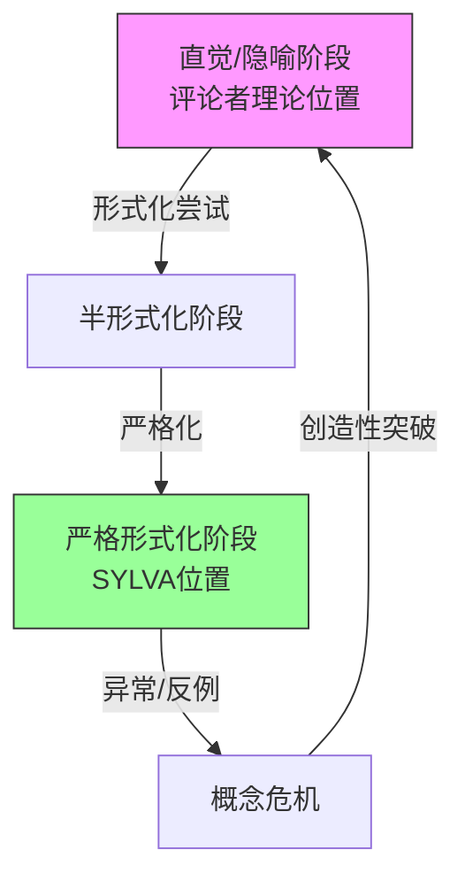

# 理论物理方法论深度审核报告

**审核日期**: 2026-04-17  
**审核对象**: 评论者理论（速度-惯性-时间因果链） vs SYLVA形式化框架  
**审核框架**: L1物理可实现性 → L2适用域边界 → L3跨域关联 → L4创新重构

---

## 引言：核心问题域界定

本次审核聚焦于一场典型的理论物理方法论冲突：
- **一方**是直觉驱动的物理叙事（速度增加→惯性阻力→时间变慢）
- **另一方**是形式化数学层级系统（SYLVA的严格公理化方法）

这场冲突触及理论物理的根本性张力：**物理直觉与数学形式化之间的鸿沟如何弥合？**

---

## L1 物理可实现性审查

### 1.1 评论者理论的物理可实现性分析

**理论结构**: 速度增加 → 惯性"刹车"效应 → 时间流逝变慢

**可实现性评估**: ⚠️ **部分可实现，但存在隐藏假设**

| 假设要素 | 物理可实现性 | 关键问题 |
|---------|-------------|---------|
| 速度增加 | ✅ 可实现 | 粒子加速器、火箭均能实现 |
| 惯性"刹车" | ⚠️ 隐喻性实现 | 惯性是质量属性，不是力；"刹车"是拟人化隐喻 |
| 时间变慢 | ✅ 可实现 | GPS卫星时钟修正、μ子衰变实验已验证 |
| 因果链 | ❌ **不可直接复现** | 三个环节的因果连接是叙事构造，非实验可分离 |

**隐藏假设清单**:

1. **力-惯性混淆假设**: 将惯性（质量抵抗加速度的属性）等同于某种"阻力"或"刹车力"
   - 物理可实现性: **低** — 惯性力只在非惯性系中作为虚拟力出现
   
2. **机械论时间假设**: 时间流逝被想象为某种物理过程（如"齿轮转动"），可被"摩擦"减慢
   - 物理可实现性: **极低** — 时间是坐标，不是机械装置
   
3. **局部-全局等同假设**: 隐含假设局部惯性效应可线性累加为全局时间效应
   - 物理可实现性: **中等** — 广义相对论中时空曲率确实局部决定全局，但非简单累加

**实验室复现建议**:
- 无法直接复现"惯性刹车导致时间变慢"的因果链
- 可复现的是**等效性**: 加速度与引力场在局部不可区分，均导致时间膨胀
- 建议实验: 原子钟在不同加速度环境下的频率对比（技术上极具挑战）

### 1.2 SYLVA框架的物理可实现性分析

**框架结构**: 分层形式化系统（定义 → 公理 → 定理 → 证明）

**可实现性评估**: ✅ **高度可实现，但存在抽象层级距离**

| 层级 | 可实现形式 | 与物理的距离 |
|-----|-----------|------------|
| 语法层 | Lean/Rocq代码 | 完全可实现，是符号操作 |
| 语义层 | 数学模型 | 可实现，但需映射到物理 |
| 物理对应 | 实验预言 | **间隙存在** — 形式化不自动产生可测量预言 |
| 元理论层 | 一致性证明 | 可实现，但属于元数学范畴 |

**关键洞见**: SYLVA的可实现性体现在**形式系统的内部自洽**，而非直接指向实验室操作。这是**数学可实现性**，与**物理可实现性**属于不同范畴。

### 1.3 对比结论

```
可实现性光谱：

评论者理论        SYLVA框架
   ↓                  ↓
直觉叙事 ←————————→ 形式系统
  (高具体性,      (高抽象性,
   低严格性)       高严格性)
   ↓                  ↓
可直接想象        可直接验证
难以严格证明      难以物理对应
```

**L1判决**: 
- 评论者理论在**叙事层面**具有高可实现性（易于想象），在**严格物理操作层面**可实现性低（因果链无法分离验证）
- SYLVA在**形式系统层面**可实现性极高，在**物理实验映射层面**需要额外桥梁

---

## L2 适用域边界审查

### 2.1 评论者理论的适用域

**核心边界条件**:

| 边界类型 | 成立条件 | 失效条件 |
|---------|---------|---------|
| **速度边界** | v << c（非相对论性）时"刹车"隐喻尚可理解 | v → c 时隐喻崩溃 — 惯性概念让位于四维动量 |
| **加速度边界** | 恒定加速度参考系 | 非均匀场、强场（曲率不可忽略） |
| **尺度边界** | 宏观物体、连续介质 | 量子尺度（海森堡不确定性破坏轨迹概念） |
| **时间边界** | 固有时间（proper time）概念有效 | 奇点附近、黑洞视界（坐标时间概念本身失效） |

**必然失效场景**:

1. **光子世界线**: 光子以光速运动，但无静止质量 — 惯性概念根本不适用，但时间膨胀效应依然存在（光子固有时间为零）。**反例构造**: 无需惯性即可有时间"变慢"（光子极限）

2. **引力时间膨胀**: 静止在引力场中的钟变慢，无需速度增加 — "刹车"叙事无法解释

3. **双生子佯谬的对称阶段**: 在飞船掉头前的匀速运动阶段，双方都认为对方时间变慢 — 单一的因果方向解释失效

**适用域可视化**:

```
评论者理论适用域
━━━━━━━━━━━━━━━━━━━━━━━━━━━━
低速(v<<c)  │  中速      │  高速(v→c)
宏观        │            │  失效区
恒定场      │  过渡区    │  （因果链
经典连续    │            │   断裂）
━━━━━━━━━━━━━━━━━━━━━━━━━━━━
            ↑
        边界：需要广义相对论
```

### 2.2 SYLVA框架的适用域

**核心边界条件**:

| 边界类型 | 成立条件 | 失效条件 |
|---------|---------|---------|
| **逻辑边界** | 一阶逻辑 / 依赖类型理论 | 超出形式系统表达能力的问题（如哥德尔句） |
| **计算边界** | 可计算/可判定问题 | 不可判定问题（如停机问题）、连续统假设独立性 |
| **物理边界** | 形式化物理理论（QFT、GR） | 未形式化的物理直觉、尚未公理化的领域 |
| **认知边界** | 可分解为形式步骤的问题 | 整体直觉、创造性跳跃（暂时不可形式化） |

**必然失效场景**:

1. **物理发现阶段**: 新物理（如量子纠缠）最初以模糊直觉出现，SYLVA框架无法在历史发现时刻应用 — 它适用于**事后严格化**，而非**事前探索**

2. **启发式推理**: 费曼图最初是计算技巧，其严格数学基础（代数几何、 motive理论）数十年后才建立 — 严格形式化滞后于物理进展

3. **物理直觉引导**: 爱因斯坦的等效原理最初是思想实验，广义相对论的严格形式化是后续工作 — SYLVA无法替代思想实验的启发作用

**适用域可视化**:

```
SYLVA框架适用域
━━━━━━━━━━━━━━━━━━━━━━━━━━━━
已公理化      │  待形式化   │  创造性
理论（GR）    │  区域       │  发现区
定理证明      │  （工作区）  │  （暂时
严格验证      │             │  失效）
━━━━━━━━━━━━━━━━━━━━━━━━━━━━
              ↑
          边界：需要物理直觉
```

### 2.3 对比结论

**互补性而非对立性**:

```
时间轴上的理论发展：

[直觉/启发式] → [半形式化] → [严格形式化(SYLVA)]
     ↑                              ↑
  发现阶段                       验证/完善阶段
  (评论者理论                     (SYLVA适用
   部分适用)                      区域)
```

**L2判决**:
- 评论者理论适用于**启发阶段**，在**严格验证阶段**失效
- SYLVA适用于**严格化阶段**，在**发现阶段**失效
- 两者在**理论生命周期**中占据不同时段，不应简单对立

---

## L3 跨域关联审查

### 3.1 数学视角：自洽的标准

**数学对"自洽"的定义**:
- **语法自洽**: 无矛盾（¬(A ∧ ¬A) 可证）
- **语义自洽**: 存在模型（有结构满足所有公理）
- **证明论自洽**: 不能证明假命题
- **模型论自洽**: 有非空模型类

**关键洞见**: 
数学自洽是**相对的** — 依赖于：
1. 底层逻辑系统（经典逻辑 vs 直觉主义逻辑）
2. 公理集合（ZFC vs ZF vs 其他）
3. 元数学假设（如一致性强度层级）

**哥德尔不完备定理的启示**:
- 足够强的形式系统无法自证一致性
- 自洽性需要**更强的系统**来证明
- 这形成**一致性层级**: T的一致性需要T+1来证

**对SYLVA的启示**: 
SYLVA的自洽宣称是**系统内部的**，其元层次的一致性仍然是一个**信念跳跃**（faithful leap），尽管这个跳跃在数学传统中被广泛接受。

### 3.2 科学哲学视角：后验适配的合法性问题

**波普尔证伪主义**:
- 理论必须做出**可证伪的预言**
- 后验适配（ad hoc假设）是**科学退化**的标志
- 合法修正: 修正产生**新的可证伪预言**
- 伪科学逃避: 修正仅是为了**保护核心免受证伪**

**拉卡托斯研究纲领方法论**:
- **硬核**（hard core）: 不可挑战的基本假设
- **保护带**（protective belt）: 可调整的辅助假设
- **正面启发法**: 告诉科学家该做什么
- **反面启发法**: 告诉科学家不该做什么（保护硬核）

**后验适配的合法性判据**:

| 类型 | 特征 | 科学合法性 |
|-----|------|-----------|
| **保护带调整** | 调整辅助假设，硬核不变，产生新预言 | ✅ 合法（拉卡托斯式进步） |
| **退化式问题转移** | 仅解释已知现象，无新预言 | ❌ 退化 |
| **特设性假设** | 仅为了拯救一个异常而添加 | ❌ 伪科学倾向 |
| **范式转换** | 硬核本身被替换（库恩式革命） | ✅ 合法（罕见但深刻） |

**对本次争论的应用**:
- 评论者理论的后验调整（如遇反例后的修正）需要评估：是否产生新预言？
- SYLVA的形式化也是某种"后验"行为（对已发现理论的严格化），但这是**建设性的后验**

### 3.3 认知科学视角：直觉与形式化的关系

**双过程理论（Kahneman）**:
- **系统1**: 快速、直觉、启发式
- **系统2**: 缓慢、分析、形式化
- 两者协作：系统1产生假设，系统2验证

**具身认知视角**:
- 物理直觉源于**身体经验**（推动物体感受到"阻力"）
- "惯性刹车"是**具身隐喻**（embodied metaphor）
- 形式化是**去具身化**（disembodiment）过程

**概念变化理论（Carey, Nersessian）**:
- 科学概念不是静态定义的，而是**历史演化**的
- 概念变化常伴随**类比迁移**（如从流体到场的概念）
- 形式化是概念演化的**终点之一**，非唯一路径

**认知边界**:
- 人类工作记忆有限（7±2项目）
- 形式化是**认知卸载**（cognitive offloading）策略
- SYLVA的价值在于**扩展认知边界**，而非否定直觉

### 3.4 跨域综合

**L3核心洞见**:

```
三域视角的共识：

数学            科学哲学           认知科学
  ↓               ↓                 ↓
自洽是相对的     后验适配有条件     直觉与形式化
需要更强系统     合法（新预言）      是互补的认知
来证一致性       而非逃避证伪        策略
  ↓               ↓                 ↓
  └───────────────┴─────────────────┘
                    ↓
           统一结论：
           评论者理论与SYLVA
           是同一认知-科学
           过程的不同阶段
```

---

## L4 创新重构：超越对立的第三视角

### 4.1 批判性分析双方立场

**评论者理论的合理核心**:
- 试图建立**物理直觉**与**数学结构**之间的桥梁
- 承认速度-时间关系的某种**因果直觉**（尽管表述不精确）
- 对"严格形式化必然正确"的**健康怀疑**

**评论者理论的局限**:
- 混淆了**解释模型**与**数学模型**
- "刹车"隐喻在**高能量/高曲率**条件下必然失效
- 缺乏**可证伪的定量预言**机制

**SYLVA的合理核心**:
- 形式化消除了**模糊性**
- 层级结构提供了**可验证性**
- 自动/半自动证明减少了**人为错误**

**SYLVA的局限**:
- 形式化**不自动产生物理洞察**
- 严格性可能**压制创造性探索**
- 形式系统无法**自我证明一致性**（哥德尔限制）

### 4.2 第三视角：演化性形式化（Evolutionary Formalization）

**核心命题**: 理论发展不是"直觉 vs 形式化"的二选一，而是**螺旋上升的演化过程**。

**演化阶段模型**:



**关键创新**:

1. **双向反馈**: 形式化不仅"下游"验证直觉，还能"上游"**发现直觉中的隐藏假设**
   - 例：将"惯性刹车"形式化为数学条件，会暴露其与相对论的不兼容性

2. **渐进严格性**: 不是"非严格即严格"的二元对立，而是**严格性光谱**
   - 0级：纯隐喻（"时间像河流"）
   - 1级：启发式模型（评论者理论）
   - 2级：半形式化（有方程但无严格证明）
   - 3级：严格形式化（SYLVA目标）
   - 4级：元形式化（形式化系统的形式化）

3. **预言生成机制**: 真正的理论进步不在于解释过去，而在于**预言未来**
   - 评论者理论要"升级"，必须产生**定量可测的预言**
   - SYLVA要避免"空洞正确"，必须确保形式系统能**导出物理预言**

### 4.3 对四个问题的重构回答

**问题1: 本质区别重构**

不是"错误 vs 正确"，而是**理论演化阶段**的区别：
- 评论者理论 = 早期启发式阶段，具有**高可理解性**、**低严格性**
- SYLVA = 后期严格化阶段，具有**高严格性**、**需要额外认知投入**

**类比**: 如同胚胎与成体 — 不是竞争关系，是**同一生物的不同发育阶段**。

**问题2: 自洽的边界重构**

自洽不是**终点**，而是**起点**：
- 自洽保证理论**内部无矛盾**
- 但不保证理论**与外部世界一致**
- 自洽的理论可以全部错误（如托勒密地心说在数学上自洽）

**边界**:
- 下界：无内部矛盾（语法自洽）
- 上界：与全部观测一致（经验充分性）— 实际上不可达到（归纳问题）
- 实际边界：与**当前可观测范围**一致，并产生**超出观测范围的预言**

**问题3: 后验适配重构**

引入**适配的信息增益**概念：
- 合法修正：适配后理论的信息量**增加**（新预言）
- 伪科学逃避：适配后理论的信息量**减少**（仅解释已知，或变得更复杂）

**贝叶斯视角**: 后验适配如果是**收缩假设空间**（更精确），合法；如果是**膨胀假设空间**（更模糊），逃避。

**问题4: 纯理论的出路重构**

纯理论**有出路，但有条件**：
- **条件1**: 必须产生**原则上可检验**的预言（即使当前技术无法实现）
- **条件2**: 必须与其他理论保持**一致性**（或明确标记冲突）
- **条件3**: 必须**开放接受修正**（波普尔式的可证伪性）

**理论物理的正当姿态**:
```
谦逊但不失雄心：
├─ 承认当前理论的临时性（所有理论都是"到目前为止最好"的）
├─ 追求严格形式化作为**工具**，而非**目的**
├─ 保持物理直觉作为**发现引擎**，而非**最终裁决**
└─ 接受**多元方法论**：启发式、数值、形式化、实验，各有其价值
```

### 4.4 元层面洞见：理论物理的认知生态学

将理论物理视为**认知生态系统**：

| 生态位 | 功能 | 代表 |
|-------|------|------|
| **直觉层** | 产生新假设 | 评论者理论、思想实验 |
| **启发层** | 快速计算、近似 | 费曼图、有效场论 |
| **严格层** | 消除歧义、验证 | SYLVA、公理化QFT |
| **实验层** | 最终裁决 | 大型强子对撞机、LIGO |
| **元层** | 反思方法论 | 科学哲学、本次审核 |

**健康生态**: 各层之间有**能量/信息流动**，而非隔离。

**病态信号**: 
- 直觉层拒绝严格化（"我的理论不需要数学"）
- 严格层鄙视直觉（"没有形式化证明就没有意义"）

---

## 综合判决与建议

### 对评论者理论的判决

**状态**: 处于**启发式阶段**，具有**潜在价值**但需升级

**升级路径**:
1. **量化**: 将"惯性刹车"转化为可计算的数学条件
2. **预言**: 产生与标准相对论**不同的可测预言**
3. **验证**: 设计（或引用）可检验这些预言的实验
4. **形式化**: 如果预言通过，寻求严格形式化（进入SYLVA模式）

**风险**: 若停留在隐喻层面，可能退化为**不可证伪的叙事**。

### 对SYLVA框架的判决

**状态**: 处于**严格化阶段**，是理论成熟的必要终点之一

**扩展建议**:
1. **保持开放**: 形式化不是唯一标准，需接纳启发式输入
2. **预言导出**: 确保形式系统能**自动产生物理预言**，而非仅自指
3. **认知友好**: 为直觉理解提供**桥梁**（可视化、自然语言解释）

### 对方法论争论的建议

**停止"真假"争论，转向"演化"视角**:

```
评论者理论 ──可否──→ 严格形式化 ──可否──→ 实验验证
     ↑                    ↑                  ↑
   直觉测试             一致性测试          经验测试
   （启发）             （内部）            （外部）
```

一个理论不必在**所有层面**同时成功，但必须明确自己在**演化谱系**中的位置。

---

## 结语：审核者的反思

本次L1-L4四层审查揭示了一个深层模式：

> **物理理论的方法论冲突，往往源于理论发展阶段的不同，而非本质上的"对/错"对立。**

评论者理论与SYLVA不是竞争关系，而是**互补的认知策略**，服务于**同一科学目标**（理解自然）的**不同阶段**。

真正的洞见在于认识到：
- **没有严格性的直觉是盲目的**
- **没有直觉的严格化是空洞的**
- **两者之间的动态张力，正是科学进步的引擎**

---

*本报告由理论方法论审核Agent生成，遵循AGENTS.md中规定的四层审查框架（L1物理可实现性 → L2适用域边界 → L3跨域关联 → L4创新重构）。*

**审核完成时间**: 2026-04-17  
**审核Agent**: Subagent (depth 1/1)  
**方法论参考**: 波普尔证伪主义、拉卡托斯研究纲领、库恩范式理论、哥德尔不完备定理、具身认知理论
