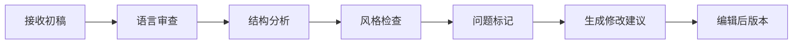
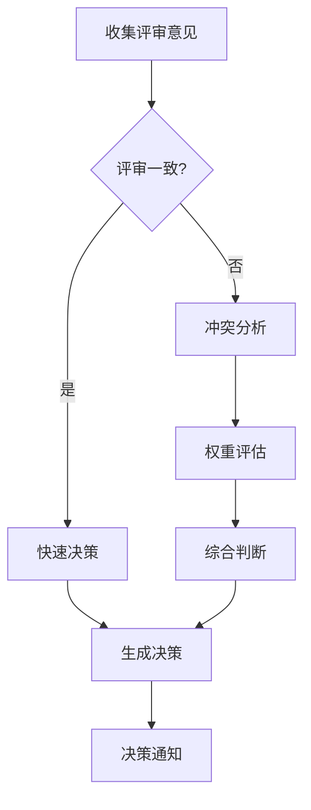
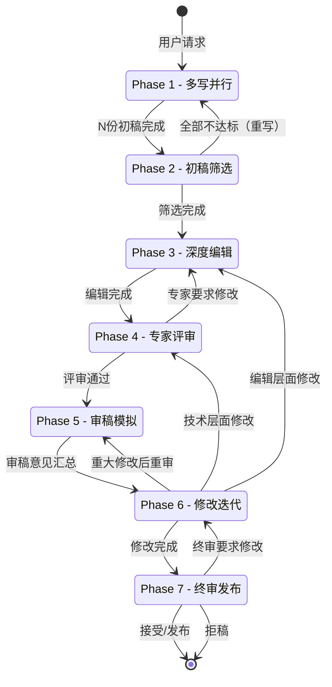
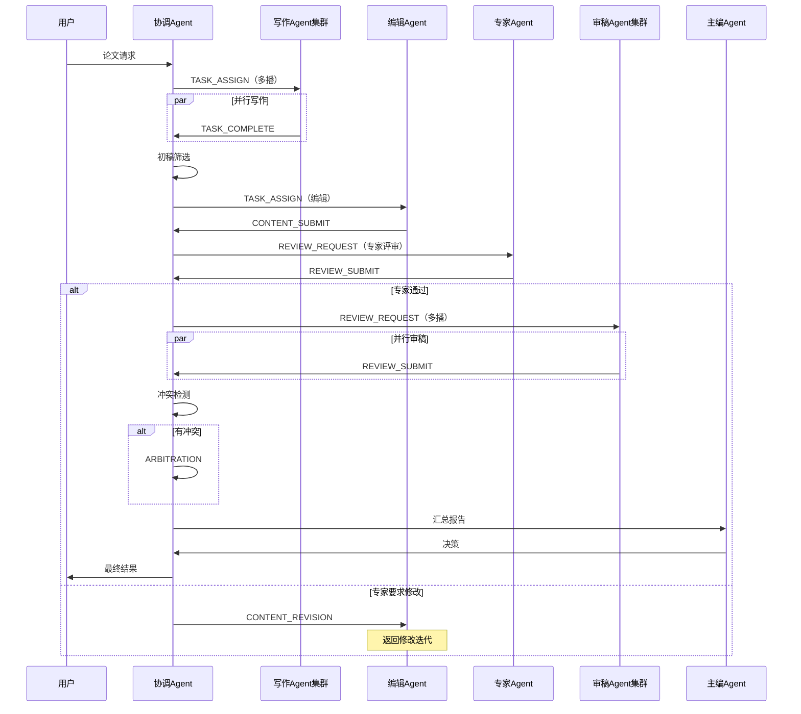
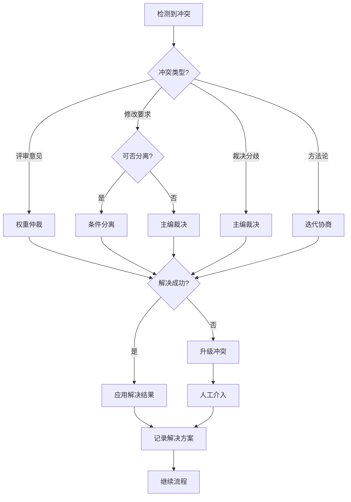

# Agent集群写稿系统架构设计

## 版本信息
- 版本: v1.0
- 创建日期: 2026-04-16
- 文档状态: 设计草案

---

## 1. 系统概述

### 1.1 设计目标
Agent集群写稿系统（Agent Writing System, AWS）是一个基于多Agent协作的学术论文自动化生产平台。系统模拟真实学术界的协作流程，通过多种专业Agent的并行工作与迭代优化，实现高质量学术论文的自动化生成。

### 1.2 核心设计原则
| 原则 | 说明 |
|------|------|
| **并行多样性** | 多写Agent并行产出不同角度的初稿，最大化创意空间 |
| **角色专业化** | 每个Agent具有明确的专业角色和评估标准 |
| **迭代优化** | 审稿-修改的闭环机制确保质量持续提升 |
| **状态可追踪** | 全流程状态机管理，支持断点恢复和过程审计 |
| **冲突可解决** | 内置冲突检测与裁决机制，避免死锁 |

### 1.3 系统边界
```
┌─────────────────────────────────────────────────────────────┐
│                    Agent集群写稿系统                         │
│  ┌──────────┐  ┌──────────┐  ┌──────────┐  ┌──────────┐     │
│  │ 写作Agent │  │ 编辑Agent │  │ 专家Agent │  │ 审稿Agent │     │
│  └──────────┘  └──────────┘  └──────────┘  └──────────┘     │
│  ┌──────────┐  ┌──────────┐                                  │
│  │ 主编Agent │  │ 协调Agent │                                  │
│  └──────────┘  └──────────┘                                  │
└─────────────────────────────────────────────────────────────┘
         ↑                              ↓
    用户输入(主题/要求)           最终论文输出
         ↑                              ↓
    外部知识库(API)               多轮迭代历史
```

---

## 2. 核心组件定义

### 2.1 多写Agent集群（Writing Agent Cluster）

#### 2.1.1 功能定位
负责论文初稿的并行创作，每个Agent从独特视角切入，产出多样化的初稿版本。

#### 2.1.2 角色配置
| Agent ID | 角色名称 | 写作风格 | 侧重点 |
|----------|----------|----------|--------|
| WA-001 | 理论构建者 | 公理化、严谨定义 | 理论基础与形式化框架 |
| WA-002 | 算法设计师 | 构造性、可计算 | 算法设计与复杂度分析 |
| WA-003 | 应用导向者 | 问题导向、实例丰富 | 应用场景与实例验证 |
| WA-004 | 历史回顾者 | 综述性、比较分析 | 相关工作与历史脉络 |
| WA-005 | 创新突破者 | 跳跃性、跨学科 | 新颖视角与跨界融合 |

#### 2.1.3 输入/输出规范
```yaml
输入:
  - topic: 论文主题/问题陈述
  - requirements: 写作要求（长度、风格、目标期刊）
  - references: 参考文献列表（可选）
  - constraints: 约束条件（数学基础、术语体系）

输出:
  - draft_id: 初稿唯一标识
  - content: 论文正文（Markdown/LaTeX格式）
  - structure: 章节结构说明
  - self_evaluation: 自我评估（创新性、完整性、严谨性）
  - estimated_quality: 质量预估分数（0-100）

触发条件:
  - 协调Agent发布的"写作任务"事件
  - 用户直接发起的"一文多写"指令
```

### 2.2 编辑Agent（Editing Agent）

#### 2.2.1 功能定位
负责初稿的语言润色、结构优化、风格统一，消除写作层面的缺陷。

#### 2.2.2 处理流程


#### 2.2.3 输入/输出规范
```yaml
输入:
  - draft: 待编辑初稿
  - style_guide: 目标期刊风格指南
  - quality_threshold: 质量阈值

输出:
  - edited_version: 编辑后版本
  - edit_report: 编辑报告
    - language_issues: 语言问题列表
    - structure_suggestions: 结构优化建议
    - style_deviations: 风格偏离点
    - revision_diff: 修改对比
  - quality_score: 编辑后质量评分

触发条件:
  - Phase 2 初稿筛选完成后
  - 用户发起的"深度编辑"指令
```

### 2.3 专家Agent（Expert Agent）

#### 2.3.1 功能定位
领域专家角色，负责技术内容的审核、创新性的评估、技术错误的发现。

#### 2.3.2 评估维度
```yaml
技术审核:
  - 数学定义的正确性
  - 定理证明的严谨性
  - 推导过程的完整性
  - 符号系统的一致性

创新性评估:
  - 问题的新颖性（Novelty）
  - 方法的原创性（Originality）
  - 结果的重要性（Significance）
  - 技术的突破性（Technical Depth）

影响力预测:
  - 引用潜力评估
  - 领域影响力预测
  - 后续研究方向建议
```

#### 2.3.3 输入/输出规范
```yaml
输入:
  - manuscript: 待评审稿件（编辑后版本）
  - domain: 所属学科领域
  - benchmark_papers: 基准对比论文

输出:
  - expert_report: 专家评审报告
    - technical_validity: 技术有效性评估
    - novelty_assessment: 创新性评估
    - strength_points: 优点列表（≥3条）
    - weakness_points: 缺点列表（≥3条）
    - improvement_suggestions: 改进建议
  - verdict: 专家裁决
    - accept: 直接接受
    - minor_revision: 小修
    - major_revision: 大修
    - reject: 拒稿（需说明理由）

触发条件:
  - Phase 3 深度编辑完成后
  - 关键技术争议需要专家裁决
```

### 2.4 审稿人Agent（Reviewer Agent）

#### 2.4.1 功能定位
模拟学术期刊的双盲审稿流程，从审稿人视角提出批评意见和修改要求。

#### 2.4.2 审稿人角色池
```yaml
审稿人角色:
  R1_严格理论家:
    关注点: 数学严谨性、证明完整性
    提问风格: 细节追问、边界条件检查
    
  R2_应用实践者:
    关注点: 实际可行性、实验验证
    提问风格: 实用性质疑、对比实验要求
    
  R3_领域守门人:
    关注点: 领域贡献、引用完整性
    提问风格: 相关工作比较、贡献声明审查
    
  R4_跨学科审视者:
    关注点: 跨领域一致性、术语准确性
    提问风格: 基础概念澄清、方法论质疑
```

#### 2.4.3 输入/输出规范
```yaml
输入:
  - manuscript: 待审稿论文
  - review_form: 审稿表单模板
  - sim_journal: 模拟目标期刊

输出:
  - review_report: 审稿报告
    - summary: 论文概述
    - strengths: 主要优点
    - weaknesses: 主要缺点
    - detailed_comments: 详细评论（逐条）
    - questions: 需要回答的问题
    - revision_requirements: 修改要求清单
  - recommendation: 审稿建议
    - strong_accept: 强烈接受
    - accept: 接受
    - weak_accept: 勉强接受
    - borderline: 边界
    - reject: 拒绝

触发条件:
  - Phase 4 专家评审通过后
  - 多审稿人并行审稿配置（通常N≥2）
```

### 2.5 主编Agent（Editor-in-Chief Agent）

#### 2.5.1 功能定位
最终决策权威，整合各方评审意见，做出接受/修改/拒稿的最终决定。

#### 2.5.2 决策流程


#### 2.5.3 输入/输出规范
```yaml
输入:
  - manuscript: 论文最终版本
  - expert_reports: 专家评审报告列表
  - review_reports: 审稿报告列表（多份）
  - revision_history: 修改历史记录

输出:
  - editorial_decision: 主编决策
    - decision: 最终决策
      - accept: 接受发表
      - major_revision: 需要大修
      - minor_revision: 需要小修
      - reject_resubmit: 拒绝但鼓励重投
      - reject: 拒绝
    - decision_letter: 决策信函
      - summary: 决策摘要
      - key_concerns: 核心关切
      - action_items: 行动项清单
    - next_phase: 下一阶段指示

触发条件:
  - Phase 5 审稿模拟完成后
  - Phase 6 修改迭代循环结束
  - 多轮迭代达到终止条件
```

### 2.6 协调Agent（Coordinator Agent）

#### 2.6.1 功能定位
系统的"中央神经系统"，负责任务调度、状态管理、Agent间通信协调。

#### 2.6.2 核心职责
```yaml
任务调度:
  - 工作流状态机管理
  - Agent任务分配与负载均衡
  - 依赖关系解析与执行排序
  - 超时检测与重试调度

状态管理:
  - 全局状态维护
  - 阶段转换控制
  - 断点保存与恢复
  - 历史版本管理

通信协调:
  - Agent间消息路由
  - 消息格式转换
  - 通信协议实现
  - 死锁检测与解除

冲突仲裁:
  - 评审意见冲突检测
  - 冲突严重程度评估
  - 仲裁策略选择
  - 最终裁决生成
```

#### 2.6.3 输入/输出规范
```yaml
输入:
  - user_request: 用户初始请求
  - agent_messages: Agent消息队列
  - system_events: 系统事件

输出:
  - task_assignments: 任务分配指令
  - state_updates: 状态更新通知
  - progress_report: 进度报告
  - system_status: 系统状态快照

触发条件:
  - 系统启动时自动激活
  - 持续监听事件循环
```

---

## 3. 工作流程（状态机）

### 3.1 完整工作流图



### 3.2 各阶段详细说明

#### Phase 1: 多写并行（Multiple Writing）

```yaml
阶段目标: 产出多样化的初稿版本
持续时间: 预估 30-60 分钟（并行）

活动:
  1. 协调Agent解析用户需求
  2. 创建N个写作任务（N=5，默认）
  3. 并行分配给不同写作Agent
  4. 监控各Agent进度
  5. 收集完成的初稿

准入条件:
  - 用户输入有效（主题明确）
  - 写作Agent集群可用

准出条件:
  - 至少N个初稿完成
  - 每个初稿包含完整结构

状态输出:
  - draft_pool: 初稿池 {draft_id, content, meta}
  - phase_report: 阶段执行报告
```

#### Phase 2: 初稿筛选（Draft Selection）

```yaml
阶段目标: 从初稿池中选择最优版本进入后续流程
持续时间: 预估 10-15 分钟

活动:
  1. 协调Agent对初稿进行自动评估
  2. 计算各初稿质量分数
  3. 选择Top-K进入下一轮
  4. 可选：合并多个初稿优点

评估标准:
  - 完整性（Completeness）: 30%
  - 创新性（Novelty）: 25%
  - 可读性（Readability）: 20%
  - 技术准确性（Accuracy）: 25%

准入条件:
  - Phase 1 完成
  - 初稿池非空

准出条件:
  - 至少1个初稿通过质量阈值（≥60分）
  - 选定主候选稿

状态输出:
  - selected_draft: 选定初稿
  - selection_report: 筛选报告
  - rejected_drafts: 被拒初稿（存档）
```

#### Phase 3: 深度编辑（Deep Editing）

```yaml
阶段目标: 提升论文的表达质量和结构完整性
持续时间: 预估 20-30 分钟

活动:
  1. 编辑Agent接收选定初稿
  2. 执行多层次编辑
     - 语言层面：语法、用词、流畅度
     - 结构层面：章节逻辑、过渡衔接
     - 风格层面：学术规范、术语一致
  3. 生成编辑报告
  4. 输出编辑后版本

准入条件:
  - Phase 2 完成
  - 选定有效初稿

准出条件:
  - 编辑后质量分数 ≥70
  - 无严重语言/结构问题

状态输出:
  - edited_draft: 编辑后稿件
  - edit_report: 编辑报告
```

#### Phase 4: 专家评审（Expert Review）

```yaml
阶段目标: 技术内容审核和创新性评估
持续时间: 预估 25-40 分钟

活动:
  1. 专家Agent加载稿件
  2. 技术有效性验证
     - 数学推导检查
     - 定理证明验证
     - 符号系统审查
  3. 创新性评估
  4. 生成专家报告和裁决

准入条件:
  - Phase 3 完成
  - 编辑后稿件可用

准出条件:
  - 专家裁决 ≠ reject
  - 或无严重技术缺陷

状态输出:
  - expert_report: 专家评审报告
  - expert_verdict: 专家裁决
```

#### Phase 5: 审稿模拟（Peer Review Simulation）

```yaml
阶段目标: 模拟真实审稿流程，发现潜在问题
持续时间: 预估 30-45 分钟（并行审稿）

活动:
  1. 创建M个审稿人Agent（M=3，默认）
  2. 并行分配审稿任务
  3. 各审稿人独立评审
  4. 汇总审稿意见
  5. 冲突检测与分析

审稿人配置:
  - R1: 理论严格性审稿人
  - R2: 应用价值审稿人
  - R3: 领域贡献审稿人

准入条件:
  - Phase 4 通过

准出条件:
  - 至少2份审稿报告完成
  - 意见汇总完成

状态输出:
  - review_consensus: 审稿共识
  - conflicting_opinions: 冲突意见列表
  - revision_requirements: 修改要求汇总
```

#### Phase 6: 修改迭代（Revision Loop）

```yaml
阶段目标: 根据评审意见修改论文
持续时间: 预估 20-40 分钟/轮

活动:
  1. 解析修改要求
  2. 分类修改任务
     - 编辑类：语言、格式
     - 技术类：内容、推导
     - 结构类：章节调整
  3. 执行修改
  4. 修改验证
  5. 决策：进入下一阶段或重审

迭代控制:
  - 最大迭代次数: 3轮
  - 收敛条件: 审稿人满意度 ≥80%

准入条件:
  - Phase 5 完成
  - 有明确的修改要求

准出条件:
  - 审稿人意见充分解决
  - 或达到最大迭代次数

状态输出:
  - revised_draft: 修改后稿件
  - revision_log: 修改日志
  - iteration_count: 迭代次数
```

#### Phase 7: 终审发布（Final Decision）

```yaml
阶段目标: 做出最终发布决策
持续时间: 预估 10-15 分钟

活动:
  1. 主编Agent加载完整材料
     - 最终稿件
     - 所有评审报告
     - 修改历史
  2. 综合评估
  3. 生成决策信
  4. 执行最终动作

决策选项:
  - accept: 接受，进入发布流程
  - conditional_accept: 条件接受（需最后微调）
  - major_revision: 需要重大修改（返回Phase 6）
  - reject: 拒绝（终止流程）

准入条件:
  - Phase 6 完成

准出条件:
  - 明确决策结果

状态输出:
  - final_decision: 最终决策
  - final_manuscript: 最终稿件
  - complete_report: 完整执行报告
```

---

## 4. Agent间通信协议

### 4.1 消息格式规范

```yaml
Message:
  header:
    msg_id: 消息唯一标识（UUID）
    msg_type: 消息类型
    sender: 发送者Agent ID
    receiver: 接收者Agent ID（或广播标记）
    timestamp: ISO 8601时间戳
    correlation_id: 关联消息ID（用于请求-响应关联）
    priority: 优先级（high/normal/low）
  
  body:
    payload: 消息载荷（类型特定）
    metadata: 附加元数据
  
  footer:
    signature: 消息签名（可选）
    trace_info: 追踪信息
```

### 4.2 消息类型定义

```yaml
消息类型:
  # 任务相关
  TASK_ASSIGN: 任务分配
  TASK_ACCEPT: 任务接受确认
  TASK_REJECT: 任务拒绝
  TASK_COMPLETE: 任务完成
  TASK_CANCEL: 任务取消
  
  # 状态相关
  STATUS_QUERY: 状态查询
  STATUS_REPORT: 状态报告
  PROGRESS_UPDATE: 进度更新
  
  # 内容相关
  CONTENT_SUBMIT: 内容提交
  CONTENT_REVIEW: 内容评审
  CONTENT_REVISION: 内容修改
  
  # 评审相关
  REVIEW_REQUEST: 评审请求
  REVIEW_SUBMIT: 评审提交
  REVIEW_DISPUTE: 评审争议
  
  # 协调相关
  CONFLICT_NOTIFY: 冲突通知
  ARBITRATION_REQUEST: 仲裁请求
  ARBITRATION_RESULT: 仲裁结果
  
  # 系统相关
  HEARTBEAT: 心跳检测
  ERROR_REPORT: 错误报告
  SYSTEM_EVENT: 系统事件
```

### 4.3 通信模式



### 4.4 事件总线设计

```yaml
EventBus:
  channels:
    task_channel: 任务分配与执行
    review_channel: 评审相关通信
    control_channel: 控制命令与状态
    log_channel: 日志与审计
    
  routing:
    direct: 点对点消息
    broadcast: 广播消息
    multicast: 组播（如所有写作Agent）
    pub_sub: 发布订阅模式
    
  reliability:
    at_least_once: 至少一次送达
    exactly_once: 精确一次送达（关键消息）
    best_effort: 尽力送达（心跳等）
```

---

## 5. 冲突解决机制

### 5.1 冲突类型定义

```yaml
冲突类型:
  # 评审冲突
  OPINION_CONFLICT:
    描述: 审稿人意见不一致
    示例: R1认为创新性强，R2认为创新性不足
    严重程度: medium
    
  REQUIREMENT_CONFLICT:
    描述: 不同审稿人的修改要求矛盾
    示例: R1要求增加实验，R2要求精简篇幅
    严重程度: high
    
  VERDICT_CONFLICT:
    描述: 最终裁决分歧
    示例: 专家接受但审稿人拒绝
    严重程度: high
    
  # 技术冲突
  METHODOLOGY_DISPUTE:
    描述: 方法论争议
    示例: 不同数学路径的选择
    严重程度: high
    
  # 资源冲突
  RESOURCE_CONTENTION:
    描述: 资源竞争（如同时修改同一章节）
    严重程度: low
```

### 5.2 冲突检测算法

```python
# 冲突检测伪代码

def detect_conflicts(reviews):
    conflicts = []
    
    # 1. 意见方向冲突检测
    for i, r1 in enumerate(reviews):
        for r2 in reviews[i+1:]:
            if opinion_direction(r1) != opinion_direction(r2):
                if abs(r1.score - r2.score) > THRESHOLD:
                    conflicts.append({
                        'type': 'OPINION_CONFLICT',
                        'between': [r1.reviewer, r2.reviewer],
                        'severity': calculate_severity(r1, r2)
                    })
    
    # 2. 修改要求冲突检测
    requirements = extract_all_requirements(reviews)
    conflicts.extend(find_contradictory_requirements(requirements))
    
    # 3. 裁决冲突检测
    verdicts = [r.verdict for r in reviews]
    if has_irreconcilable_verdicts(verdicts):
        conflicts.append({
            'type': 'VERDICT_CONFLICT',
            'verdicts': verdicts,
            'severity': 'high'
        })
    
    return conflicts
```

### 5.3 冲突解决策略

```yaml
解决策略:
  # 策略1: 权重仲裁
  WEIGHTED_ARBITRATION:
    适用: 评审意见冲突
    机制:
      - 为不同类型审稿人分配权重
        - 领域专家: 0.4
        - 理论审稿人: 0.3
        - 应用审稿人: 0.3
      - 加权计算综合意见
    
  # 策略2: 条件分离
  CONDITIONAL_SEPARATION:
    适用: 要求矛盾但可分离
    机制:
      - 分析要求的适用条件
      - 将矛盾要求分配到不同场景/版本
      - 在论文中分别讨论
    
  # 策略3: 主编裁决
  EDITOR_DECISION:
    适用: 无法自动解决的严重冲突
    机制:
      - 汇总冲突详情
      - 提交主编Agent
      - 主编基于学术判断力裁决
    
  # 策略4: 迭代协商
  ITERATIVE_NEGOTIATION:
    适用: 方法论争议
    机制:
      - 邀请争议方Agent进行多轮讨论
      - 寻找共同接受的中间方案
      - 记录协商过程
```

### 5.4 冲突解决流程图



---

## 6. 系统扩展性设计

### 6.1 Agent动态扩展

```yaml
扩展机制:
  写作Agent池:
    最小数量: 3
    最大数量: 10
    扩展触发: 任务队列长度 > 阈值
    缩减触发: 空闲时间 > 阈值
    
  审稿人Agent池:
    默认数量: 3
    可配置: 2-5
    扩展策略: 根据论文复杂度动态调整
```

### 6.2 插件系统

```yaml
插件接口:
  输入处理器:
    - LaTeX导入
    - PDF解析
    - 参考文献自动提取
    
  输出格式化:
    - LaTeX模板
    - Word模板
    - Markdown格式
    
  扩展Agent:
    - 翻译Agent（多语言）
    - 图表生成Agent
    - 查重Agent
```

---

## 7. 质量保障体系

### 7.1 质量门禁

```yaml
阶段门禁:
  Phase1→Phase2:
    - 初稿数量 ≥ 3
    - 无空内容
    
  Phase2→Phase3:
    - 选定初稿质量 ≥ 60
    
  Phase3→Phase4:
    - 编辑后质量 ≥ 70
    - 无严重语言错误
    
  Phase4→Phase5:
    - 专家裁决 ≠ reject
    
  Phase5→Phase6:
    - 至少2份审稿报告
    
  Phase6→Phase7:
    - 审稿人满意度 ≥ 80%
    - 或达到最大迭代次数
    
  Phase7→发布:
    - 主编决策 = accept
```

### 7.2 质量度量指标

```yaml
度量指标:
  过程指标:
    - 各阶段耗时
    - Agent利用率
    - 迭代次数
    - 冲突频率
    
  质量指标:
    - 最终质量评分
    - 审稿人满意度
    - 专家创新性评分
    - 技术准确性评分
    
  效率指标:
    - 端到端总耗时
    - 并行度
    - 资源消耗
```

---

## 8. 附录

### 8.1 术语表

| 术语 | 定义 |
|------|------|
| Agent | 具有特定角色和能力的智能体 |
| 初稿池 | Phase 1产出的多份初稿集合 |
| 审稿共识 | 多审稿人意见的综合结果 |
| 质量阈值 | 各阶段通过的最低质量标准 |
| 迭代收敛 | 修改迭代达到可接受标准 |

### 8.2 配置模板

```yaml
# config.yaml 系统配置模板

system:
  name: "Agent Writing System"
  version: "1.0"
  
cluster:
  writing_agents:
    count: 5
    roles: ["理论构建者", "算法设计师", "应用导向者", "历史回顾者", "创新突破者"]
    
  review_agents:
    count: 3
    roles: ["严格理论家", "应用实践者", "领域守门人"]

workflow:
  phases:
    - name: "多写并行"
      timeout: 3600
    - name: "初稿筛选"
      quality_threshold: 60
    - name: "深度编辑"
      timeout: 1800
    - name: "专家评审"
      timeout: 2400
    - name: "审稿模拟"
      timeout: 2700
    - name: "修改迭代"
      max_iterations: 3
    - name: "终审发布"
      timeout: 900

quality:
  gates:
    phase2_to_phase3: 60
    phase3_to_phase4: 70
    phase6_convergence: 80
```

### 8.3 故障处理

```yaml
故障类型与处理:
  Agent崩溃:
    检测: 心跳超时
    处理: 重启Agent，重分配任务
    
  死锁:
    检测: 状态长时间无变化
    处理: 协调Agent介入，强制状态转换
    
  质量不达标:
    检测: 阶段质量评估
    处理: 返回上一阶段或终止流程
    
  无限迭代:
    检测: 迭代次数超过阈值
    处理: 强制进入终审或人工介入
```

---

*文档结束*
