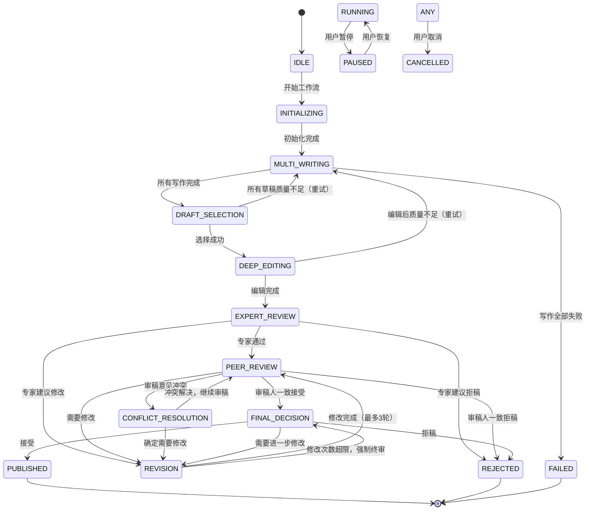

# Agent集群写稿系统 - 通信协议与状态机

## 1. Agent间通信协议

### 1.1 消息格式规范（JSON Schema）

```json
{
  "$schema": "http://json-schema.org/draft-07/schema#",
  "title": "AgentMessage",
  "type": "object",
  "required": ["header", "payload"],
  "properties": {
    "header": {
      "type": "object",
      "required": ["message_id", "sender_id", "receiver_id", "message_type", "timestamp"],
      "properties": {
        "message_id": {
          "type": "string",
          "format": "uuid",
          "description": "消息唯一标识"
        },
        "correlation_id": {
          "type": ["string", "null"],
          "format": "uuid",
          "description": "关联消息ID（用于请求-响应追踪）"
        },
        "sender_id": {
          "type": "string",
          "description": "发送者Agent ID"
        },
        "receiver_id": {
          "type": "string",
          "description": "接收者Agent ID，或'broadcast'表示广播"
        },
        "message_type": {
          "type": "string",
          "enum": [
            "TASK_ASSIGN",
            "TASK_COMPLETE",
            "TASK_FAILED",
            "SUBMIT_DRAFT",
            "DRAFT_ACCEPTED",
            "REQUEST_REVIEW",
            "SUBMIT_REVIEW",
            "REQUEST_REVISION",
            "SUBMIT_REVISION",
            "FINAL_DECISION",
            "AGENT_STATUS",
            "HEARTBEAT",
            "SYSTEM_ERROR",
            "PROGRESS_UPDATE"
          ]
        },
        "timestamp": {
          "type": "string",
          "format": "date-time",
          "description": "消息生成时间"
        },
        "priority": {
          "type": "integer",
          "minimum": 1,
          "maximum": 10,
          "default": 5,
          "description": "消息优先级（1最高，10最低）"
        },
        "ttl": {
          "type": "integer",
          "minimum": 0,
          "default": 3,
          "description": "消息生存时间（重试次数）"
        }
      }
    },
    "payload": {
      "type": "object",
      "description": "消息负载数据，根据message_type变化"
    },
    "delivery_attempts": {
      "type": "integer",
      "minimum": 0,
      "default": 0,
      "description": "投递尝试次数"
    }
  }
}
```

### 1.2 消息类型详细定义

#### 1.2.1 任务相关消息

**TASK_ASSIGN - 任务分配**
```json
{
  "header": {
    "message_type": "TASK_ASSIGN",
    "sender_id": "coordinator",
    "receiver_id": "writer_0",
    "priority": 3
  },
  "payload": {
    "task_id": "task_001",
    "task_type": "writing",
    "topic": "量子计算中的纠错码理论",
    "requirements": {
      "word_count": 5000,
      "style": "theoretical",
      "target_journal": "Physical Review A"
    },
    "deadline": "2026-04-17T10:00:00Z",
    "parent_task_id": null,
    "context": {
      "previous_drafts": [],
      "review_comments": []
    }
  }
}
```

**TASK_COMPLETE - 任务完成**
```json
{
  "header": {
    "message_type": "TASK_COMPLETE",
    "sender_id": "writer_0",
    "receiver_id": "coordinator",
    "correlation_id": "msg_task_001"
  },
  "payload": {
    "task_id": "task_001",
    "status": "success",
    "result": {
      "draft_id": "draft_abc123",
      "content": "# 量子纠错码理论...",
      "word_count": 5200,
      "quality_score": 82
    },
    "execution_time": 450.5,
    "resource_usage": {
      "tokens": 15000,
      "memory_mb": 512
    }
  }
}
```

**TASK_FAILED - 任务失败**
```json
{
  "header": {
    "message_type": "TASK_FAILED",
    "sender_id": "writer_0",
    "receiver_id": "coordinator"
  },
  "payload": {
    "task_id": "task_001",
    "error_code": "TIMEOUT",
    "error_message": "任务执行超时（600秒）",
    "partial_result": {
      "content": "未完成的草稿内容...",
      "completion_percentage": 60
    },
    "recoverable": true
  }
}
```

#### 1.2.2 写作流程消息

**SUBMIT_DRAFT - 提交草稿**
```json
{
  "header": {
    "message_type": "SUBMIT_DRAFT",
    "sender_id": "writer_0",
    "receiver_id": "coordinator",
    "priority": 4
  },
  "payload": {
    "draft": {
      "draft_id": "draft_001",
      "version": 1,
      "title": "基于深度学习的图像分类算法研究",
      "content": "## 摘要\n本文提出...",
      "sections": [
        {"type": "abstract", "title": "摘要", "word_count": 200},
        {"type": "introduction", "title": "引言", "word_count": 800}
      ],
      "quality_assessment": {
        "novelty": 75,
        "rigor": 80,
        "clarity": 70,
        "completeness": 65,
        "overall": 72
      },
      "self_evaluation": {
        "strengths": ["理论框架清晰", "实验设计合理"],
        "weaknesses": ["相关工作回顾不够全面", "缺少复杂度分析"]
      }
    },
    "workflow_id": "wf_001",
    "phase": "multi_writing"
  }
}
```

**REQUEST_REVIEW - 请求审稿**
```json
{
  "header": {
    "message_type": "REQUEST_REVIEW",
    "sender_id": "coordinator",
    "receiver_id": "reviewer_0",
    "priority": 3
  },
  "payload": {
    "review_task_id": "review_001",
    "manuscript": {
      "draft_id": "draft_001",
      "title": "...",
      "content": "...",
      "format": "markdown"
    },
    "review_form": {
      "required_sections": ["summary", "strengths", "weaknesses", "questions"],
      "evaluation_criteria": ["novelty", "rigor", "clarity", "impact"]
    },
    "simulated_journal": "Nature Machine Intelligence",
    "review_style": "theoretical",
    "deadline": "2026-04-17T12:00:00Z"
  }
}
```

**SUBMIT_REVIEW - 提交审稿报告**
```json
{
  "header": {
    "message_type": "SUBMIT_REVIEW",
    "sender_id": "reviewer_0",
    "receiver_id": "coordinator"
  },
  "payload": {
    "review_task_id": "review_001",
    "report": {
      "summary": "本文提出了一种新的深度学习架构...",
      "strengths": [
        "创新性地结合了CNN和Transformer",
        "实验设计严谨，对比充分"
      ],
      "weaknesses": [
        "理论分析不够深入，缺少收敛性证明",
        "计算复杂度分析缺失"
      ],
      "comments": [
        {
          "comment_id": "c001",
          "category": "technical",
          "severity": "major",
          "location": {
            "section": "methodology",
            "paragraph": 3
          },
          "content": "公式(4)的推导过程缺少关键步骤...",
          "suggested_change": "建议在公式(4)前增加引理2..."
        }
      ],
      "questions": [
        "如何证明算法在大规模数据上的收敛性？",
        "与SOTA方法的公平对比是否充分？"
      ],
      "recommendation": "major_revision",
      "confidence": 0.8,
      "overall_score": 65
    }
  }
}
```

**REQUEST_REVISION - 请求修改**
```json
{
  "header": {
    "message_type": "REQUEST_REVISION",
    "sender_id": "coordinator",
    "receiver_id": "writer_0",
    "priority": 2
  },
  "payload": {
    "revision_task_id": "rev_001",
    "original_draft_id": "draft_001",
    "revision_type": "major",
    "comments": [
      {
        "comment_id": "c001",
        "from_reviewer": "reviewer_0",
        "category": "technical",
        "content": "公式(4)推导不完整",
        "must_address": true
      }
    ],
    "revision_guidelines": {
      "focus_areas": ["理论证明", "复杂度分析"],
      "maintain_sections": ["introduction", "experimental_setup"],
      "word_count_target": 5500
    },
    "deadline": "2026-04-18T10:00:00Z",
    "max_attempts": 2
  }
}
```

#### 1.2.3 决策与状态消息

**FINAL_DECISION - 最终决策**
```json
{
  "header": {
    "message_type": "FINAL_DECISION",
    "sender_id": "editor_in_chief_0",
    "receiver_id": "coordinator",
    "priority": 1
  },
  "payload": {
    "workflow_id": "wf_001",
    "draft_id": "draft_003",
    "decision": "accepted",
    "decision_rationale": {
      "technical_quality": 85,
      "innovation_level": 80,
      "writing_quality": 82,
      "revision_adequacy": 90,
      "overall_assessment": "经过两轮修改，论文质量显著提升，达到了发表标准。"
    },
    "conditions": [
      "请将补充材料中的详细证明移到正文附录",
      "补充与最近相关工作[23]的对比讨论"
    ],
    "final_manuscript": {
      "content": "最终接受的论文内容...",
      "format": "latex",
      "word_count": 5800
    }
  }
}
```

**AGENT_STATUS - Agent状态更新**
```json
{
  "header": {
    "message_type": "AGENT_STATUS",
    "sender_id": "writer_0",
    "receiver_id": "coordinator",
    "priority": 6
  },
  "payload": {
    "agent_id": "writer_0",
    "role": "writer",
    "status": "busy",
    "current_task": "task_001",
    "task_progress": 75,
    "estimated_completion": "2026-04-17T10:30:00Z",
    "health_metrics": {
      "cpu_usage": 45,
      "memory_usage": 512,
      "queue_depth": 0
    }
  }
}
```

**HEARTBEAT - 心跳消息**
```json
{
  "header": {
    "message_type": "HEARTBEAT",
    "sender_id": "writer_0",
    "receiver_id": "coordinator",
    "priority": 9
  },
  "payload": {
    "agent_id": "writer_0",
    "timestamp": "2026-04-17T10:15:30Z",
    "status": "healthy",
    "uptime_seconds": 3600
  }
}
```

**PROGRESS_UPDATE - 进度更新**
```json
{
  "header": {
    "message_type": "PROGRESS_UPDATE",
    "sender_id": "coordinator",
    "receiver_id": "broadcast",
    "priority": 7
  },
  "payload": {
    "workflow_id": "wf_001",
    "current_phase": "peer_review",
    "overall_progress": 65,
    "phase_progress": {
      "multi_writing": 100,
      "draft_selection": 100,
      "deep_editing": 100,
      "expert_review": 100,
      "peer_review": 60,
      "revision": 0,
      "final_decision": 0
    },
    "active_agents": 3,
    "completed_tasks": 8,
    "pending_tasks": 2,
    "estimated_completion": "2026-04-17T14:00:00Z"
  }
}
```

### 1.3 发布-订阅机制设计

```python
class MessageBus:
    """
    消息总线 - 实现发布-订阅模式
    """
    
    def __init__(self):
        self.subscribers: Dict[str, List[Callable]] = {}  # topic -> [handlers]
        self.message_queue: asyncio.Queue = asyncio.Queue()
        self.running = False
    
    def subscribe(self, topic: str, handler: Callable):
        """订阅主题"""
        if topic not in self.subscribers:
            self.subscribers[topic] = []
        self.subscribers[topic].append(handler)
    
    def unsubscribe(self, topic: str, handler: Callable):
        """取消订阅"""
        if topic in self.subscribers:
            self.subscribers[topic] = [
                h for h in self.subscribers[topic] if h != handler
            ]
    
    async def publish(self, topic: str, message: Dict[str, Any]):
        """发布消息到主题"""
        await self.message_queue.put({"topic": topic, "message": message})
    
    async def broadcast(self, message: Dict[str, Any]):
        """广播消息到所有订阅者"""
        await self.message_queue.put({"topic": "*", "message": message})
    
    async def start(self):
        """启动消息总线"""
        self.running = True
        while self.running:
            try:
                item = await asyncio.wait_for(self.message_queue.get(), timeout=1.0)
                topic = item["topic"]
                message = item["message"]
                
                # 分发到订阅者
                handlers = self.subscribers.get(topic, [])
                if topic != "*":
                    handlers.extend(self.subscribers.get("*", []))  # 广播订阅者
                
                for handler in handlers:
                    try:
                        await handler(message)
                    except Exception as e:
                        logging.exception(f"Message handler error for topic {topic}")
                        
            except asyncio.TimeoutError:
                continue
    
    async def stop(self):
        """停止消息总线"""
        self.running = False
```

### 1.4 优先级队列设计

```python
import heapq
from dataclasses import dataclass, field
from typing import Any

@dataclass(order=True)
class PrioritizedMessage:
    """带优先级的消息"""
    priority: int
    timestamp: float = field(compare=True)
    message: Any = field(compare=False)

class PriorityMessageQueue:
    """
    优先级消息队列
    实现带优先级的消息排序和调度
    """
    
    def __init__(self):
        self._queue: List[PrioritizedMessage] = []
        self._counter = 0
        self._lock = asyncio.Lock()
    
    async def put(self, message: AgentMessage):
        """放入消息（按优先级排序）"""
        async with self._lock:
            priority = message.header.priority
            timestamp = message.header.timestamp.timestamp()
            
            # 使用计数器确保相同优先级的消息按FIFO处理
            self._counter += 1
            
            heapq.heappush(self._queue, PrioritizedMessage(
                priority=priority,
                timestamp=timestamp + self._counter * 1e-9,  # 微小偏移保证FIFO
                message=message
            ))
    
    async def get(self) -> AgentMessage:
        """取出最高优先级消息"""
        async with self._lock:
            if not self._queue:
                return None
            return heapq.heappop(self._queue).message
    
    async def peek(self) -> Optional[AgentMessage]:
        """查看但不取出最高优先级消息"""
        async with self._lock:
            if not self._queue:
                return None
            return self._queue[0].message
    
    def qsize(self) -> int:
        """队列大小"""
        return len(self._queue)
    
    async def remove_by_correlation(self, correlation_id: str) -> List[AgentMessage]:
        """移除所有关联到指定ID的消息（用于取消操作）"""
        async with self._lock:
            removed = []
            remaining = []
            
            for item in self._queue:
                if item.message.header.correlation_id == correlation_id:
                    removed.append(item.message)
                else:
                    remaining.append(item)
            
            # 重建堆
            self._queue = remaining
            heapq.heapify(self._queue)
            
            return removed
```

---

## 2. 完整状态机设计

### 2.1 状态定义

```python
class WorkflowPhase(Enum):
    """
    工作流阶段枚举
    定义论文生产的完整生命周期
    """
    IDLE = "idle"                          # 空闲状态
    INITIALIZING = "initializing"          # 初始化中
    MULTI_WRITING = "multi_writing"        # 多写并行
    DRAFT_SELECTION = "draft_selection"  # 初稿筛选
    DEEP_EDITING = "deep_editing"          # 深度编辑
    EXPERT_REVIEW = "expert_review"        # 专家评审
    PEER_REVIEW = "peer_review"          # 同行审稿
    CONFLICT_RESOLUTION = "conflict_resolution"  # 冲突解决
    REVISION = "revision"                  # 修改阶段
    FINAL_DECISION = "final_decision"      # 最终决策
    PUBLISHED = "published"              # 完成/发布
    REJECTED = "rejected"                  # 拒稿
    PAUSED = "paused"                      # 暂停
    FAILED = "failed"                      # 失败

class WorkflowStatus(Enum):
    """工作流执行状态"""
    PENDING = "pending"                    # 等待执行
    RUNNING = "running"                    # 运行中
    COMPLETED = "completed"                # 完成
    FAILED = "failed"                      # 失败
    TIMEOUT = "timeout"                    # 超时
    CANCELLED = "cancelled"                # 取消
```

### 2.2 状态转换图



### 2.3 状态转换条件详解

```python
class StateTransitionRules:
    """
    状态转换规则定义
    明确每个转换的触发条件和准入准出标准
    """
    
    TRANSITIONS = {
        # 从 MULTI_WRITING 可转换到：
        WorkflowPhase.MULTI_WRITING: [
            {
                "to": WorkflowPhase.DRAFT_SELECTION,
                "condition": "at_least_one_draft",
                "condition_detail": "至少有一个写作Agent成功返回草稿",
                "gate": {
                    "input_required": ["drafts"],
                    "input_validation": lambda data: len(data.get("drafts", [])) > 0
                }
            },
            {
                "to": WorkflowPhase.FAILED,
                "condition": "all_writing_failed",
                "condition_detail": "所有写作Agent均失败",
                "automatic": False  # 需要人工确认是否重试
            }
        ],
        
        # 从 DRAFT_SELECTION 可转换到：
        WorkflowPhase.DRAFT_SELECTION: [
            {
                "to": WorkflowPhase.DEEP_EDITING,
                "condition": "draft_selected",
                "condition_detail": "成功选中质量最高的草稿",
                "gate": {
                    "input_required": ["selected_draft"],
                    "quality_threshold": 50  # 最低质量门槛
                }
            },
            {
                "to": WorkflowPhase.MULTI_WRITING,
                "condition": "quality_insufficient",
                "condition_detail": "所有草稿质量低于阈值，需要重写",
                "max_retries": 2
            }
        ],
        
        # 从 DEEP_EDITING 可转换到：
        WorkflowPhase.DEEP_EDITING: [
            {
                "to": WorkflowPhase.EXPERT_REVIEW,
                "condition": "editing_complete",
                "condition_detail": "编辑完成，质量达到标准",
                "gate": {
                    "quality_threshold": 60
                }
            },
            {
                "to": WorkflowPhase.MULTI_WRITING,
                "condition": "fundamental_issues",
                "condition_detail": "编辑发现根本性缺陷，需要重写",
                "automatic": False
            }
        ],
        
        # 从 EXPERT_REVIEW 可转换到：
        WorkflowPhase.EXPERT_REVIEW: [
            {
                "to": WorkflowPhase.PEER_REVIEW,
                "condition": "expert_accept",
                "condition_detail": "专家评审通过（accept 或 minor_revision）",
                "gate": {
                    "verdict": ["accept", "minor_revision"]
                }
            },
            {
                "to": WorkflowPhase.REVISION,
                "condition": "expert_major_revision",
                "condition_detail": "专家建议大修",
                "gate": {
                    "verdict": "major_revision"
                }
            },
            {
                "to": WorkflowPhase.REJECTED,
                "condition": "expert_reject",
                "condition_detail": "专家建议拒稿",
                "gate": {
                    "verdict": "reject"
                }
            }
        ],
        
        # 从 PEER_REVIEW 可转换到：
        WorkflowPhase.PEER_REVIEW: [
            {
                "to": WorkflowPhase.FINAL_DECISION,
                "condition": "consensus_accept",
                "condition_detail": "审稿人一致建议接受",
                "gate": {
                    "consensus_threshold": 0.7,
                    "dominant_verdict": "accept"
                }
            },
            {
                "to": WorkflowPhase.CONFLICT_RESOLUTION,
                "condition": "reviewer_conflict",
                "condition_detail": "审稿人意见存在不可调和冲突",
                "gate": {
                    "conflict_detected": True
                }
            },
            {
                "to": WorkflowPhase.REVISION,
                "condition": "revision_required",
                "condition_detail": "多数审稿人建议修改",
                "gate": {
                    "dominant_verdict": ["minor_revision", "major_revision"]
                }
            },
            {
                "to": WorkflowPhase.REJECTED,
                "condition": "consensus_reject",
                "condition_detail": "审稿人一致建议拒稿",
                "gate": {
                    "dominant_verdict": "reject"
                }
            }
        ],
        
        # 从 REVISION 可转换到：
        WorkflowPhase.REVISION: [
            {
                "to": WorkflowPhase.PEER_REVIEW,
                "condition": "revision_complete_under_limit",
                "condition_detail": "修改完成，且修改次数未超限",
                "gate": {
                    "max_revisions": 3,
                    "revision_count_check": lambda count: count < 3
                }
            },
            {
                "to": WorkflowPhase.FINAL_DECISION,
                "condition": "revision_count_exceeded",
                "condition_detail": "修改次数达到上限，强制进入终审",
                "gate": {
                    "revision_count_check": lambda count: count >= 3
                }
            }
        ],
        
        # 从 FINAL_DECISION 可转换到：
        WorkflowPhase.FINAL_DECISION: [
            {
                "to": WorkflowPhase.PUBLISHED,
                "condition": "chief_accept",
                "condition_detail": "主编决定接受",
                "gate": {
                    "decision": "accepted"
                }
            },
            {
                "to": WorkflowPhase.REVISION,
                "condition": "chief_require_revision",
                "condition_detail": "主编要求进一步修改",
                "gate": {
                    "decision": "revision_required"
                }
            },
            {
                "to": WorkflowPhase.REJECTED,
                "condition": "chief_reject",
                "condition_detail": "主编决定拒稿",
                "gate": {
                    "decision": "rejected"
                }
            }
        ]
    }
    
    @classmethod
    def get_allowed_transitions(cls, current_phase: WorkflowPhase) -> List[Dict]:
        """获取从当前状态可进行的转换"""
        return cls.TRANSITIONS.get(current_phase, [])
    
    @classmethod
    def can_transition(
        cls, 
        from_phase: WorkflowPhase, 
        to_phase: WorkflowPhase, 
        context: Dict[str, Any]
    ) -> Tuple[bool, str]:
        """
        检查是否可以进行状态转换
        
        Returns:
            (是否允许, 原因说明)
        """
        allowed = cls.get_allowed_transitions(from_phase)
        
        for transition in allowed:
            if transition["to"] == to_phase:
                # 检查门控条件
                gate = transition.get("gate", {})
                
                # 验证必需输入
                input_required = gate.get("input_required", [])
                for key in input_required:
                    if key not in context:
                        return False, f"缺少必需输入: {key}"
                
                # 验证质量阈值
                quality_threshold = gate.get("quality_threshold")
                if quality_threshold is not None:
                    quality = context.get("quality_score", 0)
                    if quality < quality_threshold:
                        return False, f"质量分数 {quality} 低于阈值 {quality_threshold}"
                
                # 验证裁决
                verdict = context.get("verdict")
                expected_verdicts = gate.get("verdict")
                if expected_verdicts:
                    if isinstance(expected_verdicts, str):
                        expected_verdicts = [expected_verdicts]
                    if verdict not in expected_verdicts:
                        return False, f"裁决 {verdict} 不在允许的列表中"
                
                return True, "转换允许"
        
        return False, f"从 {from_phase.value} 到 {to_phase.value} 的转换未定义"
```

### 2.4 状态入口/出口动作

```python
class StateActions:
    """
    状态入口和出口动作定义
    每个状态进入和离开时执行的操作
    """
    
    ENTRY_ACTIONS = {
        WorkflowPhase.MULTI_WRITING: [
            {
                "action": "spawn_writers",
                "description": "根据配置启动多个写作Agent",
                "implementation": lambda state: StateActions._spawn_writers(state)
            },
            {
                "action": "set_timeout",
                "description": "设置写作阶段超时计时器",
                "implementation": lambda state: StateActions._set_phase_timeout(state, 1800)
            }
        ],
        
        WorkflowPhase.DRAFT_SELECTION: [
            {
                "action": "collect_drafts",
                "description": "收集所有完成的草稿",
                "implementation": lambda state: StateActions._collect_drafts(state)
            },
            {
                "action": "score_drafts",
                "description": "对所有草稿进行质量评分",
                "implementation": lambda state: StateActions._score_drafts(state)
            }
        ],
        
        WorkflowPhase.DEEP_EDITING: [
            {
                "action": "dispatch_editor",
                "description": "调度编辑Agent处理选中草稿",
                "implementation": lambda state: StateActions._dispatch_editor(state)
            }
        ],
        
        WorkflowPhase.EXPERT_REVIEW: [
            {
                "action": "dispatch_expert",
                "description": "调度专家Agent进行技术审核",
                "implementation": lambda state: StateActions._dispatch_expert(state)
            }
        ],
        
        WorkflowPhase.PEER_REVIEW: [
            {
                "action": "spawn_reviewers",
                "description": "启动多个审稿人Agent",
                "implementation": lambda state: StateActions._spawn_reviewers(state)
            },
            {
                "action": "set_review_deadline",
                "description": "设置审稿截止日期",
                "implementation": lambda state: StateActions._set_review_deadline(state)
            }
        ],
        
        WorkflowPhase.CONFLICT_RESOLUTION: [
            {
                "action": "detect_conflicts",
                "description": "分析审稿意见，识别冲突",
                "implementation": lambda state: StateActions._detect_conflicts(state)
            },
            {
                "action": "dispatch_conflict_resolver",
                "description": "调度冲突解决Agent",
                "implementation": lambda state: StateActions._dispatch_conflict_resolver(state)
            }
        ],
        
        WorkflowPhase.REVISION: [
            {
                "action": "prepare_revision_task",
                "description": "整合所有评论，准备修改任务",
                "implementation": lambda state: StateActions._prepare_revision_task(state)
            },
            {
                "action": "increment_revision_count",
                "description": "增加修改轮数计数器",
                "implementation": lambda state: StateActions._increment_revision_count(state)
            }
        ],
        
        WorkflowPhase.FINAL_DECISION: [
            {
                "action": "prepare_decision_package",
                "description": "准备完整的决策材料包",
                "implementation": lambda state: StateActions._prepare_decision_package(state)
            },
            {
                "action": "dispatch_editor_in_chief",
                "description": "调度主编Agent进行终审",
                "implementation": lambda state: StateActions._dispatch_editor_in_chief(state)
            }
        ],
        
        WorkflowPhase.PUBLISHED: [
            {
                "action": "generate_final_output",
                "description": "生成最终输出文件",
                "implementation": lambda state: StateActions._generate_final_output(state)
            },
            {
                "action": "archive_workflow",
                "description": "归档工作流历史",
                "implementation": lambda state: StateActions._archive_workflow(state)
            },
            {
                "action": "notify_completion",
                "description": "通知用户工作流完成",
                "implementation": lambda state: StateActions._notify_completion(state)
            }
        ]
    }
    
    EXIT_ACTIONS = {
        WorkflowPhase.MULTI_WRITING: [
            {
                "action": "cleanup_writers",
                "description": "清理写作Agent资源",
                "implementation": lambda state: StateActions._cleanup_writers(state)
            }
        ],
        
        WorkflowPhase.PEER_REVIEW: [
            {
                "action": "collect_review_reports",
                "description": "收集所有审稿报告",
                "implementation": lambda state: StateActions._collect_review_reports(state)
            }
        ]
    }
    
    @staticmethod
    async def execute_entry_actions(state: WorkflowState):
        """执行当前状态的入口动作"""
        actions = StateActions.ENTRY_ACTIONS.get(state.current_phase, [])
        for action in actions:
            try:
                await action["implementation"](state)
            except Exception as e:
                logging.exception(f"Entry action {action['action']} failed")
                # 入口动作失败可能需要中止工作流
                raise
    
    @staticmethod
    async def execute_exit_actions(state: WorkflowState):
        """执行当前状态的出口动作"""
        actions = StateActions.EXIT_ACTIONS.get(state.current_phase, [])
        for action in actions:
            try:
                await action["implementation"](state)
            except Exception as e:
                logging.exception(f"Exit action {action['action']} failed")
                # 出口动作失败通常可以容忍

    # 具体的动作实现方法
    @staticmethod
    async def _spawn_writers(state: WorkflowState):
        """启动写作Agent"""
        # 实际实现：通过Coordinator启动Agent
        pass
    
    @staticmethod
    async def _set_phase_timeout(state: WorkflowState, seconds: int):
        """设置阶段超时"""
        state.set_data("phase_start_time", datetime.now())
        state.set_data("phase_timeout_seconds", seconds)
    
    @staticmethod
    async def _collect_drafts(state: WorkflowState):
        """收集草稿"""
        # 从各个写作Agent收集结果
        pass
    
    @staticmethod
    async def _score_drafts(state: WorkflowState):
        """评分草稿"""
        drafts = state.get_data("drafts", [])
        for draft in drafts:
            # 计算质量分
            pass
    
    # ... 其他动作实现
```

### 2.5 异常处理与恢复

```python
class ExceptionHandling:
    """
    异常处理机制
    定义各种异常情况的处理策略
    """
    
    EXCEPTION_HANDLERS = {
        "AGENT_TIMEOUT": {
            "description": "Agent任务执行超时",
            "strategy": "retry_with_exponential_backoff",
            "max_retries": 3,
            "backoff_base": 2,
            "fallback": "spawn_backup_agent"
        },
        
        "AGENT_CRASH": {
            "description": "Agent进程崩溃",
            "strategy": "restart_agent",
            "max_retries": 2,
            "fallback": "use_alternative_agent"
        },
        
        "QUALITY_GATE_FAILED": {
            "description": "质量门禁未通过",
            "strategy": "request_revision",
            "fallback": "escalate_to_editor_in_chief"
        },
        
        "CONFLICT_UNRESOLVED": {
            "description": "冲突无法自动解决",
            "strategy": "escalate_to_human",
            "fallback": "make_conservative_decision"
        },
        
        "DATA_INCONSISTENCY": {
            "description": "数据不一致错误",
            "strategy": "rollback_to_last_checkpoint",
            "fallback": "abort_workflow"
        },
        
        "EXTERNAL_API_FAILURE": {
            "description": "外部API调用失败（如LLM服务）",
            "strategy": "retry_with_circuit_breaker",
            "max_retries": 5,
            "fallback": "use_cached_response"
        }
    }
    
    @staticmethod
    async def handle_exception(
        state: WorkflowState,
        exception_type: str,
        exception: Exception
    ) -> Tuple[str, Dict[str, Any]]:
        """
        处理异常
        
        Returns:
            (处理结果, 上下文数据)
        """
        handler = ExceptionHandling.EXCEPTION_HANDLERS.get(exception_type)
        
        if not handler:
            return "abort", {"reason": f"Unknown exception type: {exception_type}"}
        
        strategy = handler["strategy"]
        
        if strategy == "retry_with_exponential_backoff":
            retry_count = state.get_data(f"retry_count_{exception_type}", 0)
            max_retries = handler["max_retries"]
            
            if retry_count < max_retries:
                # 指数退避
                delay = handler["backoff_base"] ** retry_count
                await asyncio.sleep(delay)
                state.set_data(f"retry_count_{exception_type}", retry_count + 1)
                return "retry", {"delay": delay}
            else:
                # 达到最大重试，使用fallback
                return handler["fallback"], {}
        
        elif strategy == "restart_agent":
            return "restart", {"agent_id": state.get_data("last_active_agent")}
        
        elif strategy == "request_revision":
            return "transition_to_revision", {"reason": str(exception)}
        
        elif strategy == "escalate_to_human":
            return "await_human_intervention", {"exception": str(exception)}
        
        elif strategy == "rollback_to_last_checkpoint":
            checkpoint = state.get_data("last_checkpoint")
            return "rollback", {"checkpoint": checkpoint}
        
        return "abort", {"reason": str(exception)}
```

### 2.6 重试机制

```python
class RetryMechanism:
    """
    通用重试机制
    支持多种重试策略
    """
    
    def __init__(self, config: Dict[str, Any]):
        self.config = config
    
    async def execute_with_retry(
        self,
        operation: Callable,
        operation_name: str,
        max_retries: int = 3,
        retry_delay: float = 1.0,
        backoff_factor: float = 2.0,
        exceptions_to_retry: Tuple[type, ...] = (Exception,),
        on_retry: Optional[Callable] = None
    ) -> Any:
        """
        执行带重试的操作
        
        Args:
            operation: 要执行的操作
            operation_name: 操作名称（用于日志）
            max_retries: 最大重试次数
            retry_delay: 初始重试延迟
            backoff_factor: 退避因子
            exceptions_to_retry: 需要重试的异常类型
            on_retry: 重试时的回调函数
            
        Returns:
            操作结果
            
        Raises:
            最后一次重试的异常
        """
        last_exception = None
        
        for attempt in range(max_retries + 1):
            try:
                result = await operation()
                if attempt > 0:
                    logging.info(f"{operation_name} succeeded on attempt {attempt + 1}")
                return result
                
            except exceptions_to_retry as e:
                last_exception = e
                
                if attempt < max_retries:
                    delay = retry_delay * (backoff_factor ** attempt)
                    logging.warning(
                        f"{operation_name} failed (attempt {attempt + 1}/{max_retries + 1}): {e}. "
                        f"Retrying in {delay:.1f}s..."
                    )
                    
                    if on_retry:
                        await on_retry(attempt, e, delay)
                    
                    await asyncio.sleep(delay)
                else:
                    logging.error(f"{operation_name} failed after {max_retries + 1} attempts")
        
        raise last_exception
    
    async def execute_with_circuit_breaker(
        self,
        operation: Callable,
        circuit_name: str,
        failure_threshold: int = 5,
        recovery_timeout: float = 60.0,
        half_open_max_calls: int = 3
    ) -> Any:
        """
        断路器模式
        防止级联故障
        """
        # 断路器状态管理
        circuit_state = self._get_circuit_state(circuit_name)
        
        if circuit_state["state"] == "OPEN":
            # 断路器打开，快速失败
            if time.time() - circuit_state["opened_at"] < recovery_timeout:
                raise CircuitBreakerOpen(f"Circuit {circuit_name} is OPEN")
            else:
                # 进入半开状态
                circuit_state["state"] = "HALF_OPEN"
                circuit_state["half_open_calls"] = 0
        
        if circuit_state["state"] == "HALF_OPEN":
            if circuit_state["half_open_calls"] >= half_open_max_calls:
                raise CircuitBreakerOpen(f"Circuit {circuit_name} half-open limit reached")
            circuit_state["half_open_calls"] += 1
        
        try:
            result = await operation()
            
            # 成功，重置断路器
            if circuit_state["state"] in ["HALF_OPEN", "OPEN"]:
                self._reset_circuit(circuit_name)
            
            return result
            
        except Exception as e:
            # 失败，增加计数
            circuit_state["failures"] = circuit_state.get("failures", 0) + 1
            
            if circuit_state["failures"] >= failure_threshold:
                circuit_state["state"] = "OPEN"
                circuit_state["opened_at"] = time.time()
            
            raise
    
    def _get_circuit_state(self, circuit_name: str) -> Dict:
        """获取断路器状态（实际实现使用共享存储）"""
        # 简化实现
        return {"state": "CLOSED", "failures": 0}
    
    def _reset_circuit(self, circuit_name: str):
        """重置断路器"""
        pass
```

### 2.7 健康检查机制

```python
class HealthChecker:
    """
    健康检查器
    定期检查系统各组件健康状态
    """
    
    HEALTH_CHECKS = {
        "agent_heartbeat": {
            "interval": 30,  # 秒
            "check": lambda agent: agent.last_heartbeat > time.time() - 60,
            "on_failure": "mark_agent_offline"
        },
        
        "workflow_progress": {
            "interval": 60,
            "check": lambda workflow: workflow.status == "running",
            "on_failure": "alert_admin"
        },
        
        "message_queue_depth": {
            "interval": 10,
            "check": lambda bus: bus.qsize() < 1000,
            "on_failure": "scale_up_consumers"
        },
        
        "resource_usage": {
            "interval": 30,
            "check": lambda: psutil.cpu_percent() < 80 and psutil.virtual_memory().percent < 85,
            "on_failure": "throttle_agents"
        }
    }
    
    async def run_health_checks(self):
        """运行所有健康检查"""
        tasks = []
        
        for check_name, check_config in self.HEALTH_CHECKS.items():
            task = asyncio.create_task(
                self._run_periodic_check(check_name, check_config)
            )
            tasks.append(task)
        
        await asyncio.gather(*tasks, return_exceptions=True)
    
    async def _run_periodic_check(self, name: str, config: Dict):
        """周期性执行单个健康检查"""
        while True:
            try:
                healthy = await config["check"]()
                
                if not healthy:
                    handler = config["on_failure"]
                    await self._execute_failure_handler(handler, name)
                
                await asyncio.sleep(config["interval"])
                
            except Exception as e:
                logging.exception(f"Health check {name} failed")
                await asyncio.sleep(config["interval"])
    
    async def _execute_failure_handler(self, handler: str, check_name: str):
        """执行失败处理程序"""
        logging.error(f"Health check {check_name} failed, executing handler: {handler}")
        # 实际实现根据handler类型执行不同操作
```

---

## 3. 质量评估体系

### 3.1 多维度评分系统

```python
class QualityAssessmentSystem:
    """
    质量评估系统
    对论文草稿进行多维度评估
    """
    
    DIMENSIONS = {
        "novelty": {
            "name": "创新性",
            "weight": 0.25,
            "description": "问题的新颖程度和方法的原创性",
            "criteria": [
                (90, "范式转变级创新，开辟全新研究方向"),
                (80, "重大创新，对领域有显著推进"),
                (70, "有新意，提出改进或新视角"),
                (60, "增量式改进，小幅扩展已有工作"),
                (50, "重复已知工作，缺乏新意")
            ]
        },
        
        "rigor": {
            "name": "严谨性",
            "weight": 0.25,
            "description": "数学/逻辑的严密性和证明的完整性",
            "criteria": [
                (90, "无懈可击的严谨性，所有证明完整正确"),
                (80, "高度严谨，仅存在可忽略的小瑕疵"),
                (70, "总体严谨，有改进空间但不影响结论"),
                (60, "存在明显漏洞，需要补充证明"),
                (50, "缺乏基本严谨性")
            ]
        },
        
        "clarity": {
            "name": "清晰性",
            "weight": 0.20,
            "description": "表达清晰度和可读性",
            "criteria": [
                (90, "极佳的写作，逻辑清晰，易于理解"),
                (80, "清晰的表达，偶有晦涩之处"),
                (70, "基本清晰，但需润色提升可读性"),
                (60, "表达混乱，难以理解核心思想"),
                (50, "无法阅读")
            ]
        },
        
        "completeness": {
            "name": "完整性",
            "weight": 0.15,
            "description": "论证的完备性和实验的充分性",
            "criteria": [
                (90, "论证完整，实验充分，无遗漏"),
                (80, "基本完整，小补充可改善"),
                (70, "主体完整，有明显缺失但非核心"),
                (60, "明显不完整，缺少关键实验或证明"),
                (50, "严重缺失，无法评估")
            ]
        },
        
        "impact": {
            "name": "影响力",
            "weight": 0.15,
            "description": "对领域的潜在贡献",
            "criteria": [
                (90, "范式转变级影响，可能改变领域方向"),
                (80, "重大进展推动，被广泛引用"),
                (70, "有价值的贡献，特定子领域重要"),
                (60, "边际贡献，影响有限"),
                (50, "无实质影响")
            ]
        }
    }
    
    async def assess_draft(self, draft: ArticleDraft) -> QualityAssessment:
        """
        评估草稿质量
        
        Returns:
            质量评估结果
        """
        scores = {}
        
        # 并行评估各维度
        assessment_tasks = []
        for dim_name, dim_config in self.DIMENSIONS.items():
            task = self._assess_dimension(draft, dim_name, dim_config)
            assessment_tasks.append(task)
        
        results = await asyncio.gather(*assessment_tasks)
        
        for dim_name, score in zip(self.DIMENSIONS.keys(), results):
            scores[dim_name] = score
        
        # 计算加权总分
        overall = self._calculate_weighted_score(scores)
        
        return QualityAssessment(
            assessment_id=str(uuid.uuid4()),
            target_id=draft.draft_id,
            assessor_id="quality_system",
            dimension_scores=scores,
            overall_score=overall,
            assessed_at=datetime.now()
        )
    
    async def _assess_dimension(
        self, 
        draft: ArticleDraft, 
        dimension: str,
        config: Dict
    ) -> float:
        """评估单个维度"""
        # 实际实现：调用专门的评估Agent或算法
        # 这里使用占位实现
        return 70.0
    
    def _calculate_weighted_score(self, scores: Dict[str, float]) -> float:
        """计算加权总分"""
        total = 0.0
        weight_sum = 0.0
        
        for dim_name, score in scores.items():
            weight = self.DIMENSIONS[dim_name]["weight"]
            total += score * weight
            weight_sum += weight
        
        return total / weight_sum if weight_sum > 0 else 0.0
```

### 3.2 阈值配置

```python
class QualityThresholds:
    """
    质量阈值配置
    定义各阶段的准入门槛
    """
    
    # 阶段准入阈值
    PHASE_THRESHOLDS = {
        WorkflowPhase.DEEP_EDITING: {
            "min_overall_score": 50,
            "min_dimension_scores": {
                "clarity": 40  # 编辑阶段主要改善清晰度
            }
        },
        
        WorkflowPhase.EXPERT_REVIEW: {
            "min_overall_score": 60,
            "min_dimension_scores": {
                "rigor": 55,
                "novelty": 50
            }
        },
        
        WorkflowPhase.PEER_REVIEW: {
            "min_overall_score": 65,
            "min_dimension_scores": {
                "rigor": 60,
                "novelty": 55,
                "clarity": 50
            }
        },
        
        WorkflowPhase.FINAL_DECISION: {
            "min_overall_score": 70,
            "min_dimension_scores": {
                "rigor": 65,
                "novelty": 60,
                "clarity": 60,
                "completeness": 60
            }
        }
    }
    
    # 裁决阈值
    VERDICT_THRESHOLDS = {
        "accept": {
            "min_overall": 80,
            "min_dimensions": {"novelty": 75, "rigor": 80}
        },
        "minor_revision": {
            "min_overall": 65,
            "max_deficiencies": 2  # 最多2个维度需要小幅改进
        },
        "major_revision": {
            "min_overall": 45,
            "max_critical_issues": 3  # 最多3个严重问题
        },
        "reject": {
            "max_overall": 45  # 低于45分建议拒稿
        }
    }
    
    @classmethod
    def check_phase_eligibility(
        cls, 
        phase: WorkflowPhase, 
        assessment: QualityAssessment
    ) -> Tuple[bool, List[str]]:
        """
        检查是否满足进入某阶段的条件
        
        Returns:
            (是否满足, 不满足的原因列表)
        """
        threshold = cls.PHASE_THRESHOLDS.get(phase)
        if not threshold:
            return True, []
        
        failures = []
        
        # 检查总分
        min_overall = threshold.get("min_overall_score", 0)
        if assessment.overall_score < min_overall:
            failures.append(
                f"总分 {assessment.overall_score:.1f} 低于阈值 {min_overall}"
            )
        
        # 检查各维度
        min_dims = threshold.get("min_dimension_scores", {})
        for dim, min_score in min_dims.items():
            actual_score = assessment.dimension_scores.get(dim, 0)
            if actual_score < min_score:
                failures.append(
                    f"维度 '{dim}' 分数 {actual_score:.1f} 低于阈值 {min_score}"
                )
        
        return len(failures) == 0, failures
```

---

**文档生成时间：** 2026年4月16日  
**状态：** 核心协议与状态机定义完成  
**版本：** v1.0
