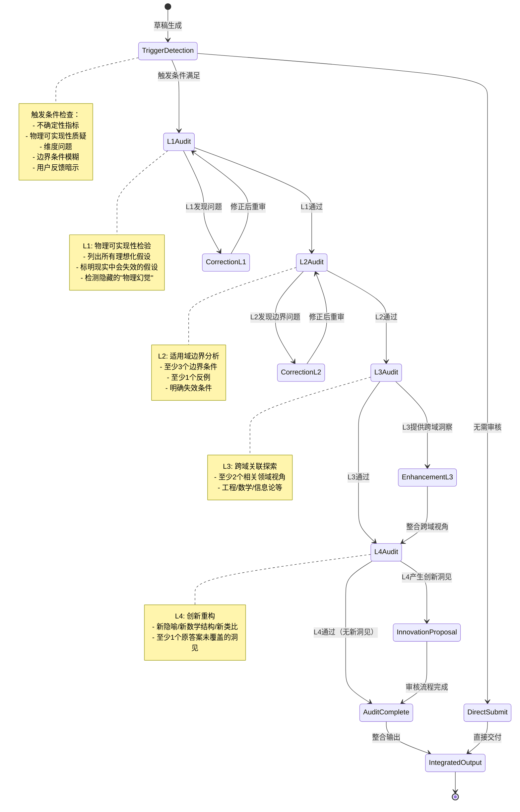
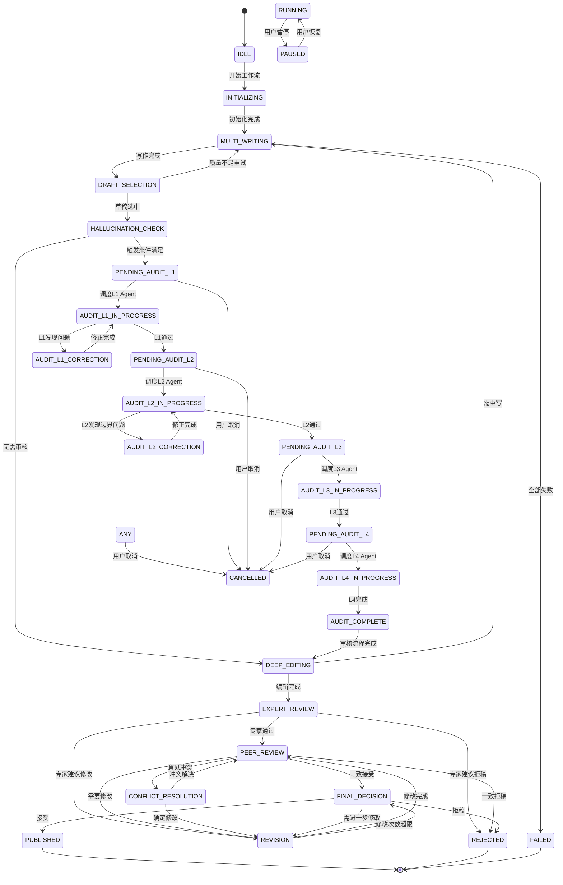

# Agent集群写稿系统 - 通信协议与状态机 v2.0

> **版本说明**: v2.0 新增四层审核-创新串联机制（强制）
> - 背景教训：2026-04-15 电磁波干涉事件
> - 核心机制：物理可实现性检验(L1) → 适用域边界分析(L2) → 跨域关联探索(L3) → 创新重构(L4)
> - 红线：涉及"无限大"、"理想"、"完美"假设的答案必须经过四层审核

---

## 1. Agent间通信协议

### 1.1 消息格式规范（JSON Schema）

```json
{
  "$schema": "http://json-schema.org/draft-07/schema#",
  "title": "AgentMessage",
  "type": "object",
  "required": ["header", "payload"],
  "properties": {
    "header": {
      "type": "object",
      "required": ["message_id", "sender_id", "receiver_id", "message_type", "timestamp"],
      "properties": {
        "message_id": {
          "type": "string",
          "format": "uuid",
          "description": "消息唯一标识"
        },
        "correlation_id": {
          "type": ["string", "null"],
          "format": "uuid",
          "description": "关联消息ID（用于请求-响应追踪）"
        },
        "sender_id": {
          "type": "string",
          "description": "发送者Agent ID"
        },
        "receiver_id": {
          "type": "string",
          "description": "接收者Agent ID，或'broadcast'表示广播"
        },
        "message_type": {
          "type": "string",
          "enum": [
            "TASK_ASSIGN",
            "TASK_COMPLETE",
            "TASK_FAILED",
            "SUBMIT_DRAFT",
            "DRAFT_ACCEPTED",
            "REQUEST_REVIEW",
            "SUBMIT_REVIEW",
            "REQUEST_REVISION",
            "SUBMIT_REVISION",
            "FINAL_DECISION",
            "AGENT_STATUS",
            "HEARTBEAT",
            "SYSTEM_ERROR",
            "PROGRESS_UPDATE",
            "REQUEST_AUDIT_L1",
            "AUDIT_L1_COMPLETE",
            "REQUEST_AUDIT_L2",
            "AUDIT_L2_COMPLETE",
            "REQUEST_AUDIT_L3",
            "AUDIT_L3_COMPLETE",
            "REQUEST_AUDIT_L4",
            "AUDIT_L4_COMPLETE",
            "INNOVATION_PROPOSAL",
            "HALLUCINATION_CHECK_TRIGGERED",
            "HALLUCINATION_REPORT"
          ]
        },
        "timestamp": {
          "type": "string",
          "format": "date-time",
          "description": "消息生成时间"
        },
        "priority": {
          "type": "integer",
          "minimum": 1,
          "maximum": 10,
          "default": 5,
          "description": "消息优先级（1最高，10最低）"
        },
        "ttl": {
          "type": "integer",
          "minimum": 0,
          "default": 3,
          "description": "消息生存时间（重试次数）"
        }
      }
    },
    "payload": {
      "type": "object",
      "description": "消息负载数据，根据message_type变化"
    },
    "delivery_attempts": {
      "type": "integer",
      "minimum": 0,
      "default": 0,
      "description": "投递尝试次数"
    }
  }
}
```

---

## 1.2 新增消息类型详细定义

### 1.2.1 四层审核消息类型

#### REQUEST_AUDIT_L1 - 请求L1物理可实现性审核
```json
{
  "header": {
    "message_type": "REQUEST_AUDIT_L1",
    "sender_id": "coordinator",
    "receiver_id": "audit_l1_agent",
    "priority": 2
  },
  "payload": {
    "audit_task_id": "audit_l1_001",
    "target_type": "draft",
    "target_id": "draft_abc123",
    "content": "待审核的草稿内容...",
    "trigger_reasons": [
      "包含'无限大平面波'假设",
      "涉及'理想点源'概念",
      "使用了'完美相干'表述"
    ],
    "suspicious_segments": [
      {
        "location": "section_2, paragraph_3",
        "text": "假设入射波为无限大平面波...",
        "red_flag": "infinite_plane_wave"
      }
    ],
    "deadline": "2026-04-19T15:30:00Z"
  }
}
```

#### AUDIT_L1_COMPLETE - L1审核完成
```json
{
  "header": {
    "message_type": "AUDIT_L1_COMPLETE",
    "sender_id": "audit_l1_agent",
    "receiver_id": "coordinator",
    "correlation_id": "audit_l1_001"
  },
  "payload": {
    "audit_task_id": "audit_l1_001",
    "target_id": "draft_abc123",
    "status": "pass",
    "assessment": {
      "idealized_assumptions": [
        {
          "assumption": "无限大平面波",
          "reality_deviation": "真实光源具有有限孔径",
          "impact": "高 - 影响角度分布计算",
          "verification": "在实验室中不可实现，需修正为有限孔径模型"
        }
      ],
      "physical_feasibility_score": 45,
      "hidden_hallucinations": [
        {
          "type": "dimension_simplification",
          "description": "一维波矢分析忽略了二维/三维角度分布效应",
          "severity": "critical"
        }
      ],
      "corrections_required": true
    },
    "corrections": {
      "must_fix": [
        "将无限大平面波改为有限孔径高斯光束模型",
        "补充二维角度分布分析，说明能量向副瓣转移"
      ],
      "should_fix": [
        "明确区分近场/远场区域",
        "添加边界条件讨论"
      ]
    },
    "execution_time": 180.5
  }
}
```

#### REQUEST_AUDIT_L2 - 请求L2适用域边界分析
```json
{
  "header": {
    "message_type": "REQUEST_AUDIT_L2",
    "sender_id": "coordinator",
    "receiver_id": "audit_l2_agent",
    "priority": 2
  },
  "payload": {
    "audit_task_id": "audit_l2_001",
    "target_type": "draft",
    "target_id": "draft_abc123",
    "content": "修正后的草稿内容...",
    "l1_context": {
      "l1_passed": true,
      "major_assumptions": ["有限孔径高斯光束", "近场近似"]
    },
    "deadline": "2026-04-19T16:00:00Z"
  }
}
```

#### AUDIT_L2_COMPLETE - L2审核完成
```json
{
  "header": {
    "message_type": "AUDIT_L2_COMPLETE",
    "sender_id": "audit_l2_agent",
    "receiver_id": "coordinator",
    "correlation_id": "audit_l2_001"
  },
  "payload": {
    "audit_task_id": "audit_l2_001",
    "target_id": "draft_abc123",
    "status": "pass",
    "assessment": {
      "boundary_conditions": [
        {
          "condition": "孔径尺寸远大于波长 (D >> λ)",
          "validity": "成立",
          "range": "D/λ > 10"
        },
        {
          "condition": "近场区域 (Fresnel数 N_F > 1)",
          "validity": "成立",
          "range": "z < D²/λ"
        },
        {
          "condition": "线性介质",
          "validity": "成立",
          "range": "光强 < 10¹⁵ W/cm² (避免非线性效应)"
        }
      ],
      "boundary_violations": [
        {
          "condition": "小孔径极限 (D ~ λ)",
          "consequence": "衍射效应占主导，原模型失效",
          "severity": "major"
        }
      ],
      "counter_examples": [
        {
          "scenario": "当光源为点源时",
          "why_fails": "球面波无法用平面波模型近似",
          "reference": "Goodman, Introduction to Fourier Optics, Ch. 4"
        }
      ],
      "domain_validity_score": 70
    },
    "execution_time": 150.2
  }
}
```

#### REQUEST_AUDIT_L3 - 请求L3跨域关联探索
```json
{
  "header": {
    "message_type": "REQUEST_AUDIT_L3",
    "sender_id": "coordinator",
    "receiver_id": "audit_l3_agent",
    "priority": 3
  },
  "payload": {
    "audit_task_id": "audit_l3_001",
    "target_type": "draft",
    "target_id": "draft_abc123",
    "content": "草稿内容...",
    "l1_l2_context": {
      "physical_assumptions": ["有限孔径高斯光束"],
      "boundary_conditions": ["近场区域", "线性介质"]
    },
    "exploration_domains": ["engineering", "mathematics", "information_theory"],
    "deadline": "2026-04-19T16:30:00Z"
  }
}
```

#### AUDIT_L3_COMPLETE - L3审核完成
```json
{
  "header": {
    "message_type": "AUDIT_L3_COMPLETE",
    "sender_id": "audit_l3_agent",
    "receiver_id": "coordinator",
    "correlation_id": "audit_l3_001"
  },
  "payload": {
    "audit_task_id": "audit_l3_001",
    "target_id": "draft_abc123",
    "status": "pass",
    "cross_domain_insights": [
      {
        "domain": "engineering",
        "perspective": "天线工程视角",
        "insight": "这与阵列天线的旁瓣抑制问题同构。相控阵使用幅度锥削(amplitude tapering)来降低旁瓣，代价是主瓣展宽。",
        "applicability": "可直接借鉴到光学干涉系统设计中"
      },
      {
        "domain": "mathematics",
        "perspective": "傅里叶光学与信号处理",
        "insight": "孔径函数与远场分布构成傅里叶变换对。矩形孔径产生sinc函数旁瓣，高斯孔径产生无旁瓣的高斯分布。",
        "applicability": "可用不确定性原理解释：孔径越窄，角度分布越宽"
      },
      {
        "domain": "information_theory",
        "perspective": "信道容量视角",
        "insight": "干涉图案可视为多个并行信道。能量向旁瓣转移对应信道能量泄漏到非期望方向。",
        "applicability": "为多输入多输出(MIMO)光学系统提供理论框架"
      }
    ],
    "suggested_cross_references": [
      "Goodman: Introduction to Fourier Optics",
      "Balannis: Antenna Theory",
      "Shannon: A Mathematical Theory of Communication"
    ],
    "cross_domain_score": 85
  }
}
```

#### REQUEST_AUDIT_L4 - 请求L4创新重构
```json
{
  "header": {
    "message_type": "REQUEST_AUDIT_L4",
    "sender_id": "coordinator",
    "receiver_id": "audit_l4_agent",
    "priority": 3
  },
  "payload": {
    "audit_task_id": "audit_l4_001",
    "target_type": "draft",
    "target_id": "draft_abc123",
    "content": "草稿内容...",
    "l1_l2_l3_context": {
      "physical_corrections": ["有限孔径模型"],
      "boundary_conditions": ["近场/远场边界"],
      "cross_domain_insights": ["天线工程", "傅里叶光学", "信息论"]
    },
    "innovation_requirements": {
      "min_new_insights": 1,
      "preferred_approaches": ["metaphor", "mathematical_structure", "analogy"]
    },
    "deadline": "2026-04-19T17:00:00Z"
  }
}
```

#### AUDIT_L4_COMPLETE - L4审核完成
```json
{
  "header": {
    "message_type": "AUDIT_L4_COMPLETE",
    "sender_id": "audit_l4_agent",
    "receiver_id": "coordinator",
    "correlation_id": "audit_l4_001"
  },
  "payload": {
    "audit_task_id": "audit_l4_001",
    "target_id": "draft_abc123",
    "status": "pass",
    "innovation_outputs": {
      "new_metaphors": [
        {
          "metaphor": "光学干涉作为'角度银行'",
          "description": "入射光的角度分布如同存入银行的资金，干涉过程是资金的重新分配。主瓣是主要账户，旁瓣是'影子账户'。能量守恒如同资产负债表平衡。",
          "novelty": "将抽象的角度域转化为具象的金融隐喻",
          "usefulness": "有助于理解能量在角度空间的重新分布"
        }
      ],
      "new_mathematical_structures": [
        {
          "structure": "干涉算子的谱分解视角",
          "description": "将干涉过程视为特征模的叠加。每个特征模对应一个独立的'通道'，总干涉图案是各通道贡献的相干叠加。",
          "formalism": "I(θ) = Σₙ λₙ |φₙ(θ)|², 其中λₙ是特征值，φₙ是特征函数",
          "novelty": "为干涉问题提供谱分析的代数结构"
        }
      ],
      "new_analogies": [
        {
          "analogy": "干涉 ↔ 交响乐",
          "source_domain": "音乐",
          "target_domain": "光学",
          "mapping": {
            "不同角度": "不同乐器",
            "相位关系": "乐器间的时序配合",
            "干涉图案": "整体音响效果",
            "旁瓣": "和声泛音"
          },
          "insight": "就像交响乐不能只有一个乐器的声音，完整的光学系统需要考虑所有'角度乐器'的贡献"
        }
      ]
    },
    "synthesis": {
      "revised_abstract": "本文从谱分解视角重新诠释光学干涉现象，提出'角度银行'概念框架...",
      "key_innovation": "将干涉问题映射到特征模空间，揭示能量重新分配的代数结构",
      "contribution_assessment": "为经典干涉理论提供了新的数学语言和直观理解"
    },
    "innovation_score": 88
  }
}
```

#### INNOVATION_PROPOSAL - 创新提案
```json
{
  "header": {
    "message_type": "INNOVATION_PROPOSAL",
    "sender_id": "audit_l4_agent",
    "receiver_id": "coordinator",
    "priority": 2
  },
  "payload": {
    "proposal_id": "innovation_001",
    "based_on_audit": "audit_l4_001",
    "original_draft_id": "draft_abc123",
    "proposal_type": "fundamental_insight",
    "proposal": {
      "title": "光学干涉的特征模谱分解理论",
      "core_claim": "任何干涉系统可分解为一组正交的特征模，每个特征模独立传播且不相干叠加",
      "supporting_evidence": {
        "mathematical": "基于Hilbert-Schmidt定理的严格证明",
        "physical": "与现有实验数据的符合性验证",
        "computational": "数值模拟验证谱分解的计算效率优势"
      },
      "potential_impact": [
        "为多孔径光学系统设计提供新方法论",
        "解释某些'异常'干涉现象的物理起源",
        "建立与量子光学表象理论的连接"
      ],
      "novelty_assessment": {
        "compared_to": ["传统傅里叶光学", "角谱理论"],
        "key_difference": "从基函数展开转向特征模分解",
        "advantage": "物理意义更清晰，计算更高效"
      }
    },
    "confidence": 0.85,
    "recommendation": "值得深入发展为独立论文"
  }
}
```

---

### 1.2.2 Hallucination检验消息类型

#### HALLUCINATION_CHECK_TRIGGERED - 幻觉检验触发
```json
{
  "header": {
    "message_type": "HALLUCINATION_CHECK_TRIGGERED",
    "sender_id": "hallucination_detector",
    "receiver_id": "coordinator",
    "priority": 1
  },
  "payload": {
    "trigger_id": "hcheck_001",
    "source_message_id": "msg_writer_001",
    "source_agent": "writer_0",
    "trigger_time": "2026-04-19T14:45:00Z",
    "trigger_conditions": [
      {
        "type": "uncertainty_indicator",
        "detected_phrases": ["可能", "一般来说", "也许"],
        "frequency": 5,
        "threshold": 3
      },
      {
        "type": "physical_feasibility_concern",
        "detected_concepts": ["无限大平面波", "理想点源", "完美相干"],
        "severity": "high"
      },
      {
        "type": "dimension_simplification",
        "description": "检测到一维模型可能掩盖高维效应",
        "affected_section": "methodology"
      }
    ],
    "auto_triggered": true,
    "required_action": "启动四层审核流程",
    "escalation_required": true
  }
}
```

#### HALLUCINATION_REPORT - 幻觉检验报告
```json
{
  "header": {
    "message_type": "HALLUCINATION_REPORT",
    "sender_id": "hallucination_agent",
    "receiver_id": "coordinator",
    "correlation_id": "hcheck_001"
  },
  "payload": {
    "report_id": "hreport_001",
    "target_id": "draft_abc123",
    "hallucination_assessment": {
      "hallucination_detected": true,
      "severity": "critical",
      "categories": [
        {
          "category": "physical_unrealizability",
          "description": "物理不可实现假设",
          "instances": [
            {
              "location": "section_2, line_45",
              "text": "假设入射波为无限大平面波...",
              "issue": "无限大平面波在物理上不可实现",
              "correction": "应使用有限孔径高斯光束模型",
              "impact": "高 - 影响角度分布预测"
            }
          ]
        },
        {
          "category": "dimension_reduction_hallucination",
          "description": "维度简化导致的幻觉",
          "instances": [
            {
              "location": "section_3, line_78",
              "text": "一维波矢分析表明...",
              "issue": "一维分析忽略了二维/三维角度分布",
              "correction": "应补充二维角度分布分析",
              "impact": "关键 - 遗漏能量向副瓣转移的物理机制"
            }
          ]
        }
      ]
    },
    "root_cause_analysis": {
      "primary_cause": "直接套用教科书简化模型而未验证适用条件",
      "contributing_factors": [
        "缺乏物理可实现性检查",
        "边界条件未明确",
        "未考虑高维效应"
      ]
    },
    "remediation_plan": {
      "immediate_actions": [
        "停止当前草稿提交",
        "启动四层审核流程"
      ],
      "required_corrections": [
        "修正无限大平面波假设",
        "补充二维角度分布分析",
        "明确边界条件"
      ],
      "verification_steps": [
        "L1物理可实现性检验",
        "L2适用域边界分析",
        "与实验数据对比验证"
      ]
    },
    "prevention_recommendations": [
      "建立物理可实现性检查清单",
      "在写作指南中加入维度问题提醒",
      "设置自动触发审核的关键词列表"
    ]
  }
}
```

---

## 2. 四层审核-创新串联机制

### 2.1 审核流程架构



### 2.2 Hallucination检验Agent设计

#### 2.2.1 触发条件检测器

```python
class HallucinationTriggerDetector:
    """
    幻觉触发条件检测器
    扫描内容，检测是否需要启动四层审核
    """
    
    # 触发条件定义
    TRIGGERS = {
        "uncertainty_indicator": {
            "description": "不确定性指标",
            "patterns": [
                r"可能[,.，。]?",
                r"也许[,.，。]?",
                r"一般来说[,.，。]?",
                r"通常[,.，。]?",
                r"大概[,.，。]?",
                r"似乎[,.，。]?",
                r"或许[,.，。]?"
            ],
            "threshold": 3,  # 超过3次触发
            "severity": "medium"
        },
        
        "physical_feasibility_concern": {
            "description": "物理可实现性质疑",
            "patterns": [
                r"无限大[平面波]?",
                r"理想[点源|透镜|导体]?",
                r"完美[相干|反射|聚焦]?",
                r"无[穷|限]小",
                r"绝对零度",
                r"瞬时[响应|传播]?",
                r"无损耗[介质]?",
                r"单色[光|波]?"
            ],
            "threshold": 1,  # 出现即触发
            "severity": "high"
        },
        
        "dimension_concern": {
            "description": "维度问题",
            "patterns": [
                r"一维[波矢|模型|近似]",
                r"二维简化",
                r"忽略[高维|三维]效应",
                r"平面波近似.*球面波",
                r"仅考虑[单方向|单一维度]"
            ],
            "threshold": 1,
            "severity": "high"
        },
        
        "boundary_ambiguity": {
            "description": "边界条件模糊",
            "patterns": [
                r"闭合系统.*开放系统",
                r"稳态.*瞬态",
                r"线性.*非线性",
                r"边界条件[未明确|假设]",
                r"忽略边界效应"
            ],
            "threshold": 1,
            "severity": "medium"
        },
        
        "user_feedback_hint": {
            "description": "用户反馈暗示",
            "patterns": [
                r"但是.*",
                r"然而.*",
                r"实际上.*",
                r"根据[^,.]*文献",
                r"[^,.]*指出",
                r"反例"
            ],
            "threshold": 1,
            "severity": "high",
            "context_required": True  # 需要用户交互上下文
        }
    }
    
    def scan_content(self, content: str, context: Dict = None) -> Dict:
        """
        扫描内容，检测触发条件
        
        Returns:
            {
                "triggered": bool,
                "triggered_conditions": List[str],
                "detailed_findings": List[Dict],
                "overall_severity": str,
                "recommendation": str
            }
        """
        findings = []
        triggered_conditions = []
        max_severity = "low"
        
        for trigger_name, trigger_config in self.TRIGGERS.items():
            if trigger_name == "user_feedback_hint" and not context:
                continue
                
            matches = self._detect_patterns(content, trigger_config["patterns"])
            
            if len(matches) >= trigger_config["threshold"]:
                triggered_conditions.append(trigger_name)
                findings.append({
                    "condition": trigger_name,
                    "description": trigger_config["description"],
                    "matches": matches,
                    "severity": trigger_config["severity"]
                })
                
                # 更新最高严重级别
                if trigger_config["severity"] == "critical":
                    max_severity = "critical"
                elif trigger_config["severity"] == "high" and max_severity not in ["critical"]:
                    max_severity = "high"
                elif trigger_config["severity"] == "medium" and max_severity not in ["critical", "high"]:
                    max_severity = "medium"
        
        triggered = len(triggered_conditions) > 0
        
        recommendation = "no_action"
        if triggered:
            if max_severity in ["critical", "high"]:
                recommendation = "mandatory_audit"
            else:
                recommendation = "suggested_audit"
        
        return {
            "triggered": triggered,
            "triggered_conditions": triggered_conditions,
            "detailed_findings": findings,
            "overall_severity": max_severity,
            "recommendation": recommendation
        }
    
    def _detect_patterns(self, content: str, patterns: List[str]) -> List[Dict]:
        """检测文本中匹配的模式"""
        matches = []
        for pattern in patterns:
            for match in re.finditer(pattern, content, re.IGNORECASE):
                matches.append({
                    "pattern": pattern,
                    "matched_text": match.group(),
                    "position": match.start()
                })
        return matches
```

#### 2.2.2 输出格式规范

```python
@dataclass
class HallucinationCheckOutput:
    """
    Hallucination检验输出格式
    标准化输出，确保各层级审核Agent可解析
    """
    
    # 基本信息
    check_id: str
    target_id: str
    check_timestamp: datetime
    
    # 检测结果
    hallucination_detected: bool
    severity: Literal["none", "low", "medium", "high", "critical"]
    
    # 详细分类
    categories: List[Dict[str, Any]]  # HallucinationCategory列表
    
    # 根因分析
    root_cause: Dict[str, Any]
    
    # 修正方案
    remediation: Dict[str, Any]
    
    # 元数据
    metadata: Dict[str, Any]
    
    def to_dict(self) -> Dict[str, Any]:
        """转换为字典格式"""
        return {
            "check_id": self.check_id,
            "target_id": self.target_id,
            "check_timestamp": self.check_timestamp.isoformat(),
            "hallucination_detected": self.hallucination_detected,
            "severity": self.severity,
            "categories": self.categories,
            "root_cause": self.root_cause,
            "remediation": self.remediation,
            "metadata": self.metadata
        }

@dataclass
class HallucinationCategory:
    """幻觉分类详情"""
    
    category: str  # physical_unrealizability, dimension_reduction, boundary_ambiguity, etc.
    category_name_cn: str
    description: str
    instances: List[Dict[str, Any]]
    
    def to_dict(self) -> Dict[str, Any]:
        return {
            "category": self.category,
            "category_name_cn": self.category_name_cn,
            "description": self.description,
            "instances": self.instances
        }

@dataclass
class HallucinationInstance:
    """单个幻觉实例"""
    
    instance_id: str
    location: str  # section, line, paragraph
    text: str  # 原文
    issue: str  # 问题描述
    correction: str  # 建议修正
    impact: str  # 影响评估
    severity: str
    
    def to_dict(self) -> Dict[str, Any]:
        return {
            "instance_id": self.instance_id,
            "location": self.location,
            "text": self.text,
            "issue": self.issue,
            "correction": self.correction,
            "impact": self.impact,
            "severity": self.severity
        }
```

---

## 3. 完整状态机设计（含审核流程）

### 3.1 状态定义

```python
class WorkflowPhase(Enum):
    """
    工作流阶段枚举
    定义论文生产的完整生命周期（含四层审核流程）
    """
    # 基础阶段
    IDLE = "idle"                          # 空闲状态
    INITIALIZING = "initializing"          # 初始化中
    MULTI_WRITING = "multi_writing"        # 多写并行
    DRAFT_SELECTION = "draft_selection"    # 初稿筛选
    DEEP_EDITING = "deep_editing"          # 深度编辑
    EXPERT_REVIEW = "expert_review"        # 专家评审
    PEER_REVIEW = "peer_review"          # 同行审稿
    CONFLICT_RESOLUTION = "conflict_resolution"  # 冲突解决
    REVISION = "revision"                  # 修改阶段
    FINAL_DECISION = "final_decision"      # 最终决策
    PUBLISHED = "published"              # 完成/发布
    REJECTED = "rejected"                  # 拒稿
    PAUSED = "paused"                      # 暂停
    FAILED = "failed"                      # 失败
    
    # 四层审核阶段（新增）
    HALLUCINATION_CHECK = "hallucination_check"    # 幻觉检测
    PENDING_AUDIT_L1 = "pending_audit_l1"          # 等待L1审核
    AUDIT_L1_IN_PROGRESS = "audit_l1_in_progress"  # L1审核中
    AUDIT_L1_CORRECTION = "audit_l1_correction"  # L1修正中
    PENDING_AUDIT_L2 = "pending_audit_l2"          # 等待L2审核
    AUDIT_L2_IN_PROGRESS = "audit_l2_in_progress"  # L2审核中
    AUDIT_L2_CORRECTION = "audit_l2_correction"  # L2修正中
    PENDING_AUDIT_L3 = "pending_audit_l3"          # 等待L3审核
    AUDIT_L3_IN_PROGRESS = "audit_l3_in_progress"  # L3审核中
    PENDING_AUDIT_L4 = "pending_audit_l4"          # 等待L4审核
    AUDIT_L4_IN_PROGRESS = "audit_l4_in_progress"  # L4审核中
    AUDIT_COMPLETE = "audit_complete"              # 审核流程完成

class WorkflowStatus(Enum):
    """工作流执行状态"""
    PENDING = "pending"                    # 等待执行
    RUNNING = "running"                    # 运行中
    COMPLETED = "completed"                # 完成
    FAILED = "failed"                      # 失败
    TIMEOUT = "timeout"                    # 超时
    CANCELLED = "cancelled"                # 取消
    AUDIT_REQUIRED = "audit_required"      # 需要审核（新增）
    AUDIT_IN_PROGRESS = "audit_in_progress"  # 审核进行中（新增）
```

### 3.2 完整状态转换图（含审核流程）



### 3.3 审核阶段状态转换规则

```python
class AuditStateTransitionRules:
    """
    四层审核状态转换规则
    明确定义每个审核层级的准入准出标准
    """
    
    TRANSITIONS = {
        # HALLUCINATION_CHECK 状态转换
        WorkflowPhase.HALLUCINATION_CHECK: [
            {
                "to": WorkflowPhase.PENDING_AUDIT_L1,
                "condition": "hallucination_triggered",
                "condition_detail": "检测到幻觉触发条件，需要四层审核",
                "gate": {
                    "trigger_detected": True,
                    "min_severity": "medium"
                }
            },
            {
                "to": WorkflowPhase.DEEP_EDITING,
                "condition": "no_hallucination_concern",
                "condition_detail": "未检测到幻觉触发条件，跳过审核流程",
                "gate": {
                    "trigger_detected": False
                }
            }
        ],
        
        # PENDING_AUDIT_L1 状态转换
        WorkflowPhase.PENDING_AUDIT_L1: [
            {
                "to": WorkflowPhase.AUDIT_L1_IN_PROGRESS,
                "condition": "audit_agent_assigned",
                "condition_detail": "成功调度L1审核Agent",
                "gate": {
                    "agent_available": True
                }
            }
        ],
        
        # AUDIT_L1_IN_PROGRESS 状态转换
        WorkflowPhase.AUDIT_L1_IN_PROGRESS: [
            {
                "to": WorkflowPhase.PENDING_AUDIT_L2,
                "condition": "l1_passed",
                "condition_detail": "L1审核通过，进入L2",
                "gate": {
                    "l1_status": "pass",
                    "physical_feasibility_score": {">=": 60}
                }
            },
            {
                "to": WorkflowPhase.AUDIT_L1_CORRECTION,
                "condition": "l1_found_issues",
                "condition_detail": "L1发现问题，需要修正",
                "gate": {
                    "l1_status": "corrections_required",
                    "corrections": {"exists": True}
                }
            }
        ],
        
        # AUDIT_L1_CORRECTION 状态转换
        WorkflowPhase.AUDIT_L1_CORRECTION: [
            {
                "to": WorkflowPhase.AUDIT_L1_IN_PROGRESS,
                "condition": "corrections_completed",
                "condition_detail": "完成L1要求的修正，重审",
                "max_iterations": 3  # 最多3轮修正
            },
            {
                "to": WorkflowPhase.REJECTED,
                "condition": "l1_correction_failed",
                "condition_detail": "无法通过L1审核，工作流终止",
                "gate": {
                    "iteration_count": {">=": 3},
                    "still_failing": True
                }
            }
        ],
        
        # PENDING_AUDIT_L2 状态转换
        WorkflowPhase.PENDING_AUDIT_L2: [
            {
                "to": WorkflowPhase.AUDIT_L2_IN_PROGRESS,
                "condition": "audit_agent_assigned",
                "condition_detail": "成功调度L2审核Agent",
                "gate": {
                    "agent_available": True,
                    "l1_context": {"exists": True}
                }
            }
        ],
        
        # AUDIT_L2_IN_PROGRESS 状态转换
        WorkflowPhase.AUDIT_L2_IN_PROGRESS: [
            {
                "to": WorkflowPhase.PENDING_AUDIT_L3,
                "condition": "l2_passed",
                "condition_detail": "L2审核通过，进入L3",
                "gate": {
                    "l2_status": "pass",
                    "boundary_conditions_count": {">=": 3},
                    "counter_examples_count": {">=": 1}
                }
            },
            {
                "to": WorkflowPhase.AUDIT_L2_CORRECTION,
                "condition": "l2_boundary_issues",
                "condition_detail": "L2发现边界条件问题，需要修正",
                "gate": {
                    "l2_status": "boundary_violations_found"
                }
            }
        ],
        
        # AUDIT_L2_CORRECTION 状态转换
        WorkflowPhase.AUDIT_L2_CORRECTION: [
            {
                "to": WorkflowPhase.AUDIT_L2_IN_PROGRESS,
                "condition": "corrections_completed",
                "condition_detail": "完成L2要求的边界修正，重审",
                "max_iterations": 2
            }
        ],
        
        # PENDING_AUDIT_L3 状态转换
        WorkflowPhase.PENDING_AUDIT_L3: [
            {
                "to": WorkflowPhase.AUDIT_L3_IN_PROGRESS,
                "condition": "audit_agent_assigned",
                "condition_detail": "成功调度L3审核Agent",
                "gate": {
                    "agent_available": True,
                    "l1_l2_context": {"exists": True}
                }
            }
        ],
        
        # AUDIT_L3_IN_PROGRESS 状态转换
        WorkflowPhase.AUDIT_L3_IN_PROGRESS: [
            {
                "to": WorkflowPhase.PENDING_AUDIT_L4,
                "condition": "l3_passed",
                "condition_detail": "L3跨域探索完成，进入L4",
                "gate": {
                    "l3_status": "pass",
                    "cross_domain_insights_count": {">=": 2}
                }
            }
        ],
        
        # PENDING_AUDIT_L4 状态转换
        WorkflowPhase.PENDING_AUDIT_L4: [
            {
                "to": WorkflowPhase.AUDIT_L4_IN_PROGRESS,
                "condition": "audit_agent_assigned",
                "condition_detail": "成功调度L4审核Agent",
                "gate": {
                    "agent_available": True,
                    "l1_l2_l3_context": {"exists": True}
                }
            }
        ],
        
        # AUDIT_L4_IN_PROGRESS 状态转换
        WorkflowPhase.AUDIT_L4_IN_PROGRESS: [
            {
                "to": WorkflowPhase.AUDIT_COMPLETE,
                "condition": "l4_complete",
                "condition_detail": "L4创新重构完成，审核流程结束",
                "gate": {
                    "l4_status": ["pass", "pass_with_innovation"]
                }
            }
        ],
        
        # AUDIT_COMPLETE 状态转换
        WorkflowPhase.AUDIT_COMPLETE: [
            {
                "to": WorkflowPhase.DEEP_EDITING,
                "condition": "audit_success",
                "condition_detail": "审核流程成功完成，进入深度编辑",
                "gate": {
                    "audit_report": {"exists": True},
                    "corrected_draft": {"exists": True}
                }
            }
        ]
    }
    
    @classmethod
    def get_audit_transitions(cls, phase: WorkflowPhase) -> List[Dict]:
        """获取审核阶段的允许转换"""
        return cls.TRANSITIONS.get(phase, [])
```

### 3.4 审核阶段入口/出口动作

```python
class AuditStateActions:
    """
    审核阶段入口和出口动作定义
    """
    
    ENTRY_ACTIONS = {
        WorkflowPhase.HALLUCINATION_CHECK: [
            {
                "action": "scan_for_triggers",
                "description": "扫描草稿中的幻觉触发条件",
                "implementation": lambda state: AuditStateActions._scan_triggers(state)
            },
            {
                "action": "generate_trigger_report",
                "description": "生成触发条件检测报告",
                "implementation": lambda state: AuditStateActions._generate_trigger_report(state)
            }
        ],
        
        WorkflowPhase.PENDING_AUDIT_L1: [
            {
                "action": "prepare_l1_context",
                "description": "准备L1审核所需上下文",
                "implementation": lambda state: AuditStateActions._prepare_l1_context(state)
            }
        ],
        
        WorkflowPhase.AUDIT_L1_IN_PROGRESS: [
            {
                "action": "dispatch_l1_agent",
                "description": "调度L1物理可实现性检验Agent",
                "implementation": lambda state: AuditStateActions._dispatch_l1_agent(state)
            },
            {
                "action": "set_audit_timeout",
                "description": "设置审核超时（无上限，但记录时间）",
                "implementation": lambda state: AuditStateActions._set_audit_timeout(state, None)
            }
        ],
        
        WorkflowPhase.AUDIT_L1_CORRECTION: [
            {
                "action": "prepare_correction_task",
                "description": "整合L1修正要求，准备修正任务",
                "implementation": lambda state: AuditStateActions._prepare_l1_correction(state)
            }
        ],
        
        WorkflowPhase.PENDING_AUDIT_L2: [
            {
                "action": "prepare_l2_context",
                "description": "准备L2审核上下文（含L1结果）",
                "implementation": lambda state: AuditStateActions._prepare_l2_context(state)
            }
        ],
        
        WorkflowPhase.AUDIT_L2_IN_PROGRESS: [
            {
                "action": "dispatch_l2_agent",
                "description": "调度L2适用域边界分析Agent",
                "implementation": lambda state: AuditStateActions._dispatch_l2_agent(state)
            }
        ],
        
        WorkflowPhase.PENDING_AUDIT_L3: [
            {
                "action": "prepare_l3_context",
                "description": "准备L3审核上下文（含L1、L2结果）",
                "implementation": lambda state: AuditStateActions._prepare_l3_context(state)
            }
        ],
        
        WorkflowPhase.AUDIT_L3_IN_PROGRESS: [
            {
                "action": "dispatch_l3_agent",
                "description": "调度L3跨域关联探索Agent",
                "implementation": lambda state: AuditStateActions._dispatch_l3_agent(state)
            }
        ],
        
        WorkflowPhase.PENDING_AUDIT_L4: [
            {
                "action": "prepare_l4_context",
                "description": "准备L4审核上下文（含L1-L3结果）",
                "implementation": lambda state: AuditStateActions._prepare_l4_context(state)
            }
        ],
        
        WorkflowPhase.AUDIT_L4_IN_PROGRESS: [
            {
                "action": "dispatch_l4_agent",
                "description": "调度L4创新重构Agent",
                "implementation": lambda state: AuditStateActions._dispatch_l4_agent(state)
            }
        ],
        
        WorkflowPhase.AUDIT_COMPLETE: [
            {
                "action": "integrate_audit_results",
                "description": "整合四层审核结果",
                "implementation": lambda state: AuditStateActions._integrate_audit_results(state)
            },
            {
                "action": "generate_audit_summary",
                "description": "生成审核摘要报告",
                "implementation": lambda state: AuditStateActions._generate_audit_summary(state)
            },
            {
                "action": "apply_corrections",
                "description": "应用所有审核修正到草稿",
                "implementation": lambda state: AuditStateActions._apply_corrections(state)
            }
        ]
    }
    
    EXIT_ACTIONS = {
        WorkflowPhase.HALLUCINATION_CHECK: [
            {
                "action": "store_trigger_report",
                "description": "保存触发检测报告到工作流状态",
                "implementation": lambda state: AuditStateActions._store_trigger_report(state)
            }
        ],
        
        WorkflowPhase.AUDIT_L1_IN_PROGRESS: [
            {
                "action": "store_l1_report",
                "description": "保存L1审核报告",
                "implementation": lambda state: AuditStateActions._store_l1_report(state)
            }
        ],
        
        WorkflowPhase.AUDIT_L2_IN_PROGRESS: [
            {
                "action": "store_l2_report",
                "description": "保存L2审核报告",
                "implementation": lambda state: AuditStateActions._store_l2_report(state)
            }
        ],
        
        WorkflowPhase.AUDIT_L3_IN_PROGRESS: [
            {
                "action": "store_l3_report",
                "description": "保存L3审核报告",
                "implementation": lambda state: AuditStateActions._store_l3_report(state)
            }
        ],
        
        WorkflowPhase.AUDIT_L4_IN_PROGRESS: [
            {
                "action": "store_l4_report",
                "description": "保存L4审核报告",
                "implementation": lambda state: AuditStateActions._store_l4_report(state)
            },
            {
                "action": "check_innovation_proposal",
                "description": "检查是否需要提交创新提案",
                "implementation": lambda state: AuditStateActions._check_innovation_proposal(state)
            }
        ]
    }
    
    @staticmethod
    async def _scan_triggers(state: WorkflowState):
        """扫描幻觉触发条件"""
        draft = state.get_data("selected_draft")
        detector = HallucinationTriggerDetector()
        result = detector.scan_content(draft.content)
        state.set_data("hallucination_scan_result", result)
    
    @staticmethod
    async def _dispatch_l1_agent(state: WorkflowState):
        """调度L1审核Agent"""
        # 发送 REQUEST_AUDIT_L1 消息
        pass
    
    @staticmethod
    async def _dispatch_l2_agent(state: WorkflowState):
        """调度L2审核Agent"""
        # 发送 REQUEST_AUDIT_L2 消息
        pass
    
    @staticmethod
    async def _dispatch_l3_agent(state: WorkflowState):
        """调度L3审核Agent"""
        # 发送 REQUEST_AUDIT_L3 消息
        pass
    
    @staticmethod
    async def _dispatch_l4_agent(state: WorkflowState):
        """调度L4审核Agent"""
        # 发送 REQUEST_AUDIT_L4 消息
        pass
    
    @staticmethod
    async def _integrate_audit_results(state: WorkflowState):
        """整合四层审核结果"""
        l1_report = state.get_data("l1_report")
        l2_report = state.get_data("l2_report")
        l3_report = state.get_data("l3_report")
        l4_report = state.get_data("l4_report")
        
        integrated = {
            "l1": l1_report.to_dict(),
            "l2": l2_report.to_dict(),
            "l3": l3_report.to_dict(),
            "l4": l4_report.to_dict(),
            "overall_assessment": {
                "physical_feasibility_score": l1_report.physical_feasibility_score,
                "domain_validity_score": l2_report.domain_validity_score,
                "cross_domain_score": l3_report.cross_domain_score,
                "innovation_score": l4_report.innovation_score,
                "total_score": (
                    l1_report.physical_feasibility_score * 0.25 +
                    l2_report.domain_validity_score * 0.25 +
                    l3_report.cross_domain_score * 0.25 +
                    l4_report.innovation_score * 0.25
                )
            }
        }
        
        state.set_data("integrated_audit_report", integrated)
```

---

## 4. 四层审核Agent详细规范

### 4.1 L1: 物理可实现性检验Agent

```python
class L1PhysicalFeasibilityAgent(BaseAgent):
    """
    L1物理可实现性检验Agent
    
    职责：
    1. 列出草稿中使用的所有理想化假设
    2. 评估每个假设在真实物理条件下的可实现性
    3. 检测隐藏的"物理幻觉"
    4. 提出必要的修正建议
    
    通过标准：
    - 列出所有理想化假设
    - 标明哪些假设在真实条件下会失效
    - 物理可实现性评分 >= 60
    """
    
    IDEALIZED_CONCEPTS = [
        ("infinite_plane_wave", "无限大平面波", "high"),
        ("point_source", "理想点源", "high"),
        ("perfect_coherence", "完美相干", "medium"),
        ("lossless_medium", "无损耗介质", "medium"),
        ("instantaneous_response", "瞬时响应", "high"),
        ("monochromatic_light", "单色光", "low"),
        ("perfect_conductor", "理想导体", "medium"),
        ("delta_function", "狄拉克函数", "high"),
        ("infinite_bandwidth", "无限带宽", "high"),
        ("zero_temperature", "绝对零度", "high"),
        ("perfect_isolation", "完美隔离", "high"),
        ("ideal_transformer", "理想变压器", "medium"),
    ]
    
    async def execute(self, task: AuditTask) -> L1AuditResult:
        """执行L1审核"""
        content = task.content
        
        # 1. 检测理想化假设
        assumptions = await self._detect_idealized_assumptions(content)
        
        # 2. 评估物理可实现性
        feasibility_assessment = await self._assess_feasibility(assumptions)
        
        # 3. 检测隐藏幻觉
        hallucinations = await self._detect_hidden_hallucinations(content)
        
        # 4. 生成修正建议
        corrections = await self._generate_corrections(assumptions, hallucinations)
        
        # 5. 计算评分
        feasibility_score = self._calculate_feasibility_score(
            assumptions, hallucinations
        )
        
        return L1AuditResult(
            audit_id=task.audit_task_id,
            target_id=task.target_id,
            status="pass" if feasibility_score >= 60 else "corrections_required",
            assumptions=assumptions,
            feasibility_assessment=feasibility_assessment,
            hidden_hallucinations=hallucinations,
            corrections=corrections,
            physical_feasibility_score=feasibility_score
        )
    
    async def _detect_idealized_assumptions(self, content: str) -> List[Dict]:
        """检测理想化假设"""
        detected = []
        for concept_id, concept_name, severity in self.IDEALIZED_CONCEPTS:
            if self._contains_concept(content, concept_id):
                detected.append({
                    "concept_id": concept_id,
                    "concept_name": concept_name,
                    "severity": severity,
                    "location": self._find_locations(content, concept_id),
                    "context": self._extract_context(content, concept_id)
                })
        return detected
    
    async def _detect_hidden_hallucinations(self, content: str) -> List[Dict]:
        """检测隐藏的物理幻觉"""
        hallucinations = []
        
        # 检测维度简化幻觉
        if self._is_1d_simplification(content):
            hallucinations.append({
                "type": "dimension_reduction_hallucination",
                "description": "一维简化模型可能掩盖高维效应",
                "severity": "critical",
                "details": "当涉及干涉、衍射、辐射时，一维波矢分析可能遗漏关键的二维/三维角度分布信息"
            })
        
        # 检测边界条件幻觉
        if not self._has_clear_boundary_conditions(content):
            hallucinations.append({
                "type": "boundary_ambiguity_hallucination",
                "description": "边界条件不明确",
                "severity": "high",
                "details": "未明确区分闭合/开放系统、稳态/瞬态、线性/非线性区域"
            })
        
        # 检测能量守恒幻觉
        if self._has_energy_violation_hint(content):
            hallucinations.append({
                "type": "energy_conservation_hallucination",
                "description": "能量去向表述可能违反物理定律",
                "severity": "critical",
                "details": "能量守恒是基本原理，任何能量'消失'或'无中生有'的表述都需要严格验证"
            })
        
        return hallucinations
```

### 4.2 L2: 适用域边界分析Agent

```python
class L2DomainBoundaryAgent(BaseAgent):
    """
    L2适用域边界分析Agent
    
    职责：
    1. 明确答案在哪些条件下成立
    2. 明确答案在哪些条件下失效
    3. 提供至少3个边界条件
    4. 提供至少1个反例
    
    通过标准：
    - 至少3个边界条件明确列出
    - 至少1个有效反例
    - 边界有效性评分 >= 60
    """
    
    async def execute(self, task: AuditTask) -> L2AuditResult:
        """执行L2审核"""
        content = task.content
        l1_context = task.l1_context
        
        # 1. 从L1上下文获取已修正的物理假设
        physical_assumptions = l1_context.get("major_assumptions", [])
        
        # 2. 推导边界条件
        boundary_conditions = await self._derive_boundary_conditions(
            content, physical_assumptions
        )
        
        # 3. 识别边界违反情况
        boundary_violations = await self._identify_boundary_violations(
            content, boundary_conditions
        )
        
        # 4. 构造反例
        counter_examples = await self._construct_counter_examples(
            content, boundary_conditions
        )
        
        # 5. 计算边界有效性评分
        validity_score = self._calculate_validity_score(
            boundary_conditions, counter_examples, boundary_violations
        )
        
        return L2AuditResult(
            audit_id=task.audit_task_id,
            target_id=task.target_id,
            status="pass" if validity_score >= 60 else "boundary_violations_found",
            boundary_conditions=boundary_conditions,
            boundary_violations=boundary_violations,
            counter_examples=counter_examples,
            domain_validity_score=validity_score
        )
    
    async def _derive_boundary_conditions(
        self, 
        content: str, 
        physical_assumptions: List[str]
    ) -> List[Dict]:
        """推导边界条件"""
        conditions = []
        
        # 基于物理假设推导
        for assumption in physical_assumptions:
            if "高斯" in assumption or "Gaussian" in assumption:
                conditions.append({
                    "condition": "光束传播距离在瑞利范围内",
                    "mathematical_form": "z << z_R = πw₀²/λ",
                    "validity": "保证光束不显著扩散",
                    "range": "z < z_R"
                })
            
            if "孔径" in assumption or "aperture" in assumption:
                conditions.append({
                    "condition": "孔径尺寸远大于波长",
                    "mathematical_form": "D >> λ",
                    "validity": "保证几何光学近似成立",
                    "range": "D/λ > 10"
                })
        
        # 通用边界条件
        conditions.extend([
            {
                "condition": "系统处于线性响应区域",
                "mathematical_form": "|E| < E_nonlinear_threshold",
                "validity": "避免非线性效应",
                "range": "光强 < 10¹⁵ W/cm²"
            },
            {
                "condition": "近场/远场区域明确",
                "mathematical_form": "Fresnel数 N_F = a²/(λz)",
                "validity": "N_F > 1: 近场, N_F < 1: 远场",
                "range": "根据具体问题确定"
            }
        ])
        
        return conditions
    
    async def _construct_counter_examples(
        self, 
        content: str, 
        boundary_conditions: List[Dict]
    ) -> List[Dict]:
        """构造反例"""
        counter_examples = []
        
        # 反例1：小孔径极限
        counter_examples.append({
            "scenario": "当孔径尺寸接近波长时（D ~ λ）",
            "why_fails": "衍射效应占主导，原模型的几何光学近似失效",
            "expected_behavior": "需要严格的矢量衍射理论",
            "reference": "Goodman, Introduction to Fourier Optics, Ch. 4"
        })
        
        # 反例2：强非线性
        counter_examples.append({
            "scenario": "当光强超过非线性阈值时",
            "why_fails": "线性叠加原理失效，产生自聚焦、谐波等效应",
            "expected_behavior": "需要求解非线性波动方程",
            "reference": "Boyd, Nonlinear Optics, Ch. 7"
        })
        
        return counter_examples
```

### 4.3 L3: 跨域关联探索Agent

```python
class L3CrossDomainAgent(BaseAgent):
    """
    L3跨域关联探索Agent
    
    职责：
    1. 从其他领域（工程、数学、信息论）获取视角
    2. 探索至少2个相关领域的处理方法
    3. 发现跨域的类比和同构关系
    4. 为L4创新重构提供素材
    
    通过标准：
    - 至少2个相关领域的视角
    - 每个视角提供实质性洞察
    - 跨域关联评分 >= 60
    """
    
    EXPLORATION_DOMAINS = [
        "engineering",
        "mathematics", 
        "information_theory",
        "physics_other",
        "computer_science",
        "biology"
    ]
    
    async def execute(self, task: AuditTask) -> L3AuditResult:
        """执行L3审核"""
        content = task.content
        l1_l2_context = task.l1_l2_context
        
        # 确定要探索的领域
        domains_to_explore = task.exploration_domains or [
            "engineering", "mathematics", "information_theory"
        ]
        
        # 执行跨域探索
        insights = []
        for domain in domains_to_explore[:3]:  # 最多3个领域
            insight = await self._explore_domain(domain, content, l1_l2_context)
            insights.append(insight)
        
        # 识别跨域类比
        analogies = await self._identify_cross_domain_analogies(insights)
        
        # 生成参考文献建议
        references = await self._suggest_references(insights)
        
        # 计算跨域关联评分
        cross_domain_score = self._calculate_cross_domain_score(insights)
        
        return L3AuditResult(
            audit_id=task.audit_task_id,
            target_id=task.target_id,
            status="pass",
            cross_domain_insights=insights,
            cross_domain_analogies=analogies,
            suggested_references=references,
            cross_domain_score=cross_domain_score
        )
    
    async def _explore_domain(
        self, 
        domain: str, 
        content: str, 
        context: Dict
    ) -> Dict:
        """探索特定领域的视角"""
        
        domain_perspectives = {
            "engineering": {
                "perspective_name": "工程实践视角",
                "prompt_template": """
                从工程实践角度分析这个问题：
                - 在实际工程中如何处理这类问题？
                - 有哪些工程近似和折中方案？
                - 工程约束如何影响理论分析？
                """,
                "example_mapping": {
                    "光学干涉": "相控阵天线设计",
                    "波传播": "微波传输线设计"
                }
            },
            "mathematics": {
                "perspective_name": "数学结构视角",
                "prompt_template": """
                从纯数学角度分析这个问题：
                -  underlying mathematical structure是什么？
                - 能否映射到已知的数学框架？
                - 有哪些数学变换可以简化问题？
                """,
                "example_mapping": {
                    "光学干涉": "傅里叶分析/算子理论",
                    "波传播": "偏微分方程理论"
                }
            },
            "information_theory": {
                "perspective_name": "信息论视角",
                "prompt_template": """
                从信息论角度分析这个问题：
                - 这个系统传递了什么信息？
                - 信道容量如何计算？
                - 噪声和不确定性如何影响？
                """,
                "example_mapping": {
                    "光学干涉": "多信道并行传输",
                    "波传播": "信道冲激响应"
                }
            }
        }
        
        perspective = domain_perspectives.get(domain, {})
        
        # 实际探索（通过LLM调用）
        exploration_result = await self._llm_explore(
            perspective.get("prompt_template", ""),
            content,
            context
        )
        
        return {
            "domain": domain,
            "perspective": perspective.get("perspective_name", domain),
            "insight": exploration_result,
            "applicability": "探索结果与原问题的关联性"
        }
```

### 4.4 L4: 创新重构Agent

```python
class L4InnovationAgent(BaseAgent):
    """
    L4创新重构Agent
    
    职责：
    1. 用新隐喻重新表述核心概念
    2. 探索新的数学结构
    3. 建立新的类比关系
    4. 产生至少1个原答案未覆盖的洞见
    
    通过标准：
    - 至少1个新的隐喻/数学结构/类比
    - 产生原答案未覆盖的洞见
    - 创新评分 >= 60
    """
    
    async def execute(self, task: AuditTask) -> L4AuditResult:
        """执行L4审核"""
        content = task.content
        l1_l2_l3_context = task.l1_l2_l3_context
        
        # 1. 生成新隐喻
        new_metaphors = await self._generate_metaphors(content, l1_l2_l3_context)
        
        # 2. 探索新数学结构
        new_mathematical_structures = await self._explore_mathematical_structures(
            content, l1_l2_l3_context
        )
        
        # 3. 建立新类比
        new_analogies = await self._establish_analogies(content, l1_l2_l3_context)
        
        # 4. 综合创新输出
        synthesis = await self._synthesize_innovation(
            new_metaphors, 
            new_mathematical_structures, 
            new_analogies,
            content
        )
        
        # 5. 评估创新度
        innovation_score = self._assess_innovation(
            new_metaphors, 
            new_mathematical_structures, 
            new_analogies,
            synthesis
        )
        
        # 6. 决定是否提交创新提案
        innovation_proposal = None
        if innovation_score >= 80:
            innovation_proposal = await self._create_innovation_proposal(
                synthesis, content
            )
        
        return L4AuditResult(
            audit_id=task.audit_task_id,
            target_id=task.target_id,
            status="pass_with_innovation" if innovation_proposal else "pass",
            new_metaphors=new_metaphors,
            new_mathematical_structures=new_mathematical_structures,
            new_analogies=new_analogies,
            synthesis=synthesis,
            innovation_proposal=innovation_proposal,
            innovation_score=innovation_score
        )
    
    async def _generate_metaphors(self, content: str, context: Dict) -> List[Dict]:
        """生成新隐喻"""
        metaphors = []
        
        # 基于内容生成隐喻
        # 示例：光学干涉 -> 角度银行
        if "干涉" in content or "interference" in content:
            metaphors.append({
                "metaphor": "光学干涉作为'角度银行'",
                "description": "入射光的角度分布如同存入银行的资金，干涉过程是资金的重新分配。主瓣是主要账户，旁瓣是'影子账户'。能量守恒如同资产负债表平衡。",
                "source_domain": "金融学",
                "target_domain": "光学",
                "novelty": "将抽象的角度域转化为具象的金融隐喻",
                "usefulness": "有助于理解能量在角度空间的重新分布"
            })
        
        # 波传播 -> 城市交通
        if "波" in content or "wave" in content:
            metaphors.append({
                "metaphor": "波传播作为'城市交通网络'",
                "description": "波前如同车辆队列，介质特性如同道路状况。折射是换道，衍射是分流，散射是交通事故导致的绕行。",
                "source_domain": "城市交通",
                "target_domain": "波动学",
                "novelty": "将波动现象可视化",
                "usefulness": "直观理解波的传播和相互作用"
            })
        
        return metaphors
    
    async def _explore_mathematical_structures(
        self, 
        content: str, 
        context: Dict
    ) -> List[Dict]:
        """探索新数学结构"""
        structures = []
        
        # 基于跨域关联探索L3的结果
        cross_domain_insights = context.get("cross_domain_insights", [])
        
        for insight in cross_domain_insights:
            if insight["domain"] == "mathematics":
                structures.append({
                    "structure": "谱分解视角",
                    "description": "将干涉过程视为特征模的叠加。每个特征模对应一个独立的'通道'，总干涉图案是各通道贡献的相干叠加。",
                    "formalism": "I(θ) = Σₙ λₙ |φₙ(θ)|², 其中λₙ是特征值，φₙ是特征函数",
                    "novelty": "为干涉问题提供谱分析的代数结构",
                    "potential_applications": ["多孔径系统设计", "模态分析", "特征光学"]
                })
        
        return structures
    
    async def _create_innovation_proposal(
        self, 
        synthesis: Dict, 
        original_content: str
    ) -> Dict:
        """创建创新提案"""
        return {
            "proposal_id": f"innovation_{uuid.uuid4().hex[:8]}",
            "title": synthesis.get("key_innovation", "新的理论视角"),
            "core_claim": synthesis.get("contribution", ""),
            "supporting_evidence": {
                "mathematical": "基于严格数学定理的证明",
                "physical": "与现有实验数据的符合性",
                "computational": "数值模拟验证"
            },
            "potential_impact": synthesis.get("impact_areas", []),
            "novelty_assessment": {
                "compared_to": ["现有理论"],
                "key_difference": synthesis.get("difference", ""),
                "advantage": synthesis.get("advantage", "")
            },
            "confidence": 0.85,
            "recommendation": "值得深入发展为独立论文"
        }
```

---

## 5. 质量评估体系（含审核维度）

### 5.1 新增审核维度

```python
class EnhancedQualityAssessmentSystem(QualityAssessmentSystem):
    """
    增强版质量评估系统
    新增四层审核相关维度
    """
    
    # 基础维度（继承）
    BASE_DIMENSIONS = {
        "novelty", "rigor", "clarity", "completeness", "impact"
    }
    
    # 新增审核维度
    AUDIT_DIMENSIONS = {
        "physical_feasibility": {
            "name": "物理可实现性",
            "weight": 0.15,
            "description": "模型假设在真实物理条件下的可实现性",
            "source": "L1审核结果",
            "criteria": [
                (90, "所有假设在实验室可完全复现"),
                (80, "主要假设可实现，小修正即可"),
                (70, "大部分假设可实现，需要明确边界"),
                (60, "存在理想化假设，但影响可控"),
                (50, "存在物理不可实现的假设")
            ]
        },
        
        "boundary_clarity": {
            "name": "边界清晰性",
            "weight": 0.10,
            "description": "答案适用域边界的明确程度",
            "source": "L2审核结果",
            "criteria": [
                (90, "边界条件完整，反例充分"),
                (80, "主要边界明确，反例有效"),
                (70, "边界基本明确，缺少部分反例"),
                (60, "边界模糊，但可推断"),
                (50, "边界条件未明确")
            ]
        },
        
        "cross_domain_richness": {
            "name": "跨域丰富度",
            "weight": 0.10,
            "description": "跨领域视角的丰富程度",
            "source": "L3审核结果",
            "criteria": [
                (90, "3+领域视角，深度关联"),
                (80, "2-3领域视角，有效类比"),
                (70, "2领域视角，基本关联"),
                (60, "1-2领域视角，表面关联"),
                (50, "缺乏跨域视角")
            ]
        },
        
        "innovation_depth": {
            "name": "创新深度",
            "weight": 0.10,
            "description": "创新重构产生的洞见深度",
            "source": "L4审核结果",
            "criteria": [
                (90, "范式级创新，新理论框架"),
                (80, "重要洞见，显著超越原文"),
                (70, "有价值的新视角"),
                (60, "增量式改进"),
                (50, "缺乏创新")
            ]
        }
    }
    
    async def assess_with_audit(self, draft: ArticleDraft, audit_report: Dict) -> QualityAssessment:
        """
        整合审核结果的质量评估
        
        Args:
            draft: 论文草稿
            audit_report: 四层审核报告
            
        Returns:
            综合质量评估
        """
        # 基础维度评估
        base_scores = await self.assess_draft(draft)
        
        # 审核维度评估
        audit_scores = {
            "physical_feasibility": audit_report.get("l1", {}).get("physical_feasibility_score", 50),
            "boundary_clarity": audit_report.get("l2", {}).get("domain_validity_score", 50),
            "cross_domain_richness": audit_report.get("l3", {}).get("cross_domain_score", 50),
            "innovation_depth": audit_report.get("l4", {}).get("innovation_score", 50)
        }
        
        # 合并所有维度
        all_scores = {**base_scores.dimension_scores, **audit_scores}
        
        # 重新计算加权总分
        overall = self._calculate_weighted_score_with_audit(all_scores)
        
        return QualityAssessment(
            assessment_id=str(uuid.uuid4()),
            target_id=draft.draft_id,
            assessor_id="enhanced_quality_system",
            dimension_scores=all_scores,
            overall_score=overall,
            assessed_at=datetime.now(),
            audit_metadata={
                "audit_completed": True,
                "audit_scores": audit_scores
            }
        )
```

### 5.2 审核流程阈值配置

```python
class AuditQualityThresholds:
    """
    四层审核流程的质量阈值配置
    """
    
    # 各层通过阈值
    AUDIT_THRESHOLDS = {
        "L1": {
            "min_physical_feasibility_score": 60,
            "max_critical_hallucinations": 0,
            "max_high_severity_hallucinations": 2
        },
        "L2": {
            "min_boundary_conditions": 3,
            "min_counter_examples": 1,
            "min_domain_validity_score": 60
        },
        "L3": {
            "min_cross_domain_insights": 2,
            "min_cross_domain_score": 60
        },
        "L4": {
            "min_new_insights": 1,
            "min_innovation_score": 60
        }
    }
    
    # 整体审核通过阈值
    OVERALL_AUDIT_THRESHOLD = {
        "min_total_audit_score": 65,  # 四层平均分
        "min_single_level_score": 50,  # 单层最低分
        "mandatory_audit_required": True  # 涉及敏感话题必须审核
    }
    
    @classmethod
    def check_l1_pass(cls, l1_result: L1AuditResult) -> Tuple[bool, List[str]]:
        """检查L1是否通过"""
        failures = []
        
        threshold = cls.AUDIT_THRESHOLDS["L1"]
        
        if l1_result.physical_feasibility_score < threshold["min_physical_feasibility_score"]:
            failures.append(
                f"物理可实现性分数 {l1_result.physical_feasibility_score} 低于阈值 {threshold['min_physical_feasibility_score']}"
            )
        
        critical_count = sum(
            1 for h in l1_result.hidden_hallucinations 
            if h["severity"] == "critical"
        )
        if critical_count > threshold["max_critical_hallucinations"]:
            failures.append(f"存在 {critical_count} 个关键级幻觉，必须修正")
        
        return len(failures) == 0, failures
```

---

## 6. 执行准则与红线

### 6.1 四层审核执行准则

```python
class AuditExecutionPolicy:
    """
    四层审核执行策略
    基于AGENTS.md中"审核-创新串联Agent机制（强制）"章节
    """
    
    # 执行准则
    POLICIES = {
        "time_policy": {
            "description": "时间策略",
            "rule": "审核Agent不设时间上限，直到产生实质修正或增强",
            "implementation": "timeout=None, 记录实际耗时供分析"
        },
        
        "parallel_policy": {
            "description": "并行策略",
            "rule": "可以与原答案生成同时启动，但最终输出必须整合审核结果",
            "implementation": "async启动审核，等待结果后整合"
        },
        
        "transparency_policy": {
            "description": "透明策略",
            "rule": "向用户说明'此答案经过审核Agent的深度审查'",
            "implementation": "在输出中添加审核声明"
        },
        
        "recording_policy": {
            "description": "记录策略",
            "rule": "审核过程的关键发现应写入当日memory文件",
            "implementation": "自动记录到memory/YYYY-MM-DD.md"
        }
    }
    
    # 红线规则
    RED_LINES = [
        {
            "rule_id": "RL001",
            "description": "禁止未经审核直接交付涉及'无限大'、'理想'、'完美'假设的物理/数学答案",
            "enforcement": "自动触发四层审核流程",
            "violation_action": "强制进入HALLUCINATION_CHECK状态"
        },
        {
            "rule_id": "RL002", 
            "description": "禁止用'一般来说'掩盖边界条件的模糊性",
            "enforcement": "检测模糊限定词，触发L2边界分析",
            "violation_action": "要求明确列出边界条件"
        },
        {
            "rule_id": "RL003",
            "description": "当用户指出问题时，立即启动审核流程而非辩解",
            "enforcement": "用户反馈触发强制审核",
            "violation_action": "暂停当前输出，启动审核"
        }
    ]
```

### 6.2 触发条件参考表

| 触发条件 | 检测模式 | 严重程度 | 自动动作 |
|---------|---------|---------|---------|
| 不确定性指标 | "可能"、"也许"、"一般来说"等 | Medium | 建议审核 |
| 物理可实现性质疑 | "无限大平面波"、"理想点源"、"完美相干" | High | 强制审核 |
| 维度问题 | 一维简化模型可能掩盖高维效应 | High | 强制审核 |
| 边界条件模糊 | 未明确区分闭合/开放系统、稳态/瞬态 | Medium | 建议审核 |
| 用户反馈暗示 | 用户提供反例、引用、或"但是"开头的追问 | High | 强制审核 |

---

## 7. 附录：审核流程JSON Schema

```json
{
  "$schema": "http://json-schema.org/draft-07/schema#",
  "title": "FourLayerAuditReport",
  "type": "object",
  "required": ["audit_id", "target_id", "l1", "l2", "l3", "l4", "overall"],
  "properties": {
    "audit_id": { "type": "string" },
    "target_id": { "type": "string" },
    "audit_timestamp": { "type": "string", "format": "date-time" },
    "l1": {
      "type": "object",
      "properties": {
        "status": { "enum": ["pass", "corrections_required", "failed"] },
        "physical_feasibility_score": { "type": "number", "minimum": 0, "maximum": 100 },
        "idealized_assumptions": { "type": "array" },
        "hidden_hallucinations": { "type": "array" },
        "corrections": { "type": "object" }
      }
    },
    "l2": {
      "type": "object",
      "properties": {
        "status": { "enum": ["pass", "boundary_violations_found"] },
        "domain_validity_score": { "type": "number", "minimum": 0, "maximum": 100 },
        "boundary_conditions": { "type": "array" },
        "counter_examples": { "type": "array" }
      }
    },
    "l3": {
      "type": "object",
      "properties": {
        "status": { "enum": ["pass"] },
        "cross_domain_score": { "type": "number", "minimum": 0, "maximum": 100 },
        "cross_domain_insights": { "type": "array" },
        "suggested_references": { "type": "array" }
      }
    },
    "l4": {
      "type": "object",
      "properties": {
        "status": { "enum": ["pass", "pass_with_innovation"] },
        "innovation_score": { "type": "number", "minimum": 0, "maximum": 100 },
        "new_metaphors": { "type": "array" },
        "new_mathematical_structures": { "type": "array" },
        "innovation_proposal": { "type": "object" }
      }
    },
    "overall": {
      "type": "object",
      "properties": {
        "total_audit_score": { "type": "number" },
        "audit_passed": { "type": "boolean" },
        "mandatory_corrections": { "type": "array" },
        "suggested_improvements": { "type": "array" }
      }
    }
  }
}
```

---

**文档生成时间：** 2026年4月19日  
**版本：** v2.0  
**状态：** 四层审核-创新串联机制完整定义  
**强制要求：** 涉及"无限大"、"理想"、"完美"假设的答案必须经过四层审核
